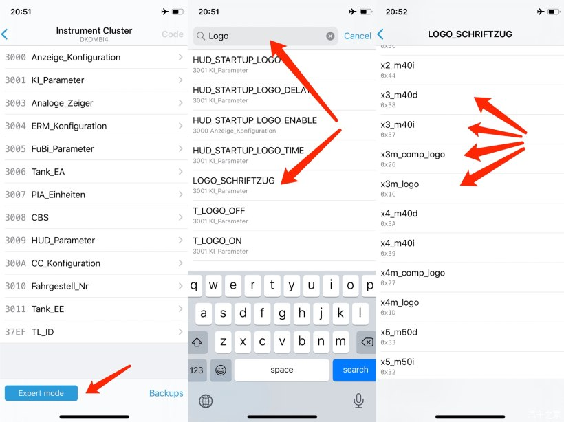
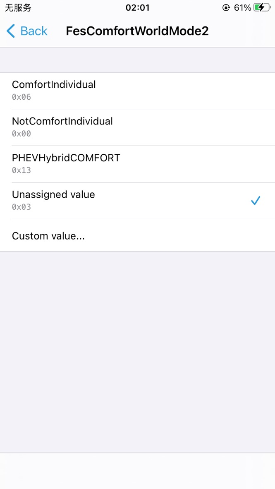
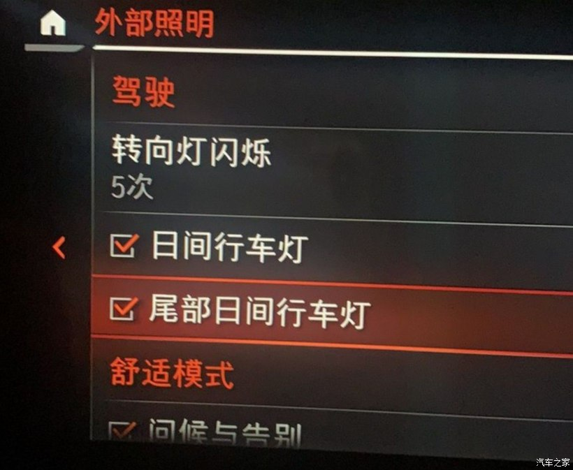
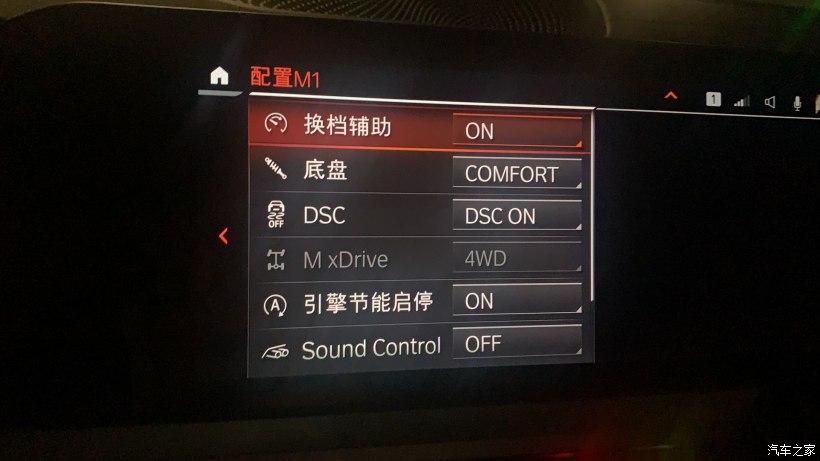
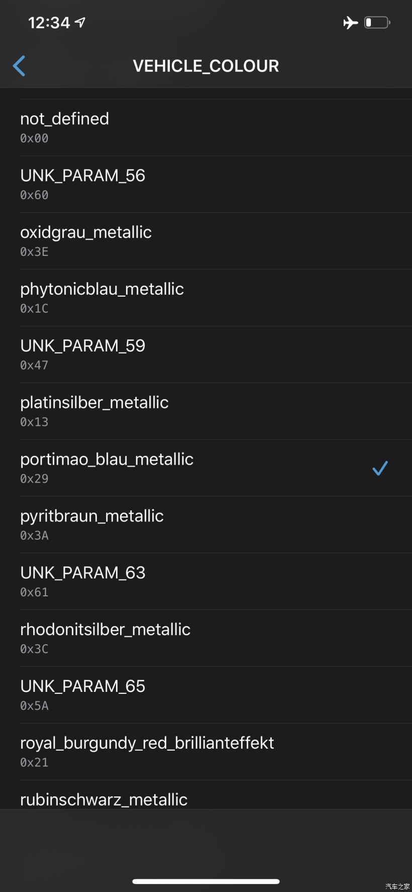
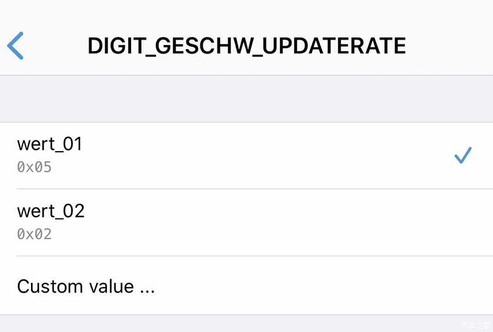
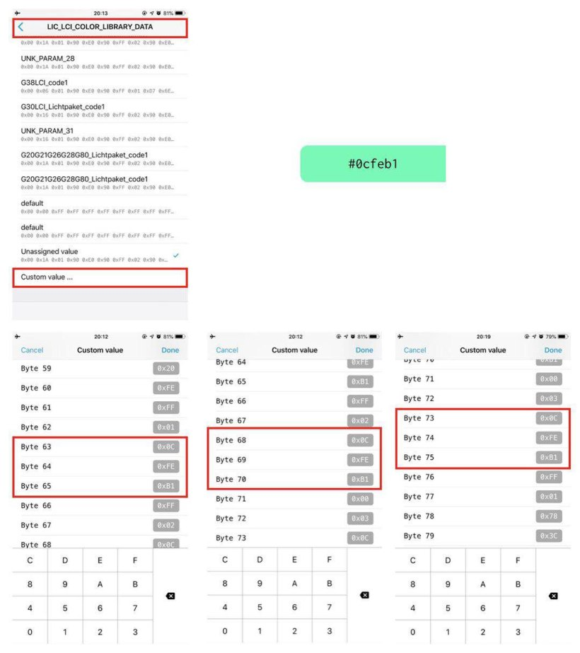
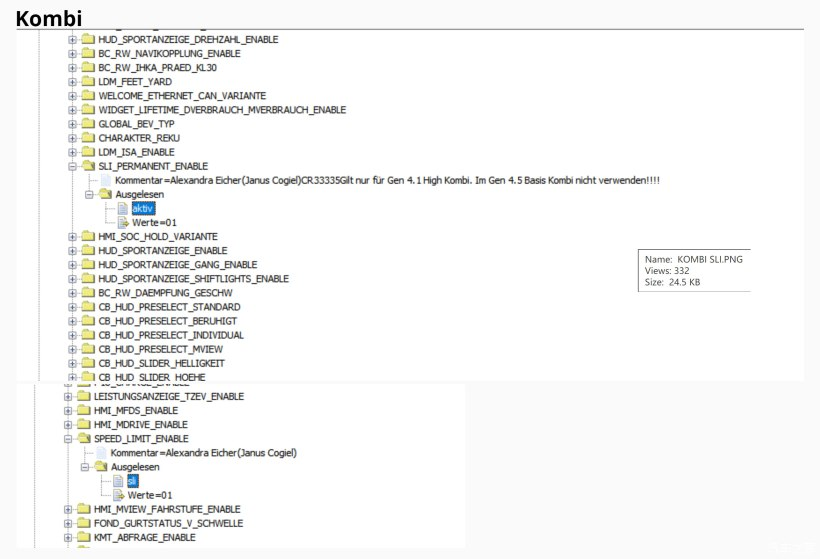
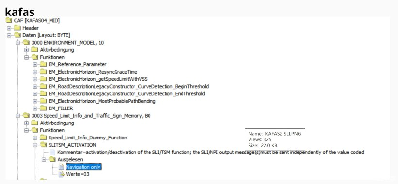
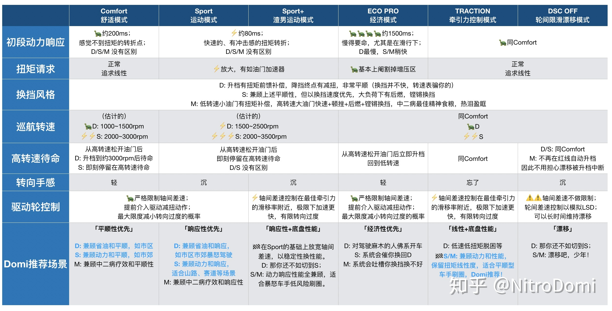

[TOC]

# bimmercode常用功能教程

==除了安全选项外 车易升有的功能 bimmercode都可以实现==

## 必刷项

> 1. 系统：自动启停、升窗不中断、转向灯五次、空调记忆&内循环自动开启、未熄火锁车鸣笛、车门再上锁时间、adaptive、comfort plus、sport plus、默认驾驶模式、usb电流、倒车右后视镜下翻角度、自动大灯&雨刷灵敏度、急刹开双闪、急刹高位刹车灯、一键关闭电尾门、氛围灯颜色、锁车键关闭所有车窗天窗
> 2. 中控：轮胎温度显示、关闭倒车、开机等声明弹窗、开机动画、宝华韦健菜单、发动机音效、全车提示音改
> 3. 仪表&HUD：胎压显示、车速刷新率、显示真实车速、驾驶辅助视角、开启限速显示（需要eyes）、仪表盘风格、瞬时油耗最大值改30、剩余油量警告、开机动画、logo

## 启停记忆

选择Engine Control Unit DME模块
选择Auto Start Stop function memory 选择 打开或者关闭即可。

## ECO模式关闭启停

hu_mgu模块 搜索 ECO_CONF_MSA 启用选项

ps：屏幕和按键不会显示关闭但实际已经关闭，且只能通过编程开启

## 主动进气格栅打开关闭代码

DME模块 隐藏akks 改成00/01

## M仪表路名居中

主机模块 HMI_BRAND改 bmw_m

## 弹射起步激活

变速箱模块 SPORTSHALTER 改aktiv

## USB充电电流限制

headunit expert里搜current usb_max_charging_current

## 电尾门 钥匙、按钮一键开启关闭 （可能跟选配无钥匙进入的自动上锁 冲突）

HKL(HKFM)PHY_TASTER nichtaktiv改为aktiv

HKL(HKFM)REV_FBD nichtaktiv改为aktiv

HKL(HKFM)TASTER_FBD nichtaktiv改为aktiv

HKL(HKFM)SCH_TOEHKI nichtaktiv改为aktiv

## 更改音频音响模式

这个模式只推荐选装哈曼卡顿音响设置，或后期有加装过音响功放都可以设置，如果都没有设置这些就毫无意义
选择 HU_NBT_EVO 块 = （专家模式）> HMI 3000 >
PS：点击手机搜索，并写"HIGH_END"
哈曼卡顿 （默认）
HIGH_END_AUDIO_MENUE 选择 kein_menue
HIGH_END_AUDIO_B_AND_W 选择kein_menue

## 宝华音响设置菜单

进入headunit expert模式 搜索AUDIO-SYSTEM 改为alev4-Ram

立体感增强，环绕逼真

## 发动机音效设置

Headunit专家模式   搜索“Sound” 将两个跟Sound有关的项目都打开（改为active）

发动机音效可控制阀门

## 锁车键关闭所有车窗天窗

无忧上锁，延迟改0，但不是所有车子都支持的

## 仪表盘中间Logo



有几个Logo单独拎出来说，在列表中选M是没有用的，要选msp。（M3、M4等的Logo需要在M仪表盘才生效）

## 默认仪表盘速度表最大值改为330（默认260）

1、进入首页的Instrument Cluster
2、进入expert模式
3、搜索找到ag_mpa_msp_view，改成330

## 瞬时油耗最大值改为30L（默认20L）

1、进入首页的Instrument Cluster
2、进入expert模式
3、搜索找到hmi_kva_scala，改成30L

## Adaptive模式

1、进入Body Domain Controller
2、进入Expert模式
3、搜索“Adaptive”，找到3221 PfFesMaster
4、将FesAdaptiveWorldMode0改为Adaptive
5、返回，点击Code
6、进入headunit中expert模式
7、找到FES_ADAPTIVE，将其修改为aktiv

## SportPlus模式

1、进入Body Domain Controller
2、进入Expert模式
3、搜索“Sport”，找到3221 PfFesMaster
4、将FesSportWorldMode1改为SportExpert
5、返回，点击Code
6、进入headunit中expert模式
7、找到FES_SPORT_EXPERT，将其修改为aktiv

## ComfortPlus模式

1、进入Body Domain Controller
2、进入Expert模式
3、搜索FesComfortWorldMode1
4、将FesComfortWorldMode1改为ComfortPlus
5、返回，点击Code
6、进入headunit中expert模式
7、找到FES_COMFORT_PLUS，将其修改为aktiv

## 默认驾驶模式

1、进入首页的Body Domain Controller
2、进入expert模式，搜FesPiaDefaultLastUserMode
01 - Sport Mode
02 - Sport Plus Mode
03 - Sport Individual
04 - Comfort Mode (default)
05 - Comfort Plus Mode
06 - Comfort Individual
0A - Adaptive
07 - EcoPro Mode
08 - EcoPro Plus Mode
09 - EcoPro Individual
3、选择一个默认的驾驶模式，或修改为下面的值

## 驾驶模式按键次数模式更改



Body Domain Controller专家模式

```shell
01 - Sport Mode
02 - Sport Plus Mode
03 - Sport Individual
04 - Comfort Mode (default)
05 - Comfort Plus Mode
06 - Comfort Individual
0A - Adaptive
07 - EcoPro Mode
08 - EcoPro Plus Mode
09 - EcoPro Individual
```

## 仪表盘（M、Alpina等）

1、进入首页的Instrument Cluster
2、将仪表盘Display改为M（默认BMW），也可以设置为Alpina，就会变成阿尔宾娜的仪表盘

注：若需要在M仪表盘增加转速红线，需要进入Instrument cluster里搜索DZM_VARIANTE，选择一个发动机类型，既可显示该发动机的转速红线（没有B48）

## AssitedDriverView辅助驾驶员视角

注： 需要本身带有辅助选装包
1、进入首页KOMBI
2、Expert模式
3、搜索以下的选项，并将其修改为右边的aktiv
CB_FZG_UMGEBUNG_FAS: aktiv (01)
CB_PRESELECT_NAVI_ANSICHT_FZG_UMGEBUNG: aktiv (01)
PIA_FZG_UMGEBUNG_FAS: aktiv (01)
SICHT_ABSICHT_ENABLE: aktiv (01)

## 车机开机视频

Headunit，Start Animation选项，选择一个你想要的开机动画，可刷选项包括iBMW、M、Alpina等

## 刷XView指南针

Headunit的expert模式里搜x_view，开启既可

注：该功能本身给X系列的SUV提供的，所以有些传感器数据没有

## 尾部日行灯（尾部示宽灯常亮）

1、进入首页的BODY DOMAIN CONTROLLER
2、进入expert模式
3、搜索找到3702LicFeatures / Feature_4 , 并改为打开状态（建议直接搜关键字feature_4）
4、Code！理论这个时候你的尾部日行灯已经开启了，但如果没有生效，可以往看以步骤
（可选择）
5、进入首页的Headunit
6、进入expert模式
7、搜索DAYDRIVING_LIGHT_REAR，并打开



## 舒适模式“滑行”功能（没用）

1、进入首页的Instrument Cluster
2、进入expert模式
3、搜索找到Anzeige_Configuration / Segeln_In_Comfort_Modus, 并改为打开状态
5、进入首页的Headunit
6、进入expert模式
7、搜索找到以下三项, 并改为打开状态：
Global_Conf_Sailing
Eff_Dyn_Sailing
Sailing_Counter

## “M菜单”功能（包含仪表盘RDC插件、仪表盘胎温胎压）

——M菜单
1、进入首页Headunit模块
2、进入Expert Mode，把3010 M_GMBH里 所有能打开的都打开
3、这个时候你就会发现车机里了一个M菜单，同时仪表盘会两个插件，胎压和涡轮压力等

——仅保留仪表盘胎压插件
Headunit 3010 M_GMBH里，会发现有一条m_vehicle_sp2018_rueko，把别的都关闭留它（用带rueko的那个，那个会改变仪表盘的设置界面）



## M HUD（彩虹条目前仅X3，5系等车型可刷写）

1. KOMBI模块打开所有mview相关的选项
2. HU模块打开M_GMBH面所有选项（有两项都叫m vehicle sp2018，选带rueko的那个）

## 更改主机中车身颜色及车辆型号

1、进入首页Headunit模块
2、进入expert模式，搜索vehicle_colour
3、选择你想要的颜色既可
4、搜搜TRIM_LINE可更改车型配置



## 仪表盘、HUD车速刷新率

Instrument cluster(KOMBI)里搜DIGIT_GESCHW_UPDATERATE
数字越小刷新频率越快，默认05，改为02即为原来2.5倍



## 氛围灯颜色修改（本方法只适用于S2018A车型）完整版ID7系统

Bronze（默认，青铜色)
Red 红色
Orange 橙色
Yellow 黄色
Yellow-green 黄绿色
Green 绿色
Green-cyan 青绿色
Cyan 青色
Cyan-blue 青蓝色
Blue 蓝色
Blue-magenta 蓝洋红色
Magenta 品红色（亮）
Magenta-red 品红色（深）

### 进阶

#### 1、进入首页BDC的expert模式

2、改原车颜色，360A里找到LIC_LCI_COLOR_LIBRARY_DATA
可以看到原厂已经指定一组数字 ，其中每三个数字分别对应1个颜色，分别对应代号00，01,02,03，比如这里001A01就00。。。具体颜色如，然后在这里你可以点击CUSTOM_VALUE可以把任意一个代号的颜色（参考面），改为你想要的颜色的HEX 16进制数

注意这边一个颜色的HEX值会出现3次，分别对应的位置的灯，以绿色#0cfeb1为例



63/64/65 => 前仪表+双前座车门LED条+后座车门LED
68/69/70 => 前座脚踏+后座脚踏
73/74/75 => 无线充电处LED + 顶棚LED气氛小灯

比如你如果想把绿色 都改成红色，假设红色AABBCC，那你就要把所有的3个0cfeb1都改成AABBCC，改完以后，原车的所有绿色都会变成红色

这原车的颜色HEX值：
\- 90,E0,90 - WHITE
\- D7,6E,14 - BRONZE
\- 93,1A,01 - ORANGE
\- 00,20FE - BLUE
\- 10,FE,32 - GREEN
\- 78,3C,FE - LILAC

#### 2、改原车氛围灯组合，找到360D里的LIC_LCI_COLOR_PROFILES_DATA

里面这些数字01, 01, 01, 00, 02, 02, 02, 00, 00, 00, 03, 03, 03, 00, 04, 04, 04, 00, 05, 05, 05, 00
每两个数字代号代表一组氛围灯组合，01,02,03就对应面的01,02,03
然后按照顺序改代号，就可以更改原车的氛围灯组合

比如原车第一个选项古铜色单色，就0101，后面橙色白色组合，就0100

根据实测，有以几个颜色比较酷：
骚粉色 FF0066
冰蓝色 00CCFF

## 变道辅助（需要esys）

1、在BDC中搜索 SPURWECHSEL_ASSISTENT，改为 "aktiv"
2、在HU_MGU中搜索SPURWECHSELASSISTENT，改为 "gen_1"
3、在SAS2中搜索C_SWA_VORHANDEN_VOR，改为"NRHANDEN"

## 刷限速标志（需要esys）

通过刷以三个代码

注：刷限速标志需要电脑的设码程序esys，因为bimmercode暂时会开放KAFAS模块的刷写（涉及车辆安全）



注意这边要改成camera only,就优先通过KAFAS摄像头读取，如果没有摄像头就通过导航信息



## 驾驶模式区别



