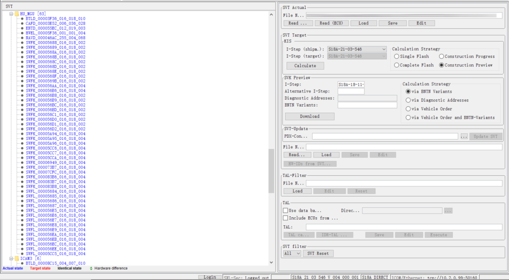
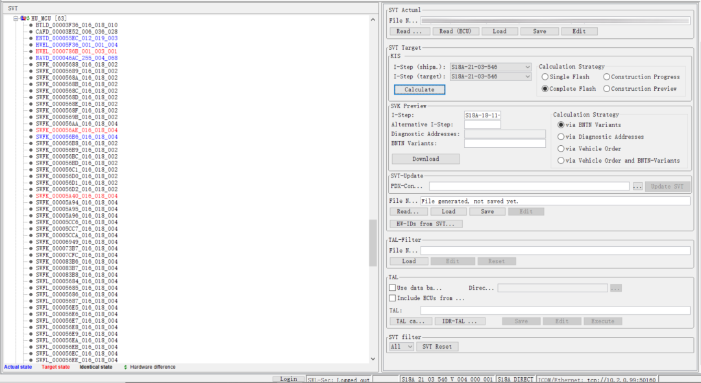
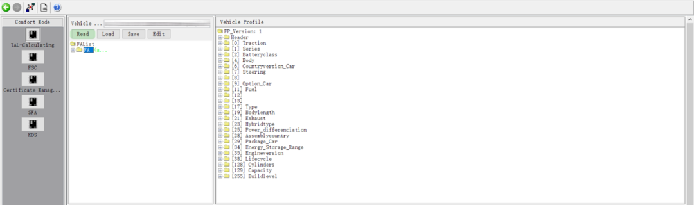
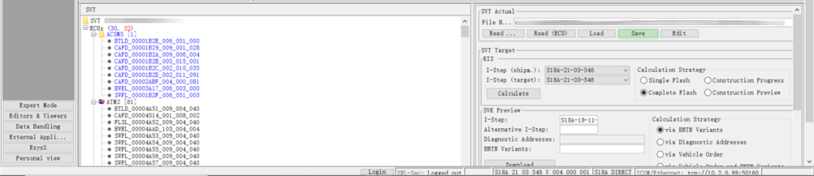
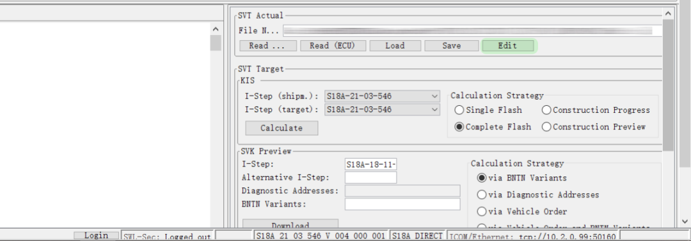
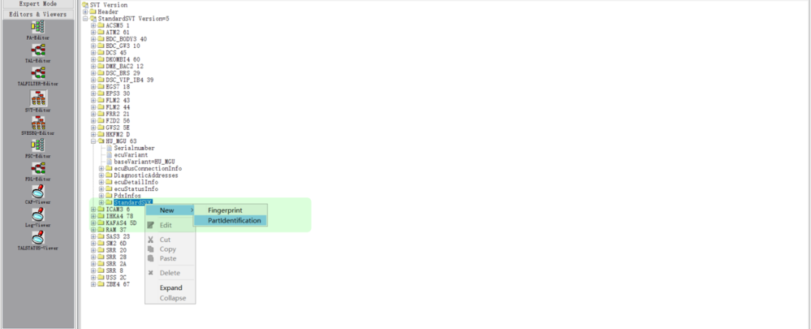
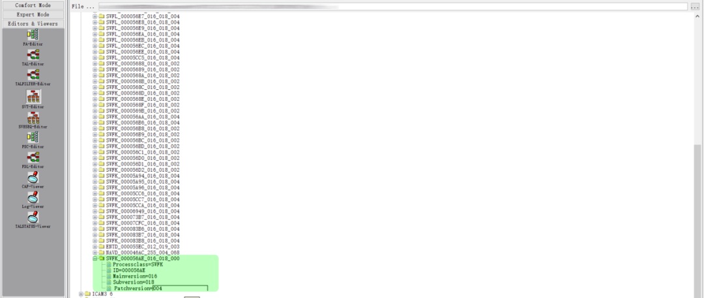
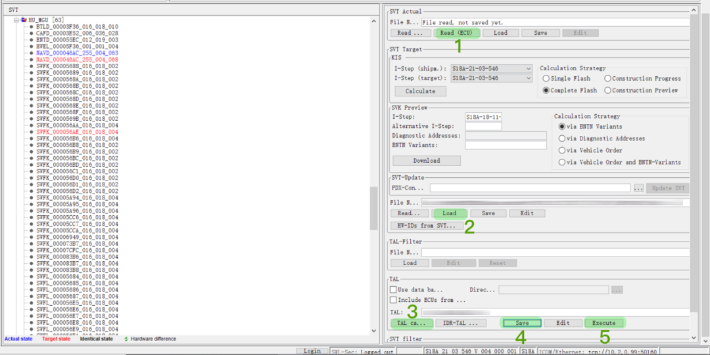
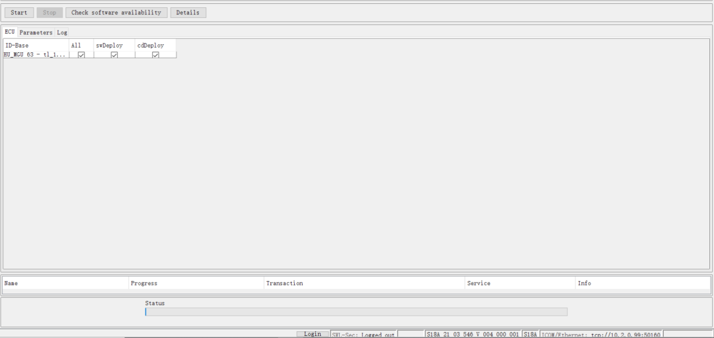

[TOC]

# bimmercode常用功能教程

==除了安全选项外 车易升有的功能 bimmercode都可以实现==

## 启停记忆

DME模块Auto Start Stop function memory 打开或者关闭即可。

## ECO模式关闭启停

hu_mgu模块 搜索 ECO_CONF_MSA 启用选项

ps：屏幕和按键不会显示关闭但实际已经关闭，且只能通过编程开启

## 主动进气格栅打开关闭

DME模块akks

## 主动进气格栅永久屏蔽

DME模块ELV-》Ausgelesen

## 弹射起步激活

变速箱模块 SPORTSHALTER 改aktiv

## USB充电电流限制

headunit 里current usb_max_charging_current

## 电尾门 钥匙、按钮一键开启关闭 （可能跟选配无钥匙进入的自动上锁 冲突）

HKL(HKFM)PHY_TASTER nichtaktiv改为aktiv

HKL(HKFM)REV_FBD nichtaktiv改为aktiv

HKL(HKFM)TASTER_FBD nichtaktiv改为aktiv

HKL(HKFM)SCH_TOEHKI nichtaktiv改为aktiv

## 更改音频音响模式

这个模式只推荐选装哈曼卡顿音响设置，或后期有加装过音响功放都可以设置，如果都没有设置这些就毫无意义
HU_NBT模块
HIGH_END_AUDIO_MENUE 选择 kein_menue
HIGH_END_AUDIO_B_AND_W 选择kein_menue

## 宝华音响设置菜单

进入headunit expert模块AUDIO-SYSTEM 改为alev4-Ram

## 发动机音效设置

Headunit模块“Sound” 将两个跟Sound有关的项目都打开（改为active）

## 锁车键关闭所有车窗天窗

无忧上锁，延迟改0，但不是所有车子都支持的

## 仪表盘中间Logo

Instrument Cluster模块Logo_Schriftzug
在列表中选M是没有用的，要选msp（M3、M4等的Logo需要在M仪表盘才生效）

## 默认仪表盘速度表最大值改为330（默认260）

Instrument Cluster模块ag_mpa_msp_view

## 瞬时油耗最大值改为30L（默认20L）

Instrument Cluster模块hmi_kva_scala

## Adaptive模式

BDC模块FesAdaptiveWorldMode0
headunit模块FES_ADAPTIVE

## SportPlus模式

BDC模块FesSportWorldMode1改为SportExpert
headunit模块FES_SPORT_EXPERT，将其修改为aktiv

## ComfortPlus模式

BDC模块FesComfortWorldMode1改为ComfortPlus
headunit模块FES_COMFORT_PLUS，将其修改为aktiv

## 默认驾驶模式

模块Body Domain Controller模块FesPiaDefaultLastUserMode
01 - Sport Mode
02 - Sport Plus Mode
03 - Sport Individual
04 - Comfort Mode (default)
05 - Comfort Plus Mode
06 - Comfort Individual
0A - Adaptive
07 - EcoPro Mode
08 - EcoPro Plus Mode
09 - EcoPro Individual
3、选择一个默认的驾驶模式，或修改为下面的值

## 驾驶模式按键次数模式更改

通过新建值

## 仪表盘类型&转速红线（M、Alpina等）

Instrument Cluster模块GLOBAL_LAYOUT_VARIANTE
Instrument cluster模块DZM_VARIANTE

## 车机开机视频

Headunit模块Start Animation

## 刷XView指南针

Headunit的expert模式x_view

## 尾部日行灯（尾部示宽灯常亮）

BDC模块feature_4
Headunit模块DAYDRIVING_LIGHT_REAR

## “滑行”功能（没用）

Instrument Cluste模块Anzeige_Configuration / Segeln_In_Comfort_Modus
Headunit模块Global_Conf_Sailing、Eff_Dyn_Sailing、Sailing_Counter

## “M菜单”功能（包含仪表盘RDC插件、仪表盘胎温胎压、喷油量显示）

——M菜单
Headunit模块3010 M_GMBH里 所有能打开的都打开

——仅保留仪表盘胎压插件
m_vehicle_sp2018_rueko仅留它

喷油量显示代码
M_ANZEIGE_WASSER_WIDGET激活后涡轮压力会变成喷油量

## M HUD（彩虹条目前仅X3，5系等车型可刷写）

1. KOMBI模块打开所有mview相关的选项
2. HU模块打开M_GMBH面所有选项选带rueko的那个

## 更改主机中车身颜色及车辆型号

Headunit模块vehicle_colour
TRIM_LINE可更改车型配置

## 仪表盘、HUD车速刷新率

Instrument cluster(KOMBI)里搜DIGIT_GESCHW_UPDATERATE
数字越小刷新频率越快，默认05，改为02即为原来2.5倍

## 便捷蹬车功能

在SM2 （6D） 模块：3000SM GLOBAL -> EINAUSSTIEGSHILFE= Modus_ FA SLV
3012 ek 3015 EAH-EAH_SCHUTZFREIRAUM_HINTEN_SLV_PHYS=Werte = 00, 00

## 变道辅助（需要esys）

1、在BDC中搜索 SPURWECHSEL_ASSISTENT，改为 "aktiv"
2、在HU_MGU中搜索SPURWECHSELASSISTENT，改为 "gen_1"
3、在SAS2中搜索C_SWA_VORHANDEN_VOR，改为"NRHANDEN"

## GPF屏蔽&原厂回火放炮

## M仪表完整版&插件可用

首先，M组件的数据命令调用必须基于M车型人机交互界面（以下简称HMI -M），而普通车型中由于缺少HMI -M的命令数据，所以即使通过HU-MGU中的M_VEHICLE_2018参数激活组件，亦无法正常正常显示。而如果以M车型VO进行逻辑计算对主机编程，则会造成原车的HMI命令/模型数据被替换，造成主机后端数据的校验问题；且如果当前车辆的集成版本较编程数据低的话，整个主机的文件都要被更新，编程时长将从4分钟变成20多分钟，如果中途因为车辆电压问题造成中断，会造成主机编死事故。

事实上，我们仅需在主机中添加HMI -M的命令数据，再按需进行参数编码即可。

（图1：G28车型原始HU-H文件架构）

（图2：修改FA后计算出的HU-H文件架构）

图2中蓝色字符（当前实际值）即意味着该文件将被红色字符（计算目标值）的文件替换，可以发现**HWEL_00005F36与HWEL_0000796B**是属于完全不同的两个硬件号，这意味着普通车型与M车型使用了完全不同的主机型号，所以系统也会提示硬件不一致。尽管我们可以忽略硬件差异继续编程，但软件架构中作为3系的人机操作界面和车辆模型数据的SWFK_000056B6文件仍将被目标值SWFK_000056AE替换。所以当使用修改FA文件中车辆的开发系列和基础型号进行计算并编程主机后，由于原车G28的车辆模型文件被M车型数据替换，所以主机和仪表内无法再继续调用G28的车辆模型数据，若之后不通过编码改变车辆模型，则在仪表、主机中将导致显示不正常。

**以下开始是干货！**

具体操作步骤如下：

1、   读取原车FA

2、  读取当前SVT并保存（文件名称建议以车架号后7位+MHMI）

3、  编辑已保存的SVT

4、 在控制单元树中选中HU-H/StandardSVK/右击并添加新的PartIdentification

5、  指定所需调用文件

该文件名称为：SWFK_000056AE，数据版本因SDP版本而异（在4.29.11中为016_018_004），所以我们需指定文件及版本号为**SWFK_000056AE_016_018_004**，并保存修改后的SVT文件。

6、  重新读取实际SVT（不再进行保存）

7、  导入刚才修改过的SVT文件并计算传输任务措施

可见，由于使用的是车辆当前的实际SVT进行添加，所以既不存在硬件不一致，也不会因为车辆集成等级与当前编程数据版本不一致而需要对整个主机进行编程。

8、  保存计算出的传输任务措施文件，执行编程。

当主机内具备HMI -M的命令数据后，我们通过修改以下两组参数来实现M组件的激活。

| No.  | 参数           | 值                        |
| ---- | -------------- | ------------------------- |
| 1    | M_VEHICLE_2018 | aktive                    |
| 2    | HMI_BRAND      | bmw_m                     |
| 3    | BAUREIHE       | G80*（如需改变车辆模型）* |

此时，受HMI -M的影响，原车的MSP仪表界面下方的道路名称位置将发生偏移，我们还需通过参数对其进行整体布局进行修改：

| No.  | 文件名                 | 车型       |
| ---- | ---------------------- | ---------- |
| 1    | AG_MPA_MSP_VIES        | ag_ansicht |
| 2    | GLOBAL_LAYOUT_VARIANTE | m_gmbh     |

此时，通过BC按键即可看到仪表中会多出几个组件，胎压/温度的显示也不再残缺，发动机油温和涡轮压力值也可以实时显示，原车的功率/马力表、瞬时油耗也从原来的竖状改变成了横向显示。同时，通过CID（中控信息显示屏）的自定义组件功能，亦能将这些功能按个人喜爱安排在中控显示中。

**注意：对于配备SA610（全彩平视显示系统）且具备SA2TB（换挡拨片）的车辆，由于切换了主机操作系统内核，那么原车跟随Sport模式在HUD上显示发动机转速的功能将无法使用。其原因为M车型与普通车型在驾驶模式方面定义不同，且运用了完全不同的信号数据处理协议，且因为涉及到DSC和BDC的底层数据修改**

## 驾驶模式区别

