[TOC]

# [bimmercode常用功能教程](https://docs.qq.com/doc/DRWZoTEFXa2ZLY0Nl)

## 自动启停记忆

选择Engine Control Unit DME模块
选择 Auto Start Stop function memory 选择
打开或者关闭即可。

## 自动启停记忆V2 （切换到ECO模式启停也生效的设置）

NBT模块 >
专家模式 > 3008 FES >
搜索 ECO_CONF_MSA >
启用选项

## 更改音频音响模式

这个模式只推荐选装哈曼卡顿音响设置，或后期有加装过音响功放都可以设置，如果都没有设置这些就毫无意义
2.1选择 HU_NBT_EVO 块 = （专家模式）> HMI 3000 >
PS：点击手机搜索，并写"HIGH_END"
哈曼卡顿 （默认）
HIGH_END_AUDIO_MENUE 选择 kein_menue
HIGH_END_AUDIO_B_AND_W 选择kein_menue

## sport模式仪表表底红色改为黑色

颜色从红色更改为灰色，您可以更改
dkombi2 模块
专家模式
3000 搜索MPA MSP
启用 > grau_weiss

## 氛围灯颜色自定义X3、5系

```json
氛围灯：中国红
GROUP_0_FARBE_ENSEMBLE_2_R 改 Bronze_R
GROUP_0_FARBE_ENSEMBLE_2_G 改 AUS_G
GROUP_0_FARBE_ENSEMBLE_2_B 改 AUS_B
AMBIENTE_FARBE_ENSEMBLE_2_LAYER_1_R 改 Bronze_R
AMBIENTE_FARBE_ENSEMBLE_2_LAYER_1_G 改 AUS_G
AMBIENTE_FARBE_ENSEMBLE_2_LAYER_1_B 改AUS_B
AMBIENTE_FARBE_ENSEMBLE_2_LAYER_2_R 改 Bronze_R
AMBIENTE_FARBE_ENSEMBLE_2_LAYER_2_G 改 AUS_G
AMBIENTE_FARBE_ENSEMBLE_2_LAYER_2_B 改AUS_B
AMBIENTE_FARBE_ENSEMBLE_2_LAYER_3_R 改 Bronze_R
AMBIENTE_FARBE_ENSEMBLE_2_LAYER_3_G 改 AUS_G
AMBIENTE_FARBE_ENSEMBLE_2_LAYER_3_B 改AUS_B
AMBIENTE_FARBE_ENSEMBLE_2_LAYER_4_R 改 Bronze_R
AMBIENTE_FARBE_ENSEMBLE_2_LAYER_4_G 改 AUS_G
AMBIENTE_FARBE_ENSEMBLE_2_LAYER_4_B 改AUS_B
AMBIENTE_FARBE_ENSEMBLE_2_LAYER_5_R 改 Bronze_R
AMBIENTE_FARBE_ENSEMBLE_2_LAYER_5_G 改 AUS_G
AMBIENTE_FARBE_ENSEMBLE_2_LAYER_5_B 改AUS_B
AMBIENTE_FARBE_ENSEMBLE_2_LAYER_6_R 改 Bronze_R
AMBIENTE_FARBE_ENSEMBLE_2_LAYER_6_G 改 AUS_G
AMBIENTE_FARBE_ENSEMBLE_2_LAYER_6_B 改AUS_B

氛围灯：土豪金
GROUP_0_FARBE_ENSEMBLE_4_R 改 Orange_R
GROUP_0_FARBE_ENSEMBLE_4_G 改 Bronze_G
GROUP_0_FARBE_ENSEMBLE_4_B 改 AUS_B
AMBIENTE_FARBE_ENSEMBLE_4_LAYER_1_R 改 Orange_R
AMBIENTE_FARBE_ENSEMBLE_4_LAYER_1_G 改 Bronze_G
AMBIENTE_FARBE_ENSEMBLE_4_LAYER_1_B 改 AUS_B
AMBIENTE_FARBE_ENSEMBLE_4_LAYER_2_R 改 Orange_R
AMBIENTE_FARBE_ENSEMBLE_4_LAYER_2_G 改 Bronze_G
AMBIENTE_FARBE_ENSEMBLE_4_LAYER_2_B 改 AUS_B
AMBIENTE_FARBE_ENSEMBLE_4_LAYER_3_R 改 Orange_R
AMBIENTE_FARBE_ENSEMBLE_4_LAYER_3_G 改 Bronze_G
AMBIENTE_FARBE_ENSEMBLE_4_LAYER_3_B 改 AUS_B
AMBIENTE_FARBE_ENSEMBLE_4_LAYER_4_R 改 Orange_R
AMBIENTE_FARBE_ENSEMBLE_4_LAYER_4_G 改 Bronze_G
AMBIENTE_FARBE_ENSEMBLE_4_LAYER_4_B 改 AUS_B
AMBIENTE_FARBE_ENSEMBLE_4_LAYER_5_R 改 Orange_R
AMBIENTE_FARBE_ENSEMBLE_4_LAYER_5_G 改 Bronze_G
AMBIENTE_FARBE_ENSEMBLE_4_LAYER_5_B 改 AUS_B
AMBIENTE_FARBE_ENSEMBLE_4_LAYER_6_R 改 Orange_R
AMBIENTE_FARBE_ENSEMBLE_4_LAYER_6_G 改 Bronze_G
AMBIENTE_FARBE_ENSEMBLE_4_LAYER_6_B 改 AUS_B

氛围灯：荧光绿
GROUP_0_FARBE_ENSEMBLE_7_R 改 Eisblau_R (AUS_R)
GROUP_0_FARBE_ENSEMBLE_7_G 改 Eisblau_G
GROUP_0_FARBE_ENSEMBLE_7_B 改 AUS_B
AMBIENTE_FARBE_ENSEMBLE_7_LAYER_1_R 改 Eisblau_R (AUS_R)
AMBIENTE_FARBE_ENSEMBLE_7_LAYER_1_G 改 Eisblau_G
AMBIENTE_FARBE_ENSEMBLE_7_LAYER_1_B 改 AUS_B
AMBIENTE_FARBE_ENSEMBLE_7_LAYER_2_R 改 Eisblau_R (AUS_R)
AMBIENTE_FARBE_ENSEMBLE_7_LAYER_2_G 改 Eisblau_G
AMBIENTE_FARBE_ENSEMBLE_7_LAYER_2_B 改 AUS_B
AMBIENTE_FARBE_ENSEMBLE_7_LAYER_3_R 改 Eisblau_R (AUS_R)
AMBIENTE_FARBE_ENSEMBLE_7_LAYER_3_G 改 Eisblau_G
AMBIENTE_FARBE_ENSEMBLE_7_LAYER_3_B 改 AUS_B
AMBIENTE_FARBE_ENSEMBLE_7_LAYER_4_R 改 Eisblau_R (AUS_R)
AMBIENTE_FARBE_ENSEMBLE_7_LAYER_4_G 改 Eisblau_G
AMBIENTE_FARBE_ENSEMBLE_7_LAYER_4_B 改 AUS_B
AMBIENTE_FARBE_ENSEMBLE_7_LAYER_5_R 改 Eisblau_R (AUS_R)
AMBIENTE_FARBE_ENSEMBLE_7_LAYER_5_G 改 Eisblau_G
AMBIENTE_FARBE_ENSEMBLE_7_LAYER_5_B 改 AUS_B
AMBIENTE_FARBE_ENSEMBLE_7_LAYER_6_R 改 Eisblau_R (AUS_R)
AMBIENTE_FARBE_ENSEMBLE_7_LAYER_6_G 改 Eisblau_G
AMBIENTE_FARBE_ENSEMBLE_7_LAYER_6_B 改 AUS_B

氛围灯：小青新
GROUP_0_FARBE_ENSEMBLE_9_R 改Eisblau_R (AUS_R)
GROUP_0_FARBE_ENSEMBLE_9_G 改Orange_G
GROUP_0_FARBE_ENSEMBLE_9_B 改Bronze_B
AMBIENTE_FARBE_ENSEMBLE_9_LAYER_1_R 改Eisblau_R (AUS_R)
AMBIENTE_FARBE_ENSEMBLE_9_LAYER_1_G 改Orange_G
AMBIENTE_FARBE_ENSEMBLE_9_LAYER_1_B 改Bronze_B
AMBIENTE_FARBE_ENSEMBLE_9_LAYER_2_R 改Eisblau_R (AUS_R)
AMBIENTE_FARBE_ENSEMBLE_9_LAYER_2_G 改Orange_G
AMBIENTE_FARBE_ENSEMBLE_9_LAYER_2_B 改Bronze_B
AMBIENTE_FARBE_ENSEMBLE_9_LAYER_3_R 改Eisblau_R (AUS_R)
AMBIENTE_FARBE_ENSEMBLE_9_LAYER_3_G 改Orange_G
AMBIENTE_FARBE_ENSEMBLE_9_LAYER_3_B 改Bronze_B
AMBIENTE_FARBE_ENSEMBLE_9_LAYER_4_R 改Eisblau_R (AUS_R)
AMBIENTE_FARBE_ENSEMBLE_9_LAYER_4_G 改Orange_G
AMBIENTE_FARBE_ENSEMBLE_9_LAYER_4_B 改Bronze_B
AMBIENTE_FARBE_ENSEMBLE_9_LAYER_5_R 改Eisblau_R (AUS_R)
AMBIENTE_FARBE_ENSEMBLE_9_LAYER_5_G 改Orange_G
AMBIENTE_FARBE_ENSEMBLE_9_LAYER_5_B 改Bronze_B
AMBIENTE_FARBE_ENSEMBLE_9_LAYER_6_R 改Eisblau_R (AUS_R)
AMBIENTE_FARBE_ENSEMBLE_9_LAYER_6_G 改Orange_G
AMBIENTE_FARBE_ENSEMBLE_9_LAYER_6_B 改Bronze_B

氛围灯：骚粉
GROUP_0_FARBE_ENSEMBLE_11_R 改Orange_R
GROUP_0_FARBE_ENSEMBLE_11_G 改Orange_G
GROUP_0_FARBE_ENSEMBLE_11_B 改Gruen_B
AMBIENTE_FARBE_ENSEMBLE_11_LAYER_1_R 改Orange_R
AMBIENTE_FARBE_ENSEMBLE_11_LAYER_1_G 改Orange_G
AMBIENTE_FARBE_ENSEMBLE_11_LAYER_1_B 改Gruen_B
AMBIENTE_FARBE_ENSEMBLE_11_LAYER_2_R 改Orange_R
AMBIENTE_FARBE_ENSEMBLE_11_LAYER_2_G 改Orange_G
AMBIENTE_FARBE_ENSEMBLE_11_LAYER_2_B 改Gruen_B
AMBIENTE_FARBE_ENSEMBLE_11_LAYER_3_R 改Orange_R
AMBIENTE_FARBE_ENSEMBLE_11_LAYER_3_G 改Orange_G
AMBIENTE_FARBE_ENSEMBLE_11_LAYER_3_B 改Gruen_B
AMBIENTE_FARBE_ENSEMBLE_11_LAYER_4_R 改Orange_R
AMBIENTE_FARBE_ENSEMBLE_11_LAYER_4_G 改Orange_G
AMBIENTE_FARBE_ENSEMBLE_11_LAYER_4_B 改Gruen_B
AMBIENTE_FARBE_ENSEMBLE_11_LAYER_5_R 改Orange_R
AMBIENTE_FARBE_ENSEMBLE_11_LAYER_5_G 改Orange_G
AMBIENTE_FARBE_ENSEMBLE_11_LAYER_5_B 改Gruen_B
AMBIENTE_FARBE_ENSEMBLE_11_LAYER_6_R 改Orange_R
AMBIENTE_FARBE_ENSEMBLE_11_LAYER_6_G 改Orange_G
AMBIENTE_FARBE_ENSEMBLE_11_LAYER_6_B 改Gruen_B
```

相信在部分中，细心的车友对氛围灯颜色设定应该有初步的解，或许你们心中已经有答案，其最基本的原理就是通过设定氛围灯条的RGB值，来改变氛围灯颜色。


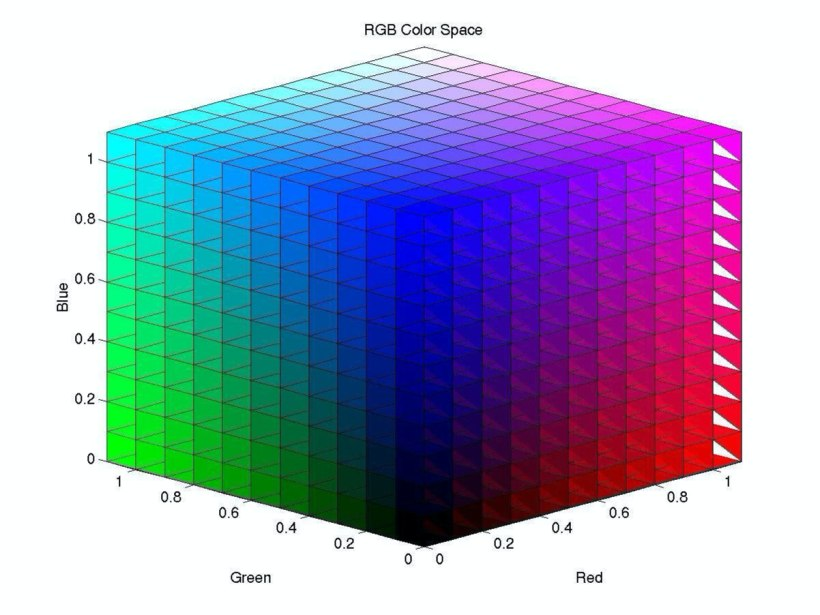

所谓的RGB值，应该也用多说吧，红(Red)，绿(Green)，蓝(Blue)。

所谓的RGB值，应该也用多说吧，红(Red)，绿(Green)，蓝(Blue)。还记得小时候美术课，把这种颜料按同比例和组合混合，就能调出新的颜色。RGB颜色系统中，用0-255来表示颜色的强弱，以红(Red)为例子，0表示非常红，255表示非常红。同样的绿(Green)和蓝(Blue)也可以用0-255来表示颜色的强弱。那么3种颜色排列组合后，共可以产生256×256×256=16777216种颜色。举几个常用颜色的例子，红色(255,0,0)，黄色(255,255,0)，绿色(0,255,0)，蓝色(0,0,255)，紫色(139,0,255)。

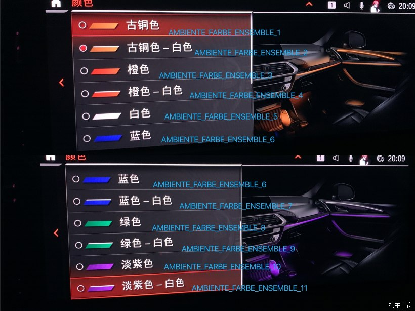

再回到代码AMBIENTE开头的代码，最后的数字表示氛围灯的排序。

再回到代码AMBIENTE开头的代码，最后的数字表示氛围灯的排序。

比如说AMBIENTE_FARBE_ENSEMBLE_2_LAYER_1_R，开头的AMBIENTE_FARBE_ENSEMBLE_2，这个2表示的是氛围灯选项中的第项"古铜色-白色"。同理AMBIENTE_FARBE_ENSEMBLE_3开头的代码，这个3表示第3项"橙色"。

这也是为什么部分增加氛围灯颜色，只选AMBIENTE_FARBE_ENSEMBLE_2(古铜色-白色)，AMBIENTE_FARBE_ENSEMBLE_4(橙色-白色)，AMBIENTE_FARBE_ENSEMBLE_7(蓝色-白色)，AMBIENTE_FARBE_ENSEMBLE_9(绿色-白色)，AMBIENTE_FARBE_ENSEMBLE_11(淡紫色-白色)，这5组颜色，其根本目的就是要替换掉多余的白色。

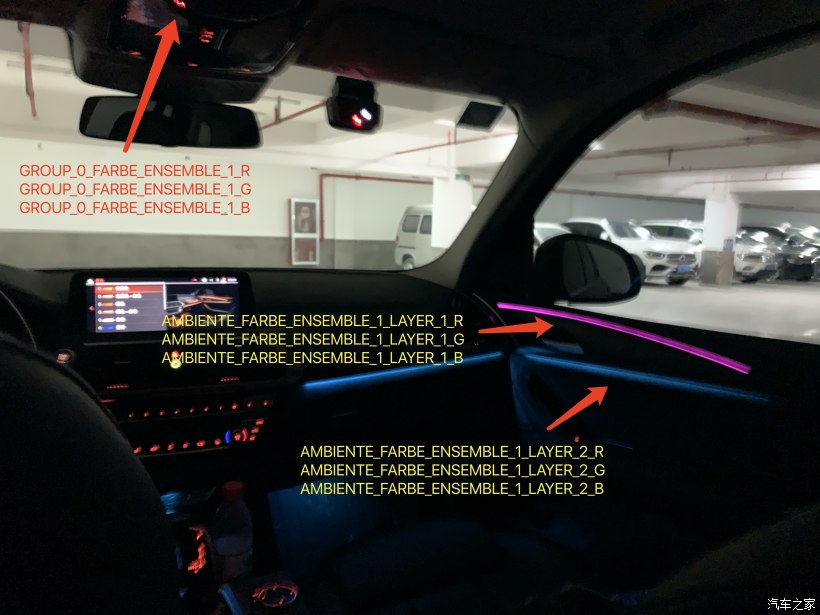

再来说下对应区域灯条颜色的对应的代码。

如图所示，楼主修改的是氛围灯选项中的第个"古铜色"，把"古铜色"选项中的颜色都替换掉，换成自己想要的颜色，那么按照之前所说的，因为古铜色是氛围灯颜色选项中的第个，那么与之有关的代码肯定是AMBIENTE_FARBE_ENSEMBLE_1开头的。在楼主研究和分析和测试后，找到具体灯条颜色对应的代码，真正起作用的只有3组。

GROUP_0_FARBE_ENSEMBLE_1_R
GROUP_0_FARBE_ENSEMBLE_1_G
GROUP_0_FARBE_ENSEMBLE_1_B
AMBIENTE_FARBE_ENSEMBLE_1_LAYER_1_R
AMBIENTE_FARBE_ENSEMBLE_1_LAYER_1_G
AMBIENTE_FARBE_ENSEMBLE_1_LAYER_1_B
AMBIENTE_FARBE_ENSEMBLE_1_LAYER_2_R
AMBIENTE_FARBE_ENSEMBLE_1_LAYER_2_G
AMBIENTE_FARBE_ENSEMBLE_1_LAYER_2_B

Group开头的代码是顶控制天窗的那个面板小灯的颜色，这个颜色也能改，别忘。
AMBIENTE_FARBE_ENSEMBLE_1_LAYER_1开头的3个代码控制半部分的颜色。
AMBIENTE_FARBE_ENSEMBLE_1_LAYER_2开头的3个代码控制下半部分的颜色。
前后左门板的颜色都是对称的，想刷五颜色的车友让你们失望。

具体操作方法如下：

楼主把天窗面板小灯改成红色，门板半部分改成紫色，下半部分改成青色。

那么这里要用到红色，紫色和青色。
为刷进车机里，我们需要用对应的RGB颜色值来表示，之前也有提到如何用RGB值来表示颜色。
为方便，楼主直接用搜索引擎找到对应的RGB颜色值。
红色(255,0,0)
紫色(255,0,255)
青色(0,255,255)
又由于车机系统是进制的，还需要转化下，怎么转化直接用计算器或者搜索引擎都可以，得到
红色(FF,00,00)
紫色(FF,00,FF)
青色(00,FF,FF)
那对应到每条代码就是
GROUP_0_FARBE_ENSEMBLE_1_R 改FF
GROUP_0_FARBE_ENSEMBLE_1_G 改00
GROUP_0_FARBE_ENSEMBLE_1_B 改00
AMBIENTE_FARBE_ENSEMBLE_1_LAYER_1_R 改FF
AMBIENTE_FARBE_ENSEMBLE_1_LAYER_1_G 改00
AMBIENTE_FARBE_ENSEMBLE_1_LAYER_1_B 改FF
AMBIENTE_FARBE_ENSEMBLE_1_LAYER_2_R 改00
AMBIENTE_FARBE_ENSEMBLE_1_LAYER_2_G 改FF
AMBIENTE_FARBE_ENSEMBLE_1_LAYER_2_B 改FF

这里需要用到自定义值的修改方法，具体方法如下。


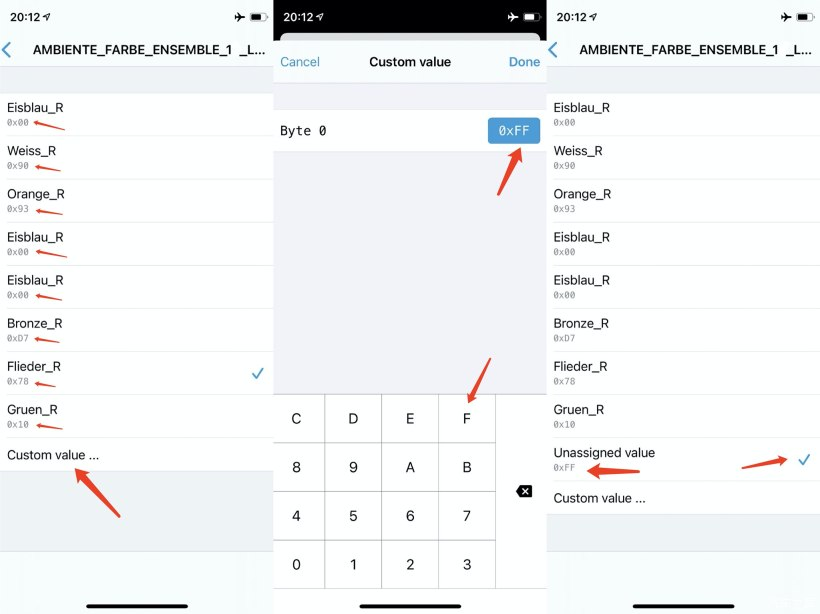

以修改 AMBIENTE_FARBE_ENSEMBLE_1_LAYER_1_R 改FF 为例，
同，首先进入BDC模块的专家模式，找到AMBIENTE_FARBE_ENSEMBLE_1_LAYER_1_R，点进去。
可以看到车机可提供的选择有好几个选项，每个选项下面有对应的进制值00，90，93，D7等，但是没有我们要的FF，所以点击最下面的Custom Value(自定义)。
进去后，直接在下面提供的小面板点击，输入FF，点击角的Done，回到之前界面。
回来后发现有个新的选项Unassigned Value(未命名的选项)，名字无法修改，但是可以看到下面与之对应的进制值"FF"已经在，打勾选择后，就完成。

以修改 AMBIENTE_FARBE_ENSEMBLE_1_LAYER_1_R 改FF 为例，
同，首先进入BDC模块的专家模式，找到AMBIENTE_FARBE_ENSEMBLE_1_LAYER_1_R，点进去。
可以看到车机可提供的选择有好几个选项，每个选项下面有对应的进制值00，90，93，D7等，但是没有我们要的FF，所以点击最下面的Custom Value(自定义)。
进去后，直接在下面提供的小面板点击，输入FF，点击角的Done，回到之前界面。
回来后发现有个新的选项Unassigned Value(未命名的选项)，名字无法修改，但是可以看到下面与之对应的进制值"FF"已经在，打勾选择后，就完成。

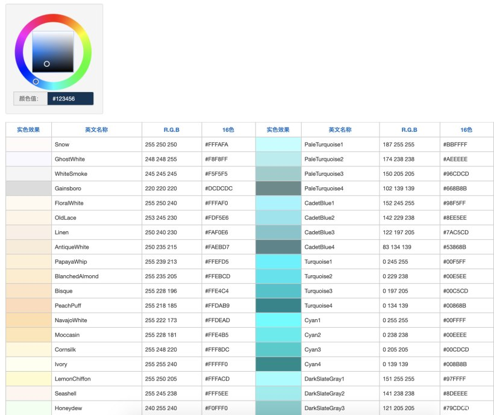

关于颜色，其实多网站都有，并且还能直接给你换算成16进制，直接搜RGB颜色就能出来多多类似这样的网站，车友们可以自己挑选出自己喜欢的颜色。

## 发动机音效设置

1、进入首页的Headunit
2、点击左角的Expert模式
3、进入HMI_SPEECH
4、搜索“Sound”
5、将两个跟Sound有关的项目都打开（改为active）
6、Code！
7、你会发现系统设置中了一个“发动机音效设置”，如图所示

注：根据测试，发动机音效可控制阀门！ 如330车型在Comfort模式，可通过设置发动机音效为“运动”来控制阀门开启。

## 仪表盘中间Logo

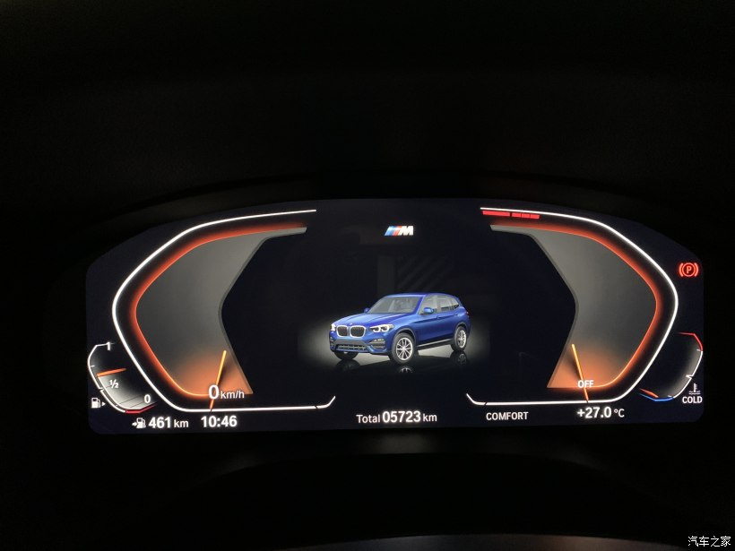

刷中间的小“M” logo。


Instrument Cluster界面下，点左下角进入Expert mode专家模式。
在搜索框内输入关键词Logo，找到LOGO_SCHRIFTZUG，点击进入。
其中几个X3开头的是X3专用的，当然，其他的也能选，找个自己喜欢的，选完后Code就行。

Instrument Cluster界面下，点左下角进入Expert mode专家模式。
在搜索框内输入关键词Logo，找到LOGO_SCHRIFTZUG，点击进入。
其中几个X3开头的是X3专用的，当然，其他的也能选，找个自己喜欢的，选完后Code就行。

有个Logo单独拎出来说下，如果需要图中的小“M” logo，在列表中选M是没有用的，要选msp。

## 瞬时油耗插件，最值改为20改30L/100KM

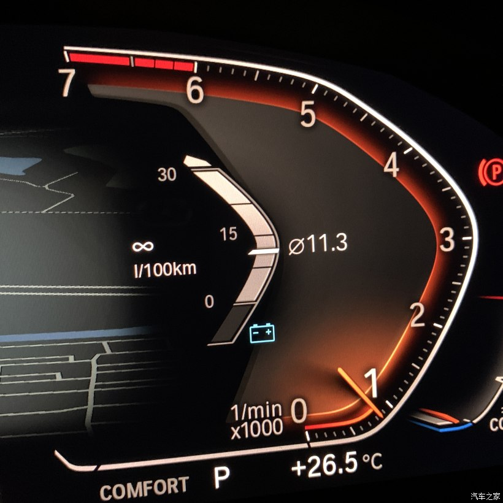

通过BC键，切换到瞬时油耗插件，限可改到30。

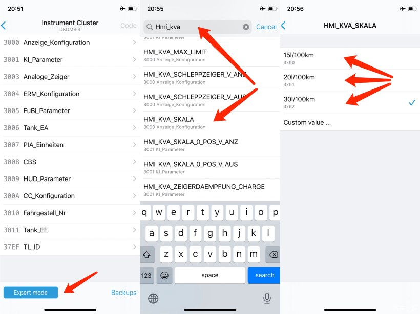

Instrument Cluster界面下，点左下角进入Expert mode专家模式。
在搜索框内输入关键词hmi_kva，找到HMI_KVA_SKALA，点击进入。
默认值为20l/100km，数值可从15l/100km，20l/100km，30l/100km中选，最后code就行。

Instrument Cluster界面下，点左下角进入Expert mode专家模式。
在搜索框内输入关键词hmi_kva，找到HMI_KVA_SKALA，点击进入。
默认值为20l/100km，数值可从15l/100km，20l/100km，30l/100km中选。

## 仪表盘和HUD的车速显示刷新率

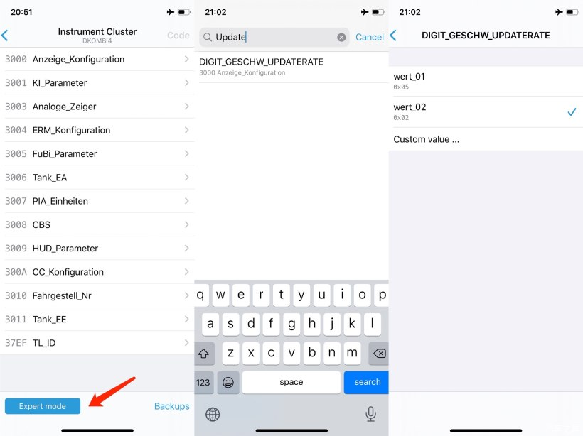

Instrument Cluster界面下，点左下角进入Expert mode专家模式。
在搜索框内输入关键词update，找到DIGIT_GESCHW_UPDATERATE，点击进入。
wert_01改成wert_02即可，点击角Code完成。

这个隐藏可以让仪表盘和抬头显示的车速刷新速率更快。
Instrument Cluster界面下，点左下角进入Expert mode专家模式。
在搜索框内输入关键词update，找到DIGIT_GESCHW_UPDATERATE，点击进入。
wert_01改成wert_02即可，点击角Code完成。

## Adaptive模式

1、进入Body Domain Controller
2、进入Expert模式（左角）
3、搜索“Adaptive”，找到3221 PfFesMaster
4、将FesAdaptiveWorldMode0改为Adaptive
5、返回，点击Code
6、进入headunit中expert模式（如）
7、找到FES_ADAPTIVE，将其修改为aktiv
到这步，你的车已经“拥有”ADAPTIVE模式了，接来，我教大家如何使用Comfort按钮切换至该模式（感谢我的朋友@斑驳的小沙包提供思路及方案）：
1、进入Body Domain Controller
2、进入Expert模式（左角）
3、搜索FesComfortWorldMode2并进入（这个的意思就，按Comfort按钮2，切换到哪个模式）
4、我们点击Custom value，将其手动更改为0A（代表Adaptive）
现在你可以试试，按comfort两，就可以切换至adaptive啦~

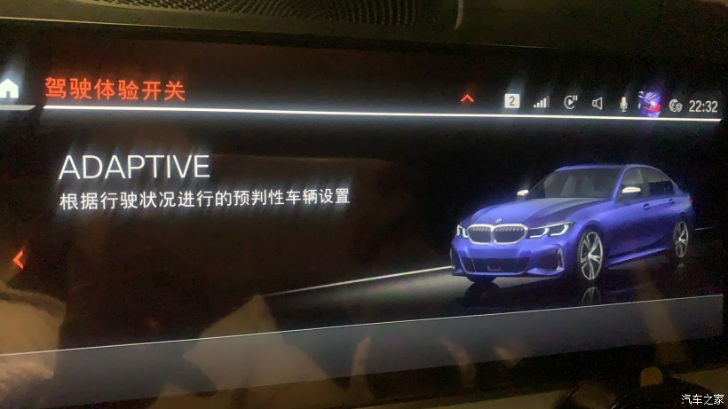

## SportPlus模式

1、进入Body Domain Controller
2、进入Expert模式（左角）
3、搜索“Sport”，找到3221 PfFesMaster
4、将FesSportWorldMode1改为SportExpert
5、返回，点击Code
6、进入headunit中expert模式（如）
7、找到FES_SPORT_EXPERT，将其修改为aktiv
8、轴的小伙伴们，享受Sport Plus模式吧！

## ComfortPlus模式

1、进入Body Domain Controller
2、进入Expert模式（左角）
3、搜索FesComfortWorldMode1
4、将FesComfortWorldMode1改为ComfortPlus
5、返回，点击Code
6、进入headunit中expert模式（如）
7、找到FES_COMFORT_PLUS，将其修改为aktiv
8、享受Comfort Plus模式吧！（根据美国的车友反映，Comfort Plus模式会比Comfort模式换挡更快，更顺，但改变大）

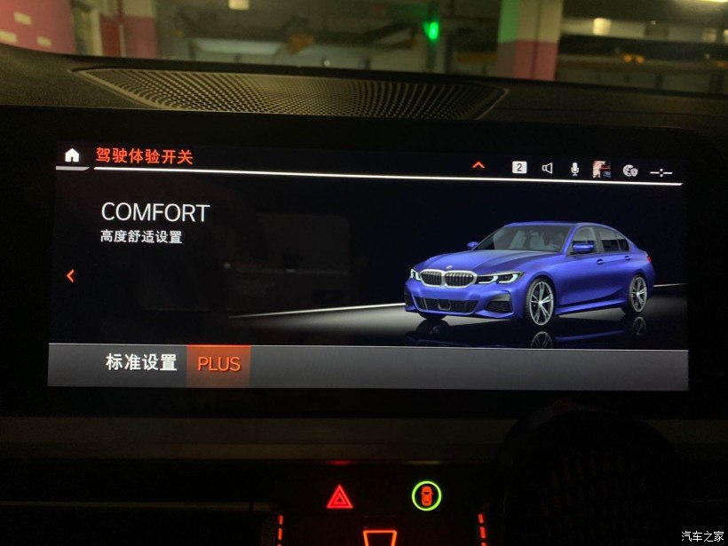

## ASD主动模拟声浪

注：ASD宝马的一个技术，在车辆换挡加速时，通过音响来模拟一部分声浪，达到自嗨的效果；

目前根据我们的测试，ID7的ASD已经集成在RAM High模块中，如果出厂哈曼卡顿的车型自带此模块，但ASD需要FSC证书才可开启（就像360行车记录仪一样），然后宝马只给6月前线的标轴耀夜车型发了该证书，因此目前ASD已绝版，暂时无解。

1、进入首页的Receiver Audio Module
2、打开Active Sound Design选项
3、Code！
4、标轴的小伙伴们，在Sport模式享受***声浪吧！（非常响，具体可以自己体验）

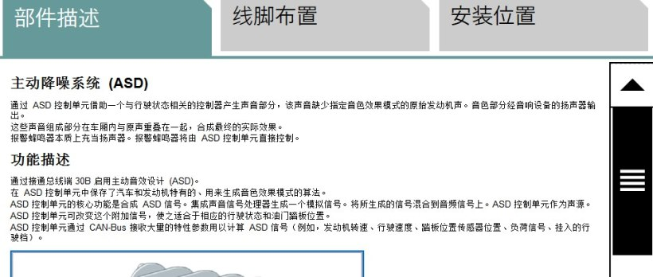


## 仪表盘（M仪表盘、Alpina仪表盘等）

1、进入首页的Instrument Cluster
2、将仪表盘Display改为M（默认应该BMW），也可以设置为Alpina，就会变成阿尔宾娜的仪表盘
3、Code！

注：若需要在M仪表盘增加转速红线，需要进入Instrument cluster里搜索DZM_VARIANTE，选择一个发动机类型，既可显示该发动机的转速红线（没有B48）

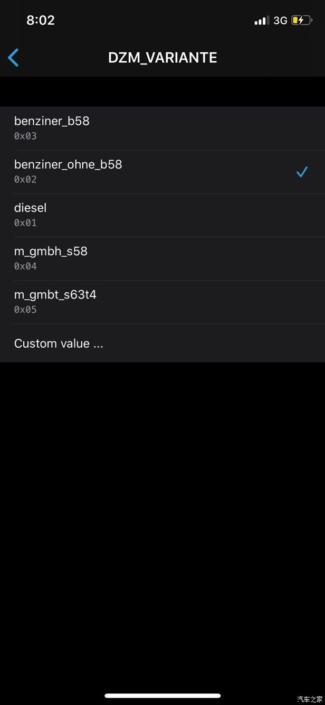

## 发动机音效设置

1、进入首页的Headunit
2、点击左角的Expert模式
3、进入HMI_SPEECH
4、搜索“Sound”
5、将两个跟Sound有关的项目都打开（改为active）
6、Code！
7、你会发现系统设置中了一个“发动机音效设置”，如图所示

注：根据测试，发动机音效可控制阀门！ 如330车型在Comfort模式，可通过设置发动机音效为“运动”来控制阀门开启。

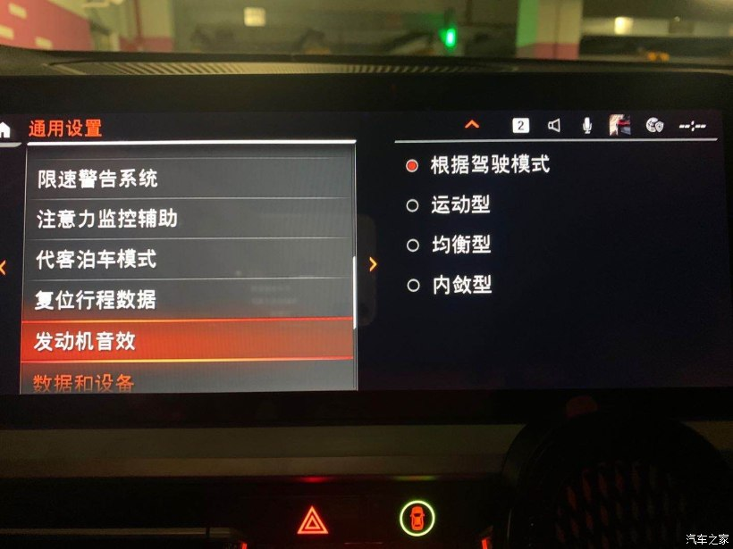

## AssitedDriverView辅助驾驶员视角

注： 需要本身带有辅助选装包
1、进入首页KOMBI
2、进入左角Expert模式
3、搜索以的选项，并将其修改为右边的aktiv
CB_FZG_UMGEBUNG_FAS: aktiv (01)
CB_PRESELECT_NAVI_ANSICHT_FZG_UMGEBUNG: aktiv (01)
PIA_FZG_UMGEBUNG_FAS: aktiv (01)
SICHT_ABSICHT_ENABLE: aktiv (01)
4、Code！
5、之后就可以将仪表盘显示修改为ADV模式，如图所示


## 各类仪表盘Logo

1、进入首页的Instrument Cluster
2、点击左角进入Expert模式
3、搜索LOGO_SCHRIFTZUG
4、在里面应该可以看到所有支持的Logo选线，包括M340i，M340d，M3 GTS等等（M3、M4的Logo需要在M仪表盘才生效）
5、Code！

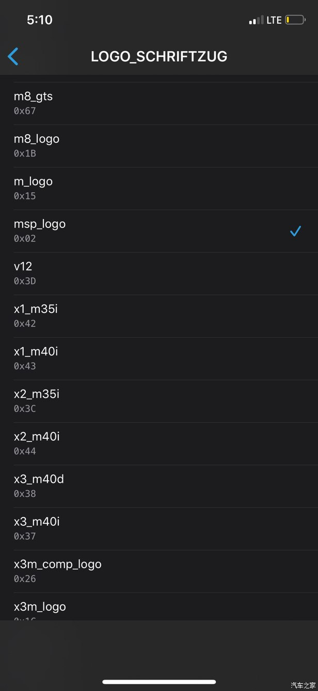

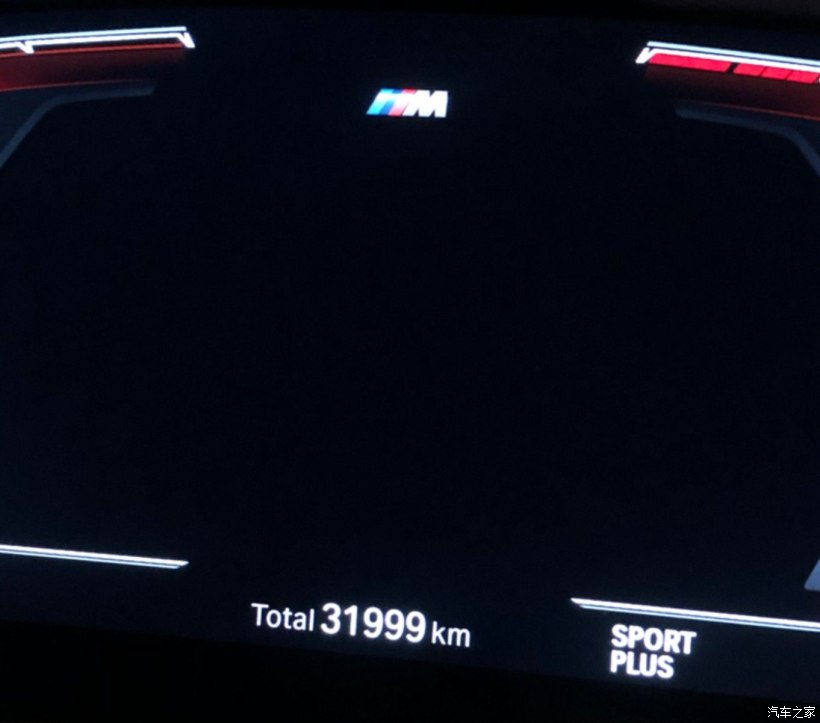

## 车机开机视频

1、进入首页的Headunit
2、点击Start Animation选项
3、选择一个你想要的开机动画，可刷选项包括iBMW、M、Alpina等等
4、Code！

## 发动后默认驾驶模式

1、进入首页的Body Domain Controller
2、进入expert模式，搜FesPiaDefaultLastUserMode
01 - Sport Mode
02 - Sport Plus Mode
03 - Sport Individual
04 - Comfort Mode (default)
05 - Comfort Plus Mode
06 - Comfort Individual
0A - Adaptive
07 - EcoPro Mode
08 - EcoPro Plus Mode
09 - EcoPro Individual
3、选择一个你想要启动后默认的驾驶模式，或修改为面的值
4、Code！

## 默认仪表盘速度表最大值改为330（默认260）

1、进入首页的Instrument Cluster
2、进入expert模式
3、搜索找到ag_mpa_msp_view，改成330
4、Code！

## 瞬时油耗最大值改为30L（默认20L）

1、进入首页的Instrument Cluster
2、进入expert模式
3、搜索找到hmi_kva_scala，改成30L
4、Code！

## 尾部日行灯（尾部示宽灯常亮）

1、进入首页的BODY DOMAIN CONTROLLER
2、进入expert模式
3、搜索找到3702LicFeatures / Feature_4 , 并改为打开状态（建议直接搜关键字feature_4）
4、Code！理论这个时候你的尾部日行灯已经开启了，但如果没有生效，可以往看以步骤
（可选择）
5、进入首页的Headunit
6、进入expert模式
7、搜索DAYDRIVING_LIGHT_REAR，并打开
8、Code！
9、然后你的外部照明设置界面里，会一个尾部日行灯的选项（该选项实测无效的，并能控制，但有车友反映刷了这个选项以后，尾部日行灯才可开启）

至此，你的尾部示宽灯，就会跟你的前日行灯一起亮，白天也可以做最靓的仔！

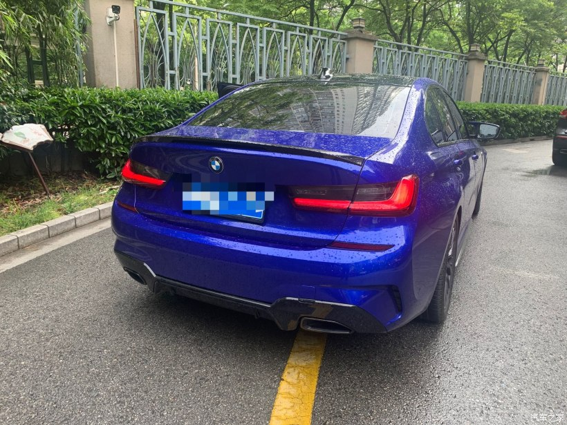


## 舒适模式“滑行”功能

1、进入首页的Instrument Cluster
2、进入expert模式
3、搜索找到Anzeige_Configuration / Segeln_In_Comfort_Modus, 并改为打开状态
4、Code！
5、进入首页的Headunit
6、进入expert模式
7、搜索找到以三项, 并改为打开状态：
Global_Conf_Sailing
Eff_Dyn_Sailing
Sailing_Counter
8、Code！
9、这个时候在设置里会一个“滑行”，如图

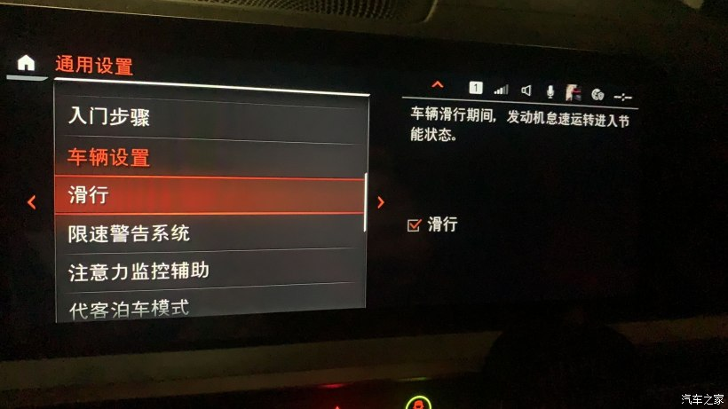

## “M菜单”功能（包含仪表盘RDC插件、仪表盘胎温胎压）

——M菜单
1、进入首页Headunit模块
2、进入Expert Mode，把3010 M_GMBH里 所有能打开的都打开
3、这个时候你就会发现车机里了一个M菜单，同时仪表盘会两个插件，胎压和涡轮压力等

——仅保留仪表盘胎压插件
在面的3010 M_GMBH里，会发现有一条m_vehicle_sp2018_rueko，把别的都关闭，就留它打开既可（建议要用带rueko的那个，那个会改变仪表盘的设置界面）

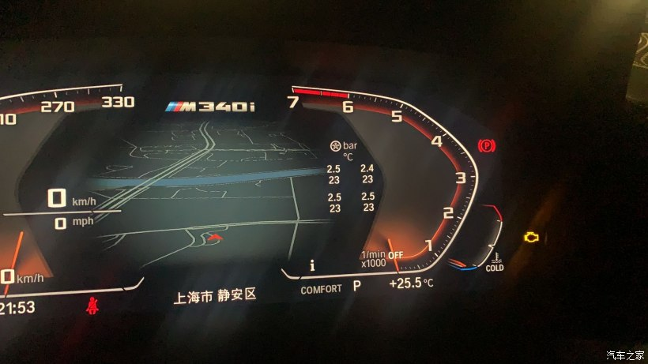

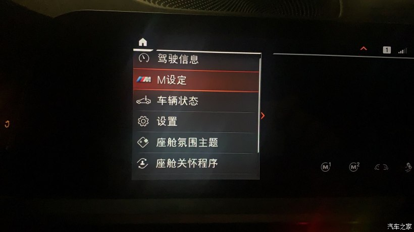


## M HUD（目前仅X3，5系等车型可刷写）

1. KOMBI模块打开所有mview相关的选项
2. HU模块打开M_GMBH面所有选项（有两项都叫m vehicle sp2018，选带rueko的那个）

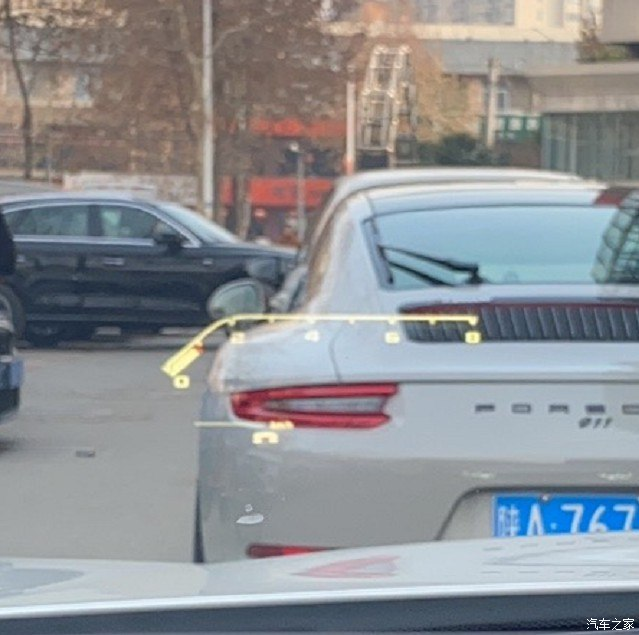

## 更改主机中车身颜色及车辆型号

1、进入首页Headunit模块
2、进入expert模式，搜索vehicle_colour
3、选择你想要的颜色既可
4、搜搜TRIM_LINE可更改车型配置（可以改成M340i的模型）

吐槽一句：国外的3系颜色真，羡慕


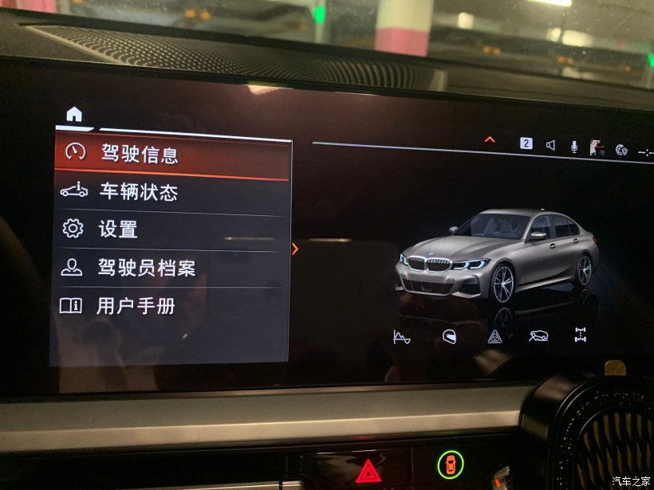

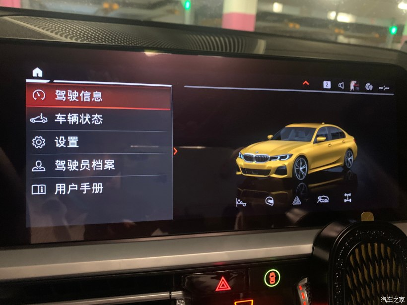

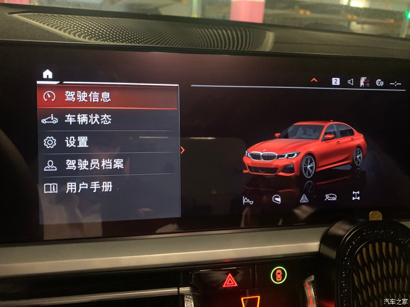

## 宝华音响设置菜单

进入headunit expert模式
搜索AUDIO-SYSTEM
改为alev4-Ram
会均衡器设置

注：根据车友亲测，提升止一丢丢，立体感增强蛮，环绕逼真了

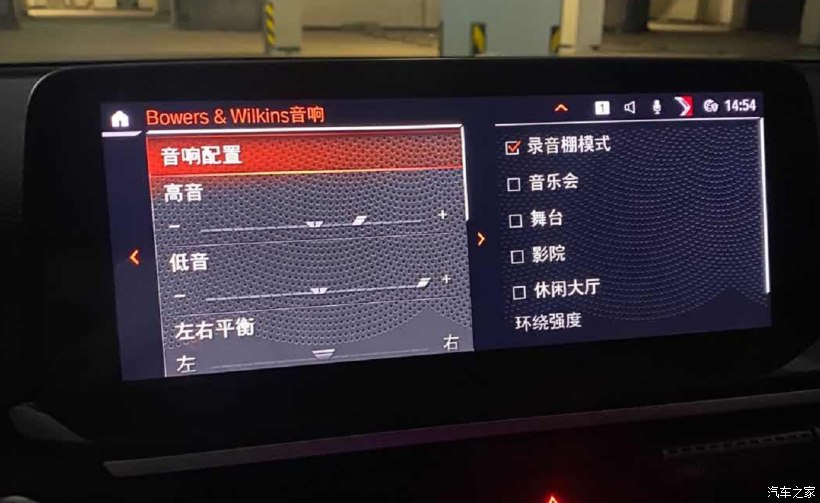

## 仪表盘电子车速显示刷新率

Instrument cluster(KOMBI)里搜DIGIT_GESCHW_UPDATERATE
数字越小刷新频率越快，默认05，改为02即为原来2.5倍


## 氛围灯颜色修改（本方法只适用于S2018A车型）新3系，新7系等

1、进入首页BDC的expert模式
2、改原车颜色，360A里找到LIC_LCI_COLOR_LIBRARY_DATA
可以看到原厂已经指定一组数字 ，其中每三个数字分别对应1个颜色，分别对应代号00，01,02,03，比如这里001A01就00。。。具体颜色如，然后在这里你可以点击CUSTOM_VALUE可以把任意一个代号的颜色（参考面），改为你想要的颜色的HEX 16进制数

注意这边一个颜色的HEX值会出现3次，分别对应同的位置的灯，以绿色#0cfeb1为例


63/64/65 => 前仪表+双前座车门LED条+后座车门LED
68/69/70 => 前座脚踏+后座脚踏
73/74/75 => 无线充电处LED + 顶棚LED气氛小灯

比如你如果想把绿色 都改成红色，假设红色AABBCC，那你就要把所有的3个0cfeb1都改成AABBCC，改完以后，原车的所有绿色都会变成红色

这原车的颜色HEX值：
\- 90,E0,90 - WHITE
\- D7,6E,14 - BRONZE
\- 93,1A,01 - ORANGE
\- 00,20FE - BLUE
\- 10,FE,32 - GREEN
\- 78,3C,FE - LILAC

3、改原车氛围灯组合，找到360D里的LIC_LCI_COLOR_PROFILES_DATA
里面这些数字01, 01, 01, 00, 02, 02, 02, 00, 00, 00, 03, 03, 03, 00, 04, 04, 04, 00, 05, 05, 05, 00
每两个数字代号代表一组氛围灯组合，01,02,03就对应面的01,02,03
然后按照顺序改代号，就可以更改原车的氛围灯组合

比如原车第一个选项古铜色单色，就0101，后面橙色白色组合，就0100

根据实测，有以几个颜色比较酷：
骚粉色 FF0066
冰蓝色 00CCFF

## 刷限速标志（需要esys）

通过刷以三个代码

注：刷限速标志需要电脑的设码程序esys，因为bimmercode暂时会开放KAFAS模块的刷写（涉及车辆安全）


注意这边要改成camera only,就优先通过KAFAS摄像头读取，如果没有摄像头就通过导航信息


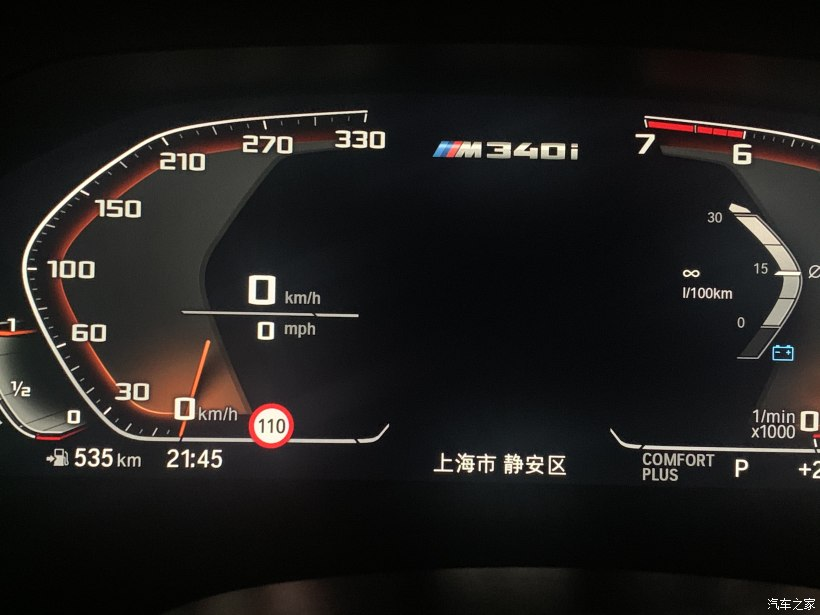

效果如图

## 刷XView指南针

Headunit的expert模式里搜x_view，开启既可

注：该功能本身给X系列的SUV提供的，所以有些传感器数据我们没有

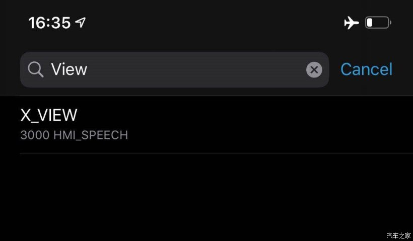

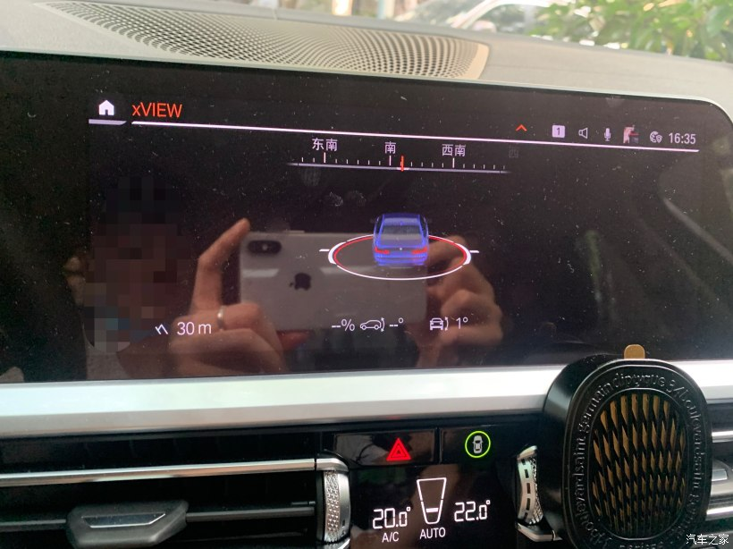

## 变道辅助（需要esys）

1、在BDC中搜索 SPURWECHSEL_ASSISTENT，改为 "aktiv"
2、在HU_MGU中搜索SPURWECHSELASSISTENT，改为 "gen_1"
3、在SAS2中搜索C_SWA_VORHANDEN_VOR，改为"NRHANDEN"

## Brake Force Display activation brake force (激活刹车警示加速度)

激活刹车显示刹车力度，默认为Medium braking (7 m/s²)，也就只能在加速度超过7 m/s²才能激活刹车提示功能，加速度数值越大说明刹车越急，所以加速度数值越闪烁机会时间更多更，具体数值可修改为Weak braking (5 m/s²)，Medium braking (7 m/s²)，Hard braking (8 m/s²)。

## USB充电电流限制

在headunitexpert里搜current，有个最大充电电流

## 电尾门 如何刷钥匙、按钮一键开启关闭 

HKL(HKFM)PHY_TASTER nichtaktiv改为aktivHKL(HKFM)REV_FBD nichtaktiv改为aktivHKL(HKFM)TASTER_FBD nichtaktiv改为aktivHKL(HKFM)SCH_TOEHKI nichtaktiv改为aktiv

