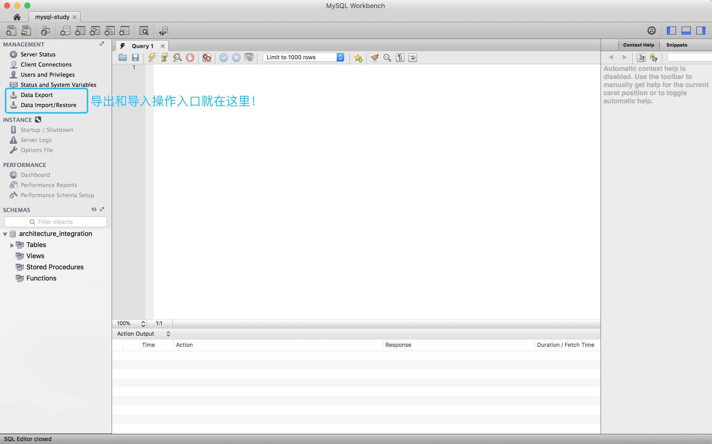
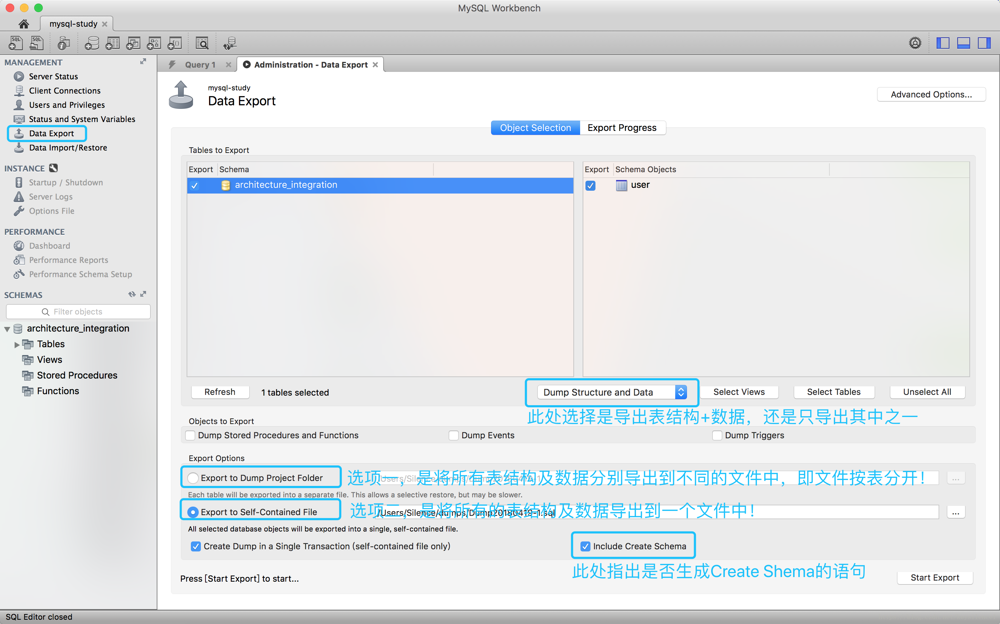
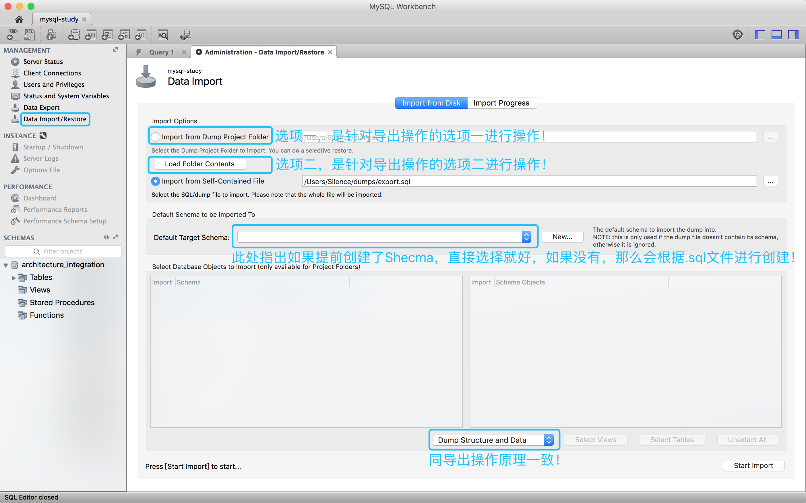

[TOC]

# MySql Workbench数据库导出和导入

# 前言

现如今大家基本上都是使用客户端操作数据库，包括数据库迁移，下面来详解一下如何使用MySql Workbench来做数据库导出和导入操作，很简单，但是有图解！

# 正文

## 操作入口

## 数据库导出

点击左侧的[Data Export]之后，呈现上面的图，按照说明选择自己的方式，然后点击[Start Export]就开始导出了。

## 数据库导入

点击左侧[Data Import/Restore]之后，呈现上面的图，按照说明选择自己的方式，然后点击[Start Import]就开始导入了。

