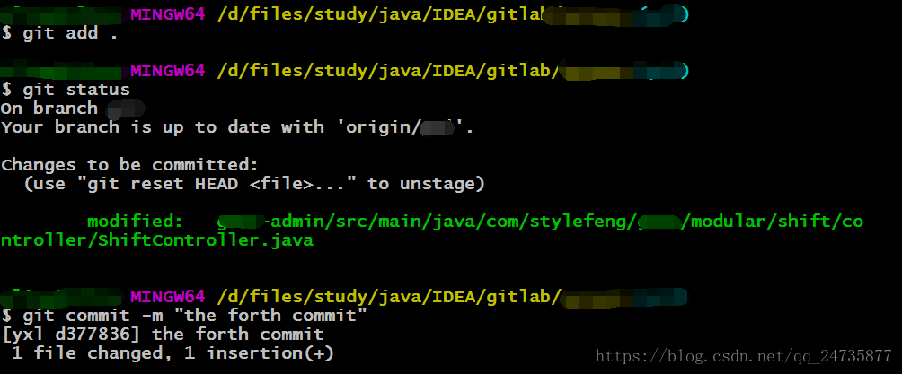

# Git常用操作

[TOC]

## 查询当前分支的版本号(commit id)

```shell
git rev-parse HEAD
```

## git pull 并强制覆盖本地修改

拉取覆盖本地更改，那么就好像工作树是干净的那样进行合并，那么请清理工作树：

```shell
git reset --hard
git pull
```

如果存在未跟踪的本地文件，则可以将`git clean`其删除。使用`git clean -f`删除未跟踪文件，`-df`删除未跟踪的文件和目录，并`-xdf`删除未跟踪或忽略的文件或目录。

另一方面，如果您想以某种方式保留本地修改，则可以在存储之前使用存储隐藏它们，然后再重新应用它们：

```shell
git stash
git pull
git stash pop
```

我认为从字面上*忽略*更改没有任何意义，尽管-pull的一半是合并，并且它需要将提交的内容版本与其获取的版本合并。

> 参考
>
>  - [Git Pull While Ignoring Local Changes?](http://stackoverflow.com/questions/4157189/git-pull-while-ignoring-local-changes)

## git pull 时发生冲突之解决合并

### 第一步

首先我在pull之前，git add . 和 git commit -m "" 了，最后还push了



### 第二步

然后开始pull，执行git pull origin master 告诉你存在三个冲突(其实有一个是内容冲突，另外两个是你新增部分提示你delete)，提示你修复冲突后再commit


### 第三步

关闭你的开发工具（IDEA、eclipse等），用编辑器打开提示你内容有冲突的文件(其实直接vim打开也是可以，但是不建议使用)，删掉冲突部分，然后保存(vim是删掉之后，按Esc 、然后：wq保存退出)。

### 第四步

git status ，可以看到红色部分提示 You have unmerged paths.

 (fix conflicts and run "git commit") 


### 第五步

然后分别git add 三个的文件。


### 第六步

然后 git status 可以看到没有红色字体的提示了。

All conflicts fixed but you are still merging.
 (use "git commit" to conclude merge)


### 第七步

最后git add . 。然后git commit 。然后pull就没问题了。


## git修改分支名称

```shell
git branch -a #查看所有分支
git branch -r #查看远程分支
git branch -v #查看本地分支所关联的远程分支 
```

假设分支名称为`oldName`
想要修改为 `newName`

### 1. 本地分支重命名(还没有推送到远程)

```shell
git branch -m oldName newName
```

### 2. 远程分支重命名 (已经推送远程-假设本地分支和远程对应分支名称相同)

- #### a. 重命名远程分支对应的本地分支

```shell
git branch -m oldName newName
```

- #### b. 删除远程分支

```shell
git push --delete origin oldName
```

- #### c. 上传新命名的本地分支

```shell
git push origin newName
```

- #### d.把修改后的本地分支与远程分支关联

```shell
git branch --set-upstream-to origin/newName
```

## git查看远程仓库地址命令：

```bash
git remote -v
```

## 修改git远程仓库地址

```shell
git remote set-url origin git@github.com:
```

