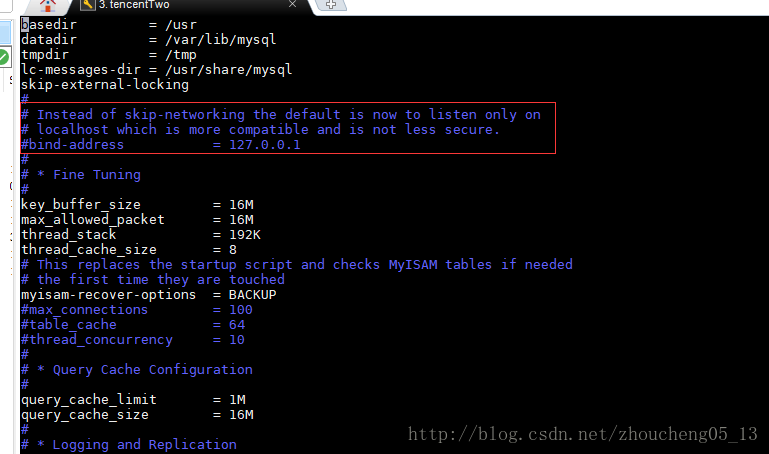

# [mysql 5.7.20, for Linux (x86_64) 配置远程连接 10061问题解决方案]( https://blog.csdn.net/zhoucheng05_13/article/details/78589025 )

最近在用workbench远程连接数据库是一直提示Can’t connect to MySQL server on ‘192.168.1.5’ (10061）的错误，百度了各种解决方法，大部分都没用。写这篇博客的原因是想要分析网络上教程到底适用于那些情况。

## 解决方案

MySQL默认是不可以通过远程机器访问的,通过下面的配置可以开启远程访问 。
要让服务器的mysql能够远程连接，至少需要两个步骤：

#### 一、在mysql中为用户赋权

在linux中，执行下列命令：

- 1.登录数据库

```
root@VM-32-73-ubuntu:/etc/mysql/mysql.conf.d# mysql -uroot -p
Enter password:
Welcome to the MySQL monitor.  Commands end with ; or \g.
Your MySQL connection id is 7
Server version: 5.7.20-0ubuntu0.16.04.1 (Ubuntu)

Copyright (c) 2000, 2017, Oracle and/or its affiliates. All rights reserved.

Oracle is a registered trademark of Oracle Corporation and/or its
affiliates. Other names may be trademarks of their respective
owners.

Type 'help;' or '\h' for help. Type '\c' to clear the current input statement.
```

- 2.使用mysql数据库并查询用户：

```
mysql> use mysql;
Reading table information for completion of table and column names
You can turn off this feature to get a quicker startup with -A

Database changed
mysql> select host,user from mysql.user;
+-----------+------------------+
| host      | user             |
+-----------+------------------+
| localhost | debian-sys-maint |
| localhost | mysql.session    |
| localhost | mysql.sys        |
| localhost | root             |
+-----------+------------------+
5 rows in set (0.00 sec)
```

user字段表示mysql中的所有用户，host表示相应用户能从哪儿登录。我们看到目前所有的host都是localhost，也就是说，当前所有用户都只能从本机登录。因此，我们需要添加一个能从其他地址登录的用户。

- 3.创建用户并赋权

```
mysql>  GRANT ALL PRIVILEGES ON *.* TO 'usrabc'@'%' IDENTIFIED BY 'usrabc' WITH GRANT OPTION;
Query OK, 0 rows affected (0.02 sec)

mysql> select host,user from mysql.user;
+-----------+------------------+
| host      | user             |
+-----------+------------------+
| %         | usrabc           |
| localhost | debian-sys-maint |
| localhost | mysql.session    |
| localhost | mysql.sys        |
| localhost | root             |
+-----------+------------------+
6 rows in set (0.00 sec)
```

这里的%表示所有的地址均可以通过账户usrabc登录，你也可以指定为具体的ip地址。
到此，数据库用户创建好了，权限也赋予了，但此时远程连接仍然会失败。

#### 二、配置文件的修改

网上的很多教程说“修改/etc/init.d/my.cnf文件，将文件中的“bind-address = 127.0.0.1”改为“bind-address = 0.0.0.0”，让所有IP都能访问”。但是当我进入该目录后发现该文件中只有两行：

```
#
# The MySQL database server configuration file.
#
# You can copy this to one of:
# - "/etc/mysql/my.cnf" to set global options,
# - "~/.my.cnf" to set user-specific options.
#
# One can use all long options that the program supports.
# Run program with --help to get a list of available options and with
# --print-defaults to see which it would actually understand and use.
#
# For explanations see
# http://dev.mysql.com/doc/mysql/en/server-system-variables.html

#
# * IMPORTANT: Additional settings that can override those from this file!
#   The files must end with '.cnf', otherwise they'll be ignored.
#

!includedir /etc/mysql/conf.d/
!includedir /etc/mysql/mysql.conf.d/
```

并没有bind-address = 127.0.0.1。于是阅读注释，注意到这句：

```
# * IMPORTANT: Additional settings that can override those from this file!
```

意思是其他配置文件中的配置会覆盖本文件。于是查看其他的配置文件，最后终于在`/etc/mysql/mysql.conf.d/mysqld.cnf`中找到了字段“bind-address = 127.0.0.1”，将其注释掉：

最后远程使用usrabc用户测试，终于成功连接！

## 问题

#### 一、my.ini与my.cnf的区别

如果你去网上搜索远程连接mysql数据库，那么很多博客都是叫你去修改mysql文件夹下的my.ini或者my.cnf文件。首先需要明确，my.ini是windows安装的的mysql下的配置文件，位置就在安装目录下。而my.cnf是linux下安装的mysql的配置文件，位置在`/etc/mysql/my.cnf`。也就是说，如果你要远程连接的数据库在Windows系统上，那么你应该去找my.ini来修改，而如果是在linux系统长，那么就去找my.cnf修改。

#### 二、Mysql5.7的my.cnf中并没有配置

网上的很多教程都已经过时了，在mysql5.7中，my.cnf是没有配置东西的，要修改配置，必须要去路径`/etc/mysql/mysql.conf.d/`下修改mysqld.cnf文件才行。


