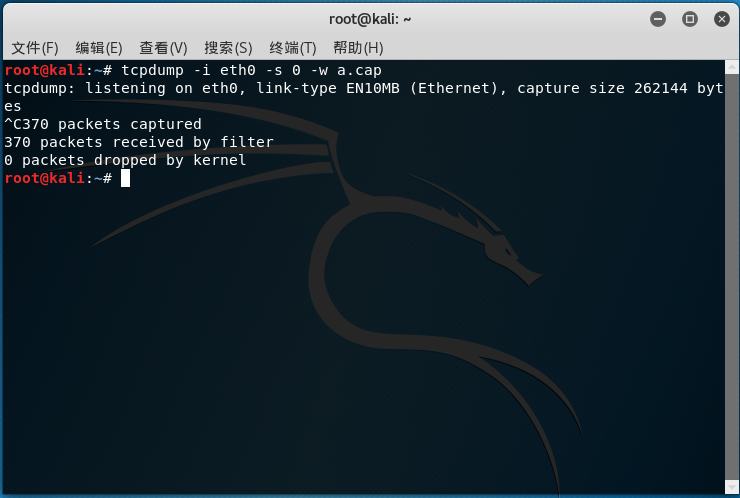
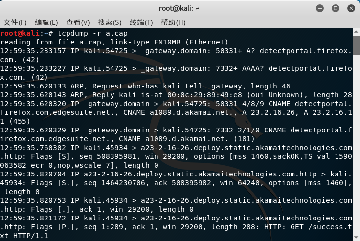
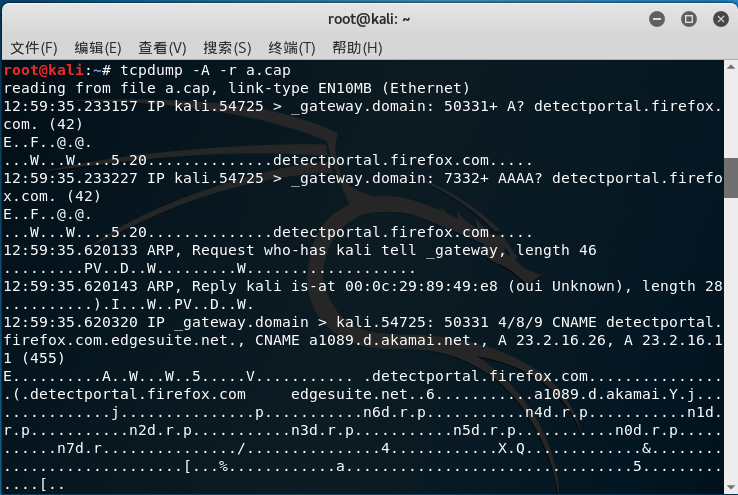
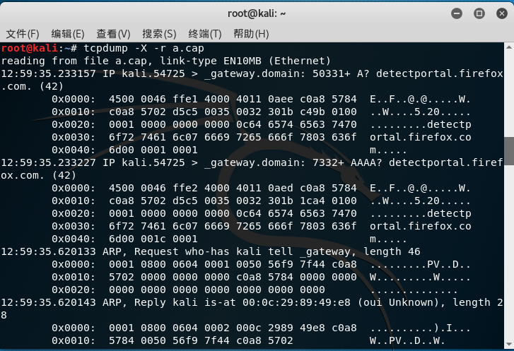
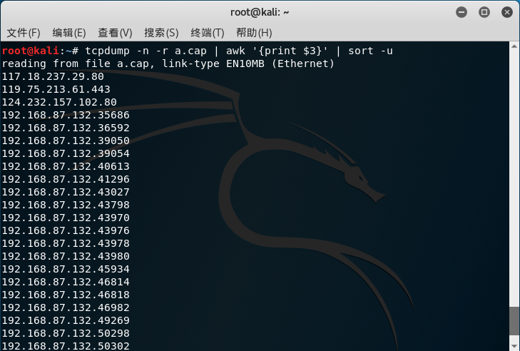
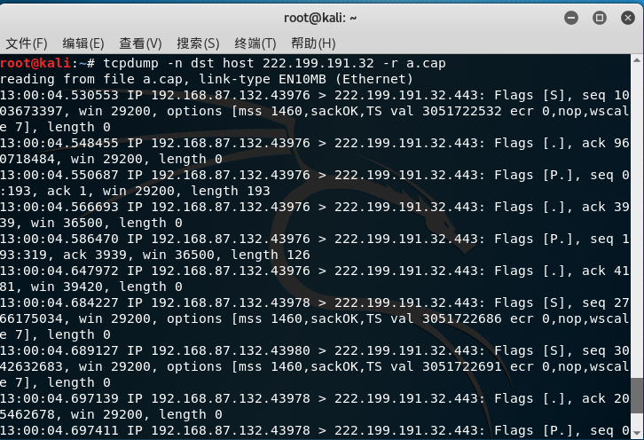
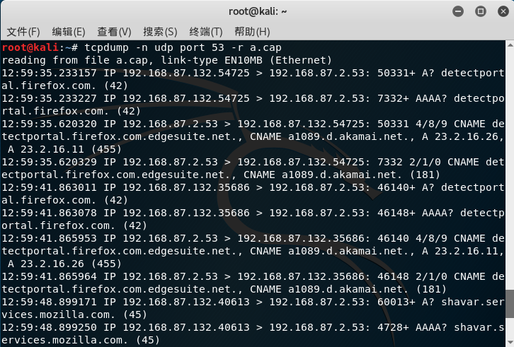
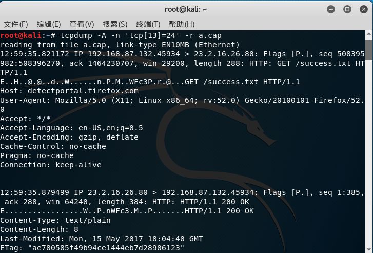

# [Kali学习笔记3：TCPDUMP详细使用方法](https://www.cnblogs.com/xuyiqing/p/9019115.html)

Kali自带Wireshark，但一般的Linux系统是不带的，需要自行下载，并且过程略复杂

而纯字符界面的Linux系统无法使用Wireshark

但是，所有Linux系统都会安装TCPDUMP：一种基于命令行的抓包工具

 

注意事项：默认只抓68字节，能够获得基本信息，但无法做到完整分析

 

1：开始抓包，-i 参数：eth0网卡，-s 0 表示抓取全部，-w a.cap 表示把抓到的内容放在a.cap文件中

随意打开一个网站，然后Ctrl+c结束，发现抓了370个包



 

接下来我们看看抓取的包：

总览信息：



 

 

详细查看：这里的-A 意思是以ASCII码解析



 

还可以用十六进制的方式查看（-X）：



 

 

刚才是抓取所有的包

类似Wireshark，TCPDUMP也有过滤器：

 

比如我这里只抓80端口的数据包：


 

 

除了抓包筛选器，还可以显示筛选（抓到之后筛选自己需要的数据包）

 

1.通过Linux系统手动筛选



 

 

-n 的意思是不解析域名，awk分隔开只看其中的某一列，sort -u 去重

 

2.用TCPDUMP的方法：

 

这里我只抓取来源是222.199.191.32的数据包

 


 

不止来源，这里设置只抓目的IP为：222.199.191.32的数据包

 



 

再比如：只抓域名解析数据包：

 



 

这些是基础筛选，还有高级筛选：

 

TCP包头结构如下，8个位为一个字节，每一行为四个字节，一共是32个位

源端口占了前面的16个位，两个字节；目的端口一样；第四行第三列是标签位

```
0                  1                    2                   3

0 1 2 3 4 5 6 7 8 9 0 1 2 3 4 5 6 7 8 9 0 1 2 3 4 5 6 7 8 9 0 1

+-+-+-+-+-+-+-+-+-+-+-+-+-+-+-+-+-+-+-+-+-+-+-+-+-+-+-+-+-+-+-+-+

|          Source Port          |     Destination Port          |

+-+-+-+-+-+-+-+-+-+-+-+-+-+-+-+-+-+-+-+-+-+-+-+-+-+-+-+-+-+-+-+-+

|                        Sequence Number                        |

+-+-+-+-+-+-+-+-+-+-+-+-+-+-+-+-+-+-+-+-+-+-+-+-+-+-+-+-+-+-+-+-+

|                      Acknowledgment Nuber                     |

+-+-+-+-+-+-+-+-+-+-+-+-+-+-+-+-+-+-+-+-+-+-+-+-+-+-+-+-+-+-+-+-+

|  Date  |      |C|E|U|A|P|R|A|F|                               |

| Offset |  Res.|W|C|R|C|S|S|Y|I|         Windwos               |

|        |      |R|E|G|K|H|T|N|N|                               |

+-+-+-+-+-+-+-+-+-+-+-+-+-+-+-+-+-+-+-+-+-+-+-+-+-+-+-+-+-+-+-+-+

|            Checksum           |     Urgent Pointer            |

+-+-+-+-+-+-+-+-+-+-+-+-+-+-+-+-+-+-+-+-+-+-+-+-+-+-+-+-+-+-+-+-+

|                      Options               |     Padding      |

+-+-+-+-+-+-+-+-+-+-+-+-+-+-+-+-+-+-+-+-+-+-+-+-+-+-+-+-+-+-+-+-+

|                                data                           |

+-+-+-+-+-+-+-+-+-+-+-+-+-+-+-+-+-+-+-+-+-+-+-+-+-+-+-+-+-+-+-+-+
```

 

根据这张图，我需要查ACK和PSH标志位，是第14个字节第00110000（24）位

这样写即可：

TCPDUMP -A -n 'tcp[13]=24' -r a.cap

试试：

