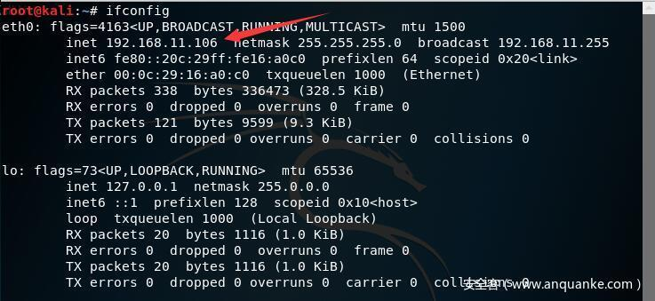
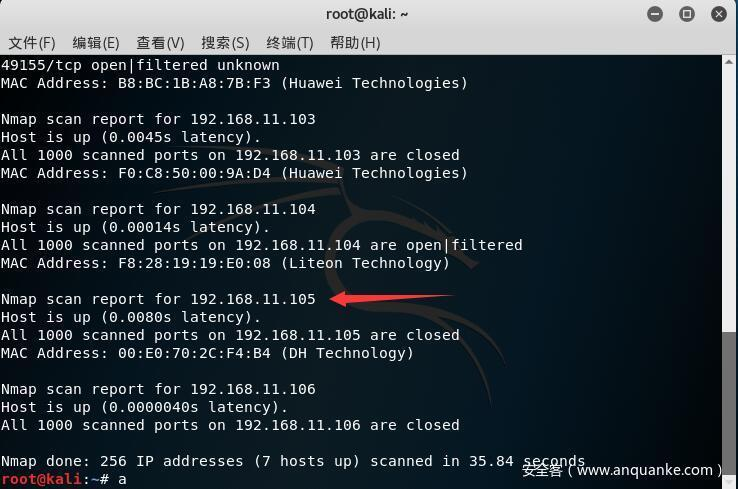
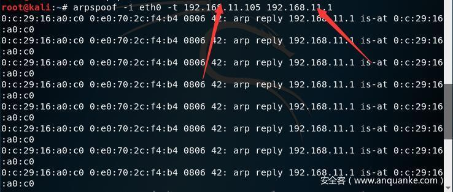
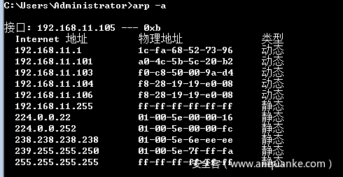

# 浅谈Arp攻击和利用Arp欺骗进行MITM

 

## 索引

arp欺骗也是很古老的渗透手段了，主要起着信息收集的作用，比如你可以利用欺骗获取对方的流量，从流量分析你认为重要的信息，例如某某账号密码。或是利用Arp攻击，切断局域网内某一用户的网络访问（单向欺骗）。下面着重讲一下中间人攻击的原理，配和实战演练分析，不对的地方，还请大家多多反馈和包涵！

 

## MITM

**借用Wiki百科的一个比喻来理解MITM（中间人攻击）：**

假设爱丽丝（Alice）希望与鲍伯（Bob）通信。同时，马洛里（Mallory）希望拦截窃会话以进行窃听并可能在某些时候传送给鲍伯一个虚假的消息。

1. 首先，爱丽丝会向鲍勃索取他的公钥。如果Bob将他的公钥发送给Alice，并且此时马洛里能够拦截到这个公钥，就可以实施中间人攻击。马洛里发送给爱丽丝一个伪造的消息，声称自己是鲍伯，并且附上了马洛里自己的公钥（而不是鲍伯的）。
2. 爱丽丝收到公钥后相信这个公钥是鲍伯的，于是爱丽丝将她的消息用马洛里的公钥（爱丽丝以为是鲍伯的）加密，并将加密后的消息回给鲍伯。马洛里再次截获爱丽丝回给鲍伯的消息，并使用马洛里自己的私钥对消息进行解密，如果马洛里愿意，她也可以对消息进行修改，然后马洛里使用鲍伯原先发给爱丽丝的公钥对消息再次加密。当鲍伯收到新加密后的消息时，他会相信这是从爱丽丝那里发来的消息。

我们的身份就是Mallory，我们希望欺骗Alice和Bob，让其认为我们是交互的正确目标，从而来获取他们之间交流的信息。

 

## Arp攻击分析

想要进行中间人攻击，先理解最基础的arp攻击

### Arp协议

ARP（Address Resolution Protocol，地址解析协议）是一个位于TCP/IP协议栈中的网络层，负责将某个IP地址解析成对应的MAC地址。

以太网（局域网）进行信息传输时，不是根据IP地址进行通信，因为IP地址是可变的，用于通信是不安全的。然而MAC地址是网卡的硬件地址，一般出厂后就具有唯一性。ARP协议就是将目标IP地址解析成MAC地址进行验证通信。

### Arp通信过程

1. 每台主机都会在自己的ARP缓冲区建立一个ARP列表（生命周期二十分钟），用于表示IP地址和MAC地址的对应关系。
2. 主机A若想和主机B通信，首先主机A会查询Arp缓存表（后面称ip-mac缓存表）是否有B主机对应的ip-mac，有的话就将B主机的mac地址封装到数据包发送。若没有的话，主机A会向以太网发送一个Arp广播包，告诉以太网内的所有主机自己的ip-mac，并请求B主机（以ip来表示B主机）的mac地址。当B主机收到Arp广播包后，确认A主机是想找自己的mac地址，就会对A主机进行回应一个自己的mac地址。A主机就会更新自己的ip-mac缓存表，同时B主机也会接收A主机的ip-mac对应关系到自己的ip-mac缓存表。

### Arp协议缺陷

ARP协议信任以太网所有的节点，效率高但是不安全。这份协议没有其它字协议来保证以太网内部信息传输的安全，它不会检查自己是否接受或发送过请求包，只要它就收到的arp广播包，他就会把对应的ip-mac更新到自己的缓存表

### 网关的理解

在wiki中这样定义网关：

在计算机网络中，网关（英语：Gateway）是转发其他服务器通信数据的服务器，接收从客户端发送来的请求时，它就像自己拥有资源的源服务器一样对请求进行处理。有时客户端可能都不会察觉，自己的通信目标是一个网关

区别于路由器（由于历史的原因，许多有关TCP/IP的文献曾经把网络层使用的路由器（英语：Router）称为网关，在今天很多局域网采用都是路由来接入网络，因此现在通常指的网关就是路由器的IP），经常在家庭中或者小型企业网络中使用，用于连接局域网和Internet。

网关也经常指把一种协议转成另一种协议的设备，比如语音网关。

网关可以把内网ip转化为外网ip，从而向服务器发出请求。也可以把外网Ip获得的数据包转换成内网ip发给内网主机。

### Arp攻击原理

根据以上说的arp协议缺陷，如果我们冒充网关主机C，不停的向以太网发送自己的ARP广播包，告知自己的ip-mac，此时其它主机就会被欺骗，更新我们C的ip-mac为网关主机的ip-mac，那么其它主机的数据包就会发送到C主机上，因为没有发给真正的网关，就会造成其它主机的网络中断。

 

## Arp攻击实操

### 环境

攻击主机A：Kali—>ip: 192.168.11.106
被攻击主机B： windows 7—>ip: 192.168.11.105
网关主机C： 192.168.11.1

我的Kali是在虚拟机下，需要Bridge连接保证机器在同一网段，很多人用Nat连接来转发，在实战的轻快下，需要更改虚拟机的网络配置。

网络配置如图:
[](https://p5.ssl.qhimg.com/t010ded0516622b1c75.png)

### 实操

这里模拟真实环境，攻击主机A和被攻击主机B在同一局域网下。
**1. 先用命令查看一下ip是否正确：**
Kali：
[](https://p5.ssl.qhimg.com/t01140b6dbaec16750c.jpg)
可以看到ip是192.168.11.106
Windows7：
[](https://p5.ssl.qhimg.com/t01676bafc8546dc6d5.png)
ip是192.168.11.105，网关地址是192.108.11.1
**2. 用nmap查看当前网端的活跃主机**

```
nmap -sF 192.168.11.0/24
```

[](https://p3.ssl.qhimg.com/t01160b3ef83d34572e.jpg)

扫描得到如图活跃主机，可以看到我们的主机B。当然获取Ip的途径不可能这么简单，你也可以用fping的方法来分析，之前我用fping探测局域网windows10的主机，发现Ping不通，win10防火墙还是有点东西。不过你可以根据fping的发送包来推断主机是否真正存活，具体可以google一下fping的用法，这里给推荐一个链接

[Kali信息收集：Fping](https://www.cnblogs.com/dunitian/p/5074783.html)

**3. 检查被攻击主机是否可以正常上网**
[](https://p4.ssl.qhimg.com/t010225c59bde160166.png)
百度正常访问

**4. 利用Arpspoof进行欺骗攻击**
Kali自带的Arpspoof可以很好的进行欺骗，man arpspoof查看官网手册（网上翻译）：

```
名字 
    arpspoof # 截获交换局域网中的数据包

用法
    arpspoof [-i interface] [-c own|host|both] [-t target] [-r] host

描述
    # arpspoof通过伪造的ARP响应包改变局域网中从目标主机（或所有主机）到另一个主机（host）的数据包转发路径。这是交换局域网中嗅探网络流量的一种极为有效的方法。内核IP转发（或如fragrouter这样的、用户层面的、能完成同样功能的软件）必须提前开启。

参数
    -i interface
        # 指定要使用的接口（即指定一块网卡）

    -c own|host|both
        # 指定在恢复ARP配置时使用的硬件地址；当在清理（cleaning up）时，数据包的源地址可以用自己的也可以用主机（host）的硬件地址。使用伪造的硬件地址可能导致某些配置下的交换网络、AP网络或桥接网络通信中断，然而它比起默认值————使用自己的硬件地址要工作地更为可靠。

    -t target
        # 指定一个特殊的、将被ARP毒化的主机（如果没有指定，则认为是局域网中所有主机）。重复可以指定多个主机。

    -r  
        # 毒化两个主机（目标和主机（host））以捕获两个方向的网络流量。（仅仅在和-t参数一起使用时有效）

    host   #你想要截获数据包的主机 (通常是网关)。
```

**5. 主机A作为网关主机欺骗**
命令语句

```
arpspoof -i eth0 -t 192.168.11.105 192.168.1.1
```

[](https://p3.ssl.qhimg.com/t01364b901401aae698.jpg)
执行命令，Kali会向主机B发送ARP响应包，响应包的内容是Kali的ip-mac地址，而响应包里的ip则是网关主机ip地址。每一行代表一个响应包。从左到右：自己Kali的mac、主机B的mac、帧类型码(0806，代表ARP包)、包大小、包内容。

**6. 被攻击主机B网络中断**
我们在B主机用`arp -a`查看一下是否欺骗成功
[](https://p1.ssl.qhimg.com/t0178e6ea7a6cacc21f.png)
可以看到，网关主机C和攻击者主机A的mac地址相同，欺骗成功

在kali终端输入control + c 可以停止，清空并恢复原来正确的arp相应包，主机重新恢复联网状态

 

## 基于Arp攻击理解下的MITM

在前面Arp成功进行攻击后，我们开始作为中间人进行欺骗，需要设置ip转发，获取目标主机B的流量，其后配合其它工具(drifnet)等进行进一步嗅探。

值得一提的是，我们的Arp攻击也是欺骗，但它是单向欺骗，冒充网关主机来欺骗目标主机。实际中，中间人攻击一般是双向欺骗。即作为中间人，主机A双向欺骗主机B与C获得通信内容，但是不破坏通信数据的传输。为了不影响B与C传输的数据丢失，主机A开启ip转发，开启后来自B主机的数据包经过A主机的Kali后转发给主机C。欺骗两个主机B和C后，我们就能嗅探到双向数据包。

如果你的kali在虚拟机，那么以下步骤均需要一个外置的usb无线网卡。在虚拟机中，网络的连接比较复杂，而Ip转发很大程度上取决于网卡性能。如果你是在虚拟机中Kali进行转发，基本都会失败，因为笔记本的内置无限网卡满足不了需求。由于放假在家我的usb无线网卡落在了寝室..下面仅以文字给大家介绍攻击的思路和流程，还请见谅…….

### linux的ip转发

linux因为系统安全，是不支持IP转发的，其配置文件写在/proc/sys/net/ipv4的ip_forward中。默认为0，需要修改为1。

开启方法大致有两种：

1. 只接进入文件修改

   ```
   cd /proc/sys/net/ipv4
   ls
   cat ip_forward
   #显示结果为0
   echo 1 > ip_forward
   cat ip_forward
   #显示结果为1，修改成功
   ```

2. 使用echo

   ```
   # echo  "1"> /proc/sys/net/ipv4/ip_forward
   ```

### 对网关和目标主机B的双向欺骗

这里进行一步执行，选用第二种Ip转发手段
命令如下：

```
root@kali:~# echo 1 > /proc/sys/net/ipv4/ip_forward && arpspoof -i eth0 -t 192.168.11.105 -r 192.168.11.1
```

### 利用driftnet进程监控

持续保持欺骗，再重新打开一个命令终端。
输入命令：

```
root@kali:~# driftnet -i eth0
```

跳出来的drift窗口即会显示本机正在浏览的图片

### 使用ettercap工具获取密码

1. 打开新的终端，输入 attercap -G 启动工具
2. 点击Sniff -> unified sniffing，选择要抓包的网卡，默认是自己的网卡eth0，点确定
3. 然后单击Hosts -> Scan for host，待扫描完成后再次Scan for host，此时可以看到ettercap-NG已经扫描的主机列表
4. 选择攻击目标，点击192.168.11.105的ip地址，点击Add to Target 1 ，然后选择网关的ip地址192.168.11.1，点击Add to Target 2
5. 明确目标攻击方式：点击Mitm -> arp poisoning -> Sniff remote connections -> 确定
6. 开始监听：start -> Start sniffing

工具就会抓取主机B的数据包和主机C返回的数据包,分析http post请求可以判断账号密码信息。

### urlsnarf：获得受害者的HTTP请求

输入命令：

```
root@kali:~# urlsnarf -i eth0
```

### 使用Wireshark抓包

使用Wireshark抓取所有的数据包，过滤分析不同请求，类似于ettercap。
例如，要找HTTP POST请求，过滤，查看明文密码，一般是以POST形式上传的账号密码。

 

## 关于Arp欺骗的防御

[](https://p4.ssl.qhimg.com/t019370399a03c046c4.png)
防御原理很简单，就是不让攻击者肆意表明自己就是网关主机。我们进入网关主机（路由器后台地址），网络参数一栏一般有ip与mac绑定一栏，把网关的mac地址与网关地址绑定就好了。只要确定了对应关系，当攻击者发布arp相应包时，就不会更新相应的ip-mac缓存表。

我们重新进行欺骗后，再查询B主机的arp缓存表，如图
[](https://p3.ssl.qhimg.com/t01ec70b4f6e8316b7b.png)
网关主机的mac并没有被欺骗成功，我们的防御达到目的

如果想知道对方主机的ip地址其实也容易。我们在Cmd下键入命令`arp -a`看一下相同mac，就找到了攻击者。

 

## 总结

- 公共区域的wifi存在钓鱼风险
- 在传输数据过程中尽量使用加密程序