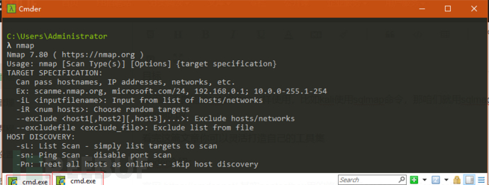
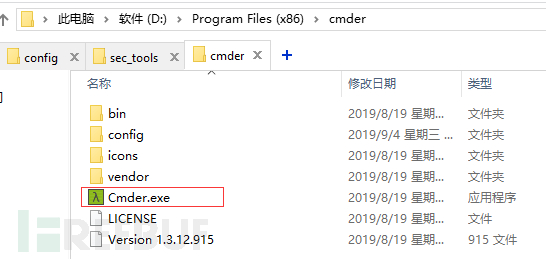
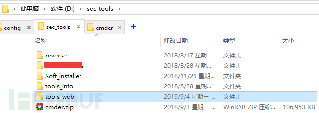
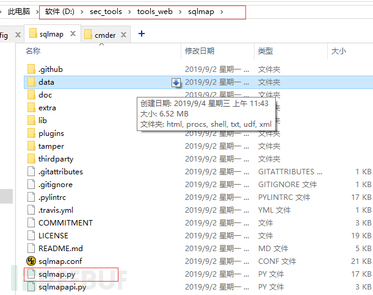
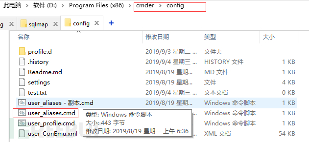
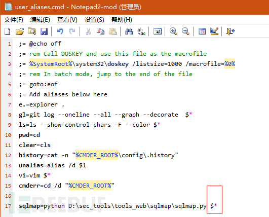

# [用Windows打造自己精简便捷的渗透工具集](https://www.freebuf.com/sectool/213459.html)

## 背景

**因为工作原因对公司上线的web系统进行测试，所以需要经常用到burp、sqlmap、dirb(支持目录递归)等工具，每次打开kali虚拟机这个占用20G磁盘4G内存的重量级工具，就用其中两三款用完再关，磁盘IO要反应老半天，重新打开又要老半天，于是我想到把常用的工具搬到win下来。**

win下大家耳熟能详的工具应该就是大名鼎鼎的pentestbox，可能我和它合不来，印象中我装了三次里面的nmap都没好用，而且它对我来说也是重量级了，动不动几个G磁盘没了，太占磁盘而且大部分工具可能用不到，而且你还得学习一下它的目录划分，工具设置配置什么的，我就研究研究利用cmder打造自己的win工具的技巧，说实话呢，前期失败了，没有专研，所以放弃了，今天突然灵感居然成功了。

## **目标**

常用的工具能像kali的命令一样使用，比如kali使用sqlmap命令，那咱们就用sqlmap命令而不是sqlmap.py。

看完这篇文章你可以灵活打造自己的工具集。

## cmder介绍：

官网 https://cmder.net/ 其实pentestbox用的终端就是cmder， 其实cmder是Windows下cmd终端最理想的替代品，它支持了大部分的Linux命令。支持ssh连接linux，使用起来非常方便。比起cmd、powershell、conEmu，其界面美观简洁，功能强大。需要的可以自行了解。下面贴个我的截图：

cmder安装没下，你从官网下载完整版，然后解压放到一个想放的目录里就可以了，这里我放D盘的program files x86文件夹了，   （注意：第一次打开cmder要点击cmder.exe右键管理员运行，便于它的安装各种Linux命令工具）。

cmder的目录结构：

然后把cmder的路径添加到环境变量，就可以使用cmder命令了，这不是主要的，主要就是你使用win+r然后输入cmder即可打开cmder，支持浏览器那样的快捷键如Ctrl+T新建标签页等等，其实cmder也可以添加到右键菜单，详细的请自行百度。

## 构建工具目录

先截图看看我的工具的大分类，有web工具，逆向，信息收集工具，先这几类吧！这几类下面的子目录放各种工具，这样方便迁移，因为安全工具多体积大，所以不放C盘。

## 下载安全工具并配置

> 说明：如果你在本机安装了nmap、msf之类的，在cmd可以直接使用的话，在cmder中也可以直接使用，下面以sqlmap为例
>
> 说明，如果在win下你把sqlmap的目录添加到环境变量，可能是无法使用sqlmap.py命令，即使能使用每次都是输入完整文件名如sqlmap.py，咱们要做成kali那种直接使用sqlmap
>
> sqlmap的下载配置（sqlmap已经支持python3.x了）

https://github.com/sqlmapproject/sqlmap 下载源代码放到咱们的工具目录，如下：

已经放好了，现在在cmder中还不能用，下面需要创建一条sqlmap命令，说是创建只是给咱们的sqlmap启动添加个别名 因为启动sqlmap的命令是 python sqlmap.py，咱们的sqlmap是在D:\sec_tools\tools_web\sqlmap，所以咱们本地的sqlmap启动命令是python D:\sec_tools\tools_web\sqlmap\sqlmap.py，打开cmder的配置命令别名文件，在cmder的config目录下的

复制一份user_aliases的备份，打开user_aliases，在文件中添加咱们的命令别名如下：

注意： 在命令的后面我用红框标记的$*一定要带上，不然sqlmap命令是无法读取参数的，带上才能正常使用sqlmap的各个参数，下面附一张报错的图：

所以那个命令末尾要有参数的话要加上$*，再来一张成功的图：

如果你在本地安装了nmap和msf什么的，在cmder中可以直接用的，下面来个nmap的截图：

利用文中同样的方法，你可以把常用的各种python工具集成到一起了，形成自己的一个工具集，而且使用上和kali中的命令一样！
