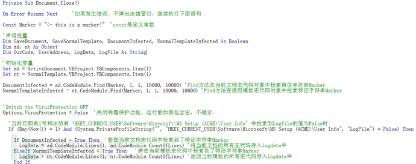
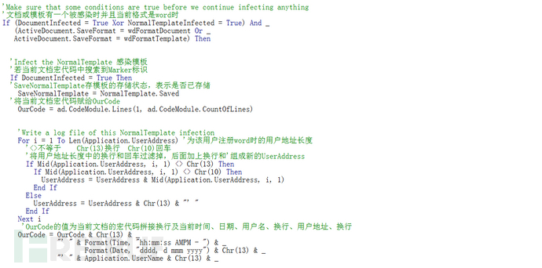
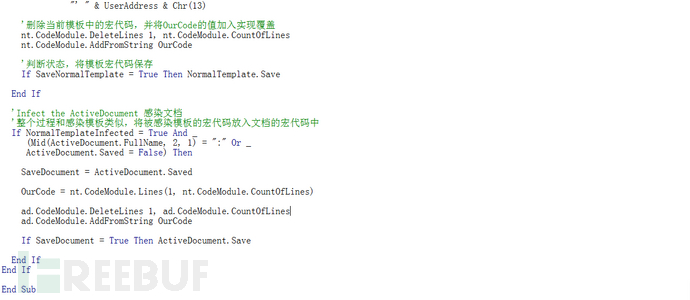

# [PowerShell若干问题的研究](https://www.freebuf.com/articles/network/214975.html)

**免责声明：本文作者竭力保证文章内容可靠，但对于任何错误、疏漏或不准确的内容，作者不负任何责任。文章部分内容来源于网络是出于传递更多信息的目的，对此不负任何法律责任。本文仅用于技术分享与讨论，严禁用于其他用途。**

## 一、PowerShell简介

PowerShell是一种基于任务的命令行shell和脚本语言，构建于.NET之上，通常用于管理基于Microsoft Windows的操作系统的技术（Linux和MacOS也可以使用）。Windows PowerShell的内置命令为cmdlets，用户可以使用其管理计算机，其具有完整的用户开发的脚本语言和丰富的表达式解析程序。

## 二、攻击者使用Powershell的原因

Powershell深受攻击者的喜爱，许多目标攻击在攻击链中使用了PowerShell，使用其作为下载器。本文在阅读了大量相关文献的基础上，对攻击者乐于使用Powershell的原因进行了总结，如下：

1.普适性强：PowerShell默认安装在Windows机器上（从Windows 7 SP1开始，操作系统默认安装）；

2.易用性好：PowerShell代码易于动态生成；同时，可以很容易地嵌入恶意软件向量中，例如Office文档（通过使用宏）；

3.多功能性：可以对操作系统主要功能进行访问；

4.隐秘性强：

> （1）几乎没有留下可以追踪的痕迹，框架可以直接从内存中执行有效负载；
>
> （2）缺乏日志记录，PowerShell日志默认不能使用，通常不会在计算机上启动监视或扩展记录。许多后台操作不可见，恶意脚本代码易于远程传播；
>
> （3）易于混淆：自动化的工具可以大量反复地混淆PowerShell代码，使静态分析变得不可行；
>
> （4）可绕过应用程序白名单；
>
> （5）管理员信任，使得PowerShell恶意软件与日常管理融为一体。

## 三、PowerShell检测方法

由于PowerShell的极易被混淆，我们在文献[1]中发现了PowerDrive，一个自动开源系统，用于对PowerShell恶意文件进行去混淆和分析。通过对数千个恶意代码的分析，获得了一些有趣的见解，例如：PowerShell使用的混淆处理方法的统计特征规律。此外，PowerDrive可以通过多层递归对PowerShell脚本进行去混淆处理。文中提供了PowerDrive源码，并证明其去混淆效果优异，但所使用的数据集链接已失效。PowerDrive可以与其他系统集成，提供有关PowerShell恶意软件功能的其他信息。

同时，在使用机器学习检测方面，在文献[2]中，作者选择了66388个不同的PowerShell命令，其中6290个标记为恶意，60098个标记为良性。使用部分数据集进行训练，部分进行验证。实施了三种深度学习模型，结果得出结合NLP-based classifier和CNN-based classifier表现出了更好的性能。有些混淆模式用NLP-based无法检测出来。

## 四、Powershell漏洞利用代理工具

Empire最大的特点是以PowerShell脚本作为攻击载荷，而且Empire实现了无需powershell.exe就可运行PowerShell代理功能。具体Empire平台的搭建文档见链接[3]，网上已有很多实验报告，这里对简单的安装不做赘述，仅对未提到的“坑”及注意点进行整理如下：

> 1.在Empire安装的过程中，需使用root账户进行实验。
>
> 2.在执行完毕安装过程输入./empire启动Empire时，查看是否可以成功进入。

遇到问题：输入./empire启动Empire报错，缺少OpenSSL

解决方法：使用pip install命令进行安装，发现pip报错，重新安装了pip

```shell
sudo apt-get remove python-pip
sudo apt-get autoremove
sudo install pip
sudo pip install pyopenss
```

本以为已经可以了，结果运行./empire继续报错。

遇到问题：遇到了很多次Import Error: No module named xx 问题

解决方法：sudo pip install xx，最终终于安装好了。

> 3.在建立监听过程中，需要使用Empire所在主机的ip作为Host地址。

## 五、宏与powershell结合

PowerShell还可用于APT攻击中。例如，在污水攻击中，利用了宏与PowerShell构建了APT攻击，具体过程如下：

> （1）使用精心构造的钓鱼文档，诱使目标人员打开文档启用宏；
>
> （2）文档宏执行后，向文件系统写入脚本及编码过的PowerShell文件；
>
> （3）加载脚本，解码PowerShell文件执行，与C&C进行通信。

我们以一个简单的例子对宏代码进行分析（样本文件附后[3]），这里启用宏后使用word中的开发功能VBA进行对宏代码的读取（也可使用oledump.py对宏代码进行提取）。

若工程已被加密，请参考文章[4],其中提供了可解密工具VBA Password Bypasser，可解密多数工程。

### （一）代码逐句解析

**第一部分,可以理解为日志上传过程：**




**第二部分，可以理解为文档与模板相互感染的过程：**





### （二）代码逻辑关系梳理

**第一部分，日志上传过程：**

> 1.在日期为1号并且注册表中LogFile的值为False时（日志文件没有上传到服务器的时候），若在文档/模板宏代码中找到标记Marker（Marker即为感染标识），则截取当前文档/模板从“LogFile—>”开始的内容即为日志文件内容，存入LogFlie路径所在的文件中。
>
> 2.c:\netldx.vxd为ftp的配置文件，其中内容为登录服务209.201.88.110，并将日志文件传到服务器上。
>
> 3.注册表中LogFile的值设置为True，表示已上传。

**第二部分，文档与模板相互感染的过程：**

文档或模板有且仅有一个被感染时，即可以实现互相感染。

文档感染模板：

> 1.若当前文档的宏代码中有Marker标识，则当前文档被感染。
>
> 2.文档的宏代码拼接当前时间、日期、用户名、用户地址等信息存入模板宏代码中，模板被感染。

模板感染文档：

> 1.若当前模板的宏代码中有Marker标识，则当前模板被感染。
>
> 2.将模板的宏代码放入文档的宏代码中，文档被感染。

### （三）思考

> 1.整个感染过程应该是以一个被感染的文档为源头，当文档传播到用户时，该用户的模板的宏代码即被替换为被感染文档的宏代码。该用户再用模板创建word时候，此时模板来感染文档，将文档的宏代码替换为模板的宏代码，此时文档被感染。
>
> 2.当文档的宏感染模板时，加上了时间、日期、用户名、地址等内容在代码的最后。在看该被模板的宏代码时候，代码最后表示是哪个用户感染给模板的。当模板生成新的文档时，新的文档也感染了此宏，后面带的依旧是模板的代码，可以说明该宏病毒的来源还是之前的用户。当被感染的新文档开始感染其它模板时，又要带上自己的信息，以此类推。这样代码最后为宏病毒传播源头的每个用户，也代表此用户中了宏病毒，同时服务器也知道了其邮件地址以便敲诈之类的活动。
>
> 3.每到1号并且此终端没有向服务器传过日志文件的时候，程序即启动，把感染情况及用户信息传送至服务器。

这里为宏病毒的特性，在word广泛使用的情况下，可以利用宏进行传播，结合Powershell与C&C通信，造成大规模的影响。

## 六、总结

由于PowerShell的种种特点，使得其成为攻击者的利器。如若配合宏，利用其普适性，可使得病毒传染效果显著增强。

在防御方面，我们可以选择扩展日志记录等方式进行防御追踪。

同时，也可允许PowerShell对其流量信息进行检测，包括其心跳、包的大小、包的时间等，来判断其流量异常的统计特征。

## 参考文献：

> [1] UgarteD, Maiorca D, Cara F, et al. PowerDrive: Accurate De-Obfuscation and Analysisof PowerShell Malware[J]. 2019.
>
> [2] HendlerD , Kels S , Rubin A . Detecting Malicious PowerShell Commands using DeepNeural Networks[J]. 2018.
>
> [3]https://github.com/Jarvan210/powershellab
>
> [4]https://bbs.ichunqiu.com/thread-35164-1-1.html?from=beef

