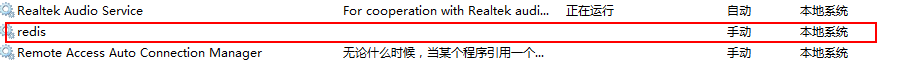

# [使用Windows命令行启动关闭服务(net,sc用法)](https://www.cnblogs.com/qlqwjy/p/8010598.html)

　　

　　下面两个命令最好以管理员方式启动cmd窗口，否则出现权限问题.　　

 

1、**net****用于打开没有被禁用的服务**，

NET命令是功能强大的以命令行方式执行的工具。

它包含了管理网络环境、服务、用户、登陆大部分重要的管理功能，关于这些完全可以写一篇20页以上的文档了，略去不表。

 

启动和关闭服务的时候，其语法是：

net start 服务名

net stop 服务名

 

　　比如我启动我的svn server 服务，命令行中输入net start svn 即可，可以更进一步将你经常需要启动的服务整理成命令，用记事本保存成cmd后缀格式的文件，这样你双击就可以完成里边相应的命令，这个还是很方便的，只 需要设置好，后续使用的时候就很简单，提高工作效率还是不错的。


```
C:\Windows\system32>net/?
此命令的语法是:

NET
    [ ACCOUNTS | COMPUTER | CONFIG | CONTINUE | FILE | GROUP | HELP |
      HELPMSG | LOCALGROUP | PAUSE | SESSION | SHARE | START |
      STATISTICS | STOP | TIME | USE | USER | VIEW ]
```


 

　　注意:服务名是服务名称

![img](data:image/png;base64,iVBORw0KGgoAAAANSUhEUgAAAe4AAAC2CAIAAACQ3/kvAAAS8klEQVR4nO2dvZKkxppA83HkNw71EHoDerz09QhdPT6lN1iruydChizccWsmFHLkXezdnduauas3qDWSn/yHqqIoEs6JVqiAJPPL7OHwkdCF+Hvt/P7LTz/9/Ouf9w4D1safv/780y+/t0u//9L+K/v9l596+nVN0aacUUinq3GooFW9FopN3/ioPo0Iyt0pfIS5sZkDpxf8+dc/fS10Y9DsFahgNfz111///POfc3/EvcO+OagcVk/cpvehEbDr3GtN7D2frAlU7geVwwb489efY5n5atjC4YzK/Wzhdw8AqwGVAwAkDyoHAEgeVA4AkDyoHAAgeVA5AEDyXKjyfwEAwJ2YTOX/AADAPUDlAADJg8oBAJIHlQMAJA8qBwBIHlQOAJA8qBwAIHlQOQBA8qByAIDkua3Kf1sw8481AMCNuLnKT4sElQPAmtiuymEdzH/MACyQ7ap8/rH2sjQfLS2eOAmFCnBTtqvy/1sGSp33jqJnafHEQeUAClR+Z5amzqXFEweVAyjuqPK6zIUQsjqd6jLPy7pdpT52ZWTVF9ZR6y9X+X+WgVLnvaPoWVo8cVA5gOJOKq+kiNJ6Wle5rvhKovLbsLR44qByAMXdVK6L2UL528jDcynzvKw7o0+g8h86f3zMtBNJ9vHTxyz7+IfaoD78+PHjx49PHwKnng+fflyIUqdnwx8fs67WTx+0IJzAL2/8nHjMsTDH5byYPn0Q1r6fPozqxKcPwtoTlQMo7qlyf2ouqy4Vd7PyCVX+3c/bo8iev37//vaYZZkQ4vEtUNDYZUSpAEqdng1fn7Ou1rfH7Pmrv0zk0uaioILxfP/6nOlR6PGpGOMXWkJoe7899ovtiA/3yu0QKgdQ3PO2p8fHmsVDKpeVf9erVP72KMTj2/evz1mnlc5cX5+zViJnSGYsQyoPGDJ7/qrONl7Hh9R/dTxBX/ftOWa2a4nI3h5G3fihaOc/ZgAWyJ1V7qFVtLk1z6dWud3pL8+ZEOLx0ZFV9vzFHSKdt0fx+BYvEkap060ye3zMlN0CDbw9Zs9fImodCPq8eP7++8tzptf55Tnzd/rtUTw++3ztK/32GIzz7dHa58tz5laCygEUi3gY0bqnadreyMorqWQ/gcrfDY77TIji9f3dXZ3tj+/v7++vRSSdVPpUBc9DqdNtttjvs+L1/f14PB7Vp/f318Juwl0TW31xPKr3fZ3Hfdb397jPui36Z31Xz9BG4lTV2/iqQOUAirupPPYMS+f15tZnu1yXeS5lfpXEvSrfZ6J49QtEZEWR+TR9hS4tGbnqfC2y/asm8KIo9sfOk8d91noteH6ZVuXHfZZlnaSb9l+LbH/UznW+86GxOeToqK9fC7XyePR1CJUDKO6p8k7JRlauLVRStDc587JWG9oplnAmP1Ll/7Y57h+KV3vla/GwP2olhGjLvBai2/RaCHfXcSh1ejY04Rz3Dw/7479fi4f9vhAP+1e1rEcozBXX4Y3ndd+3+1oI0X/S2j7uH4QQotir/7vYYRrD6dCcpbrtfbtmtPMfMwALZEkqbx8/bBRdl7lRRK3XVH5Fdv7bb799szk+eRX08HQ0ir0UoijUf0I8PB1fCrfMGSh1ejYcnx6Kl+PTQ1f38enh4eGheLGCCWjz0ohC8ahIXgohiqJoan8pRB/OS6G2GwEen6yAjU2iePn2UrgFgr1yeobKARTLnSvXHz1v0/Pms+KaeRa/PU03fdM9ahhIPDwdv70UD09PhRAhVY0kpnJdXI0UX4puzUshmtYNHb5cF1NE5aJpz4zBaGu0yl+Krmv2Pm7Dxm/heNQWUDmAYhEqn5+Ayrtc0ZSNYbNWO43QOrVfSDwr/9a2pbermnt50hrV8tgbnVo0o7b5d+N1YaTmwyrvT0HhVdqoNg2/FL5rDVQOoEDlnUqiPDw9Fb3jbWmakj+LYZU755TmdKNPCFlZ+RVSH1a5asC8emkXe5W3YRiheyzubOwt7g60c95E5QAKVH5ngiq/E0uLJw4qB1BsV+X/uwyUOu8dRc/S4omDygEU21X5/ywDpc57R9GztHjioHIABSq/M0tT59LiiYPKARTbVfl/LwOlzntH0bO0eOKgcgDFdlUOAJAWqBwAIG1QOQBA8qByAIDkQeUAAMmDygEAkgeVAwAkDyoHAEgeVA4AkDyoHAAgeVA5AEDyoHIAgORB5QAAyYPKAQCSB5UDACQPKl8LQvBj/wBsBlS+Fu7uzQX+AGwGVL4WkJcOowEbA5WvBeSlw2jAxkDlawF56TAasDFQ+VpAXjqMBmwMVL4WkJcOowEbA5WvBeSlw2jAxkDlawF56TAasDHSUnklRYOstIV+nV4yL+sxFUaL1WXe1lxJo4HFgbx0GA3YGKmpPC/r06kuc1m1Cw1qXVdO+LCs7S+lCjUO7+xdl/myTT4oL09vZ+6QE8HuMHyyvRBUDhvjMpX/cT63VnmfNFdSCCmtHLqShrmUqW2V1WVu2L47PbRiD58W7s9Yec18dVEfdr72AqsnA5XDxrhM5Rc0dIsJlryse8t22XQr2dbedZmb1q7LXJU2TgbGXIvrbvvEsLgUPSmVV/KWKfkJlcPmSE3lwazcwbRxwF6N7q2cXduq1lalfp7oThfdOWEJXK5yfeKj21RJsTtUh123ti2lKbjfsVlZN+XbirSadXPfOiU/oXLYHEmr3J3z0PxtOtbI5zX8My3GPkaubk/AJK/ySuqa7c9plez8q8ahmWrqLGzuqLbJdrmvx6Ptm6fkJ1QOmyM1lVsTLKXUplMcIUfz9sCt0c7NdSml7LL/SgpZ1WWel9VCb4BepnJbq5159Q2+zwEf23m5R+VzmByVw9ZITeX2BEsjJi1f9tyitCytJJ7nuUf0rf1ba3cZqN7KyCcd52UylXep+Jkqrw87Y6YloPJZTI7KYWskpfJWpcZceSNmV63WdIjxtKK7uaFVeSVl1ezSP4fY76JkvsoJlmZhSOXG/YXqcKj1UvVhF8rK5zE5KoetkZLK9duNzhMsplKdp1bcGZhQ9q5VNGT/Naj8FLvtGVO5PpnSW1uxk7ITeLO2P0PMMj2FymFjpKTySnY3NvOybg2kPU0u1IyL7uPgfdCBrLwt0uWd0nfTdEkgLx1GAzZGSiqHGMhLh9GAjYHK1wLy0mE0YGOg8rWAvHQYDdgYqHwtIC8dRgM2BipfC8hLh9GAjYHK14KSFz/6D8BmQOVr4e7eXOAPwGZA5QAAyYPKAQCSB5UDACQPKgcASB5UDgCQPKgcACB5UDkAQPKgcgCA5EHlAADJg8oBAJIHlQMAJA8qBwBIHlQOAJA8qBwAIHlSU3n75nuXvKxPp9PpVJd5qEhfSKvOXmXQVCar06mSQlZnx7sBKil2h8gYAsDtSU/lfvWG1sfrCtu+PSG09q7LfCUmrw87MWlXLlG5Z+jvOLpONE5/uhKent6/L8Pxw/pJT+VjE+4oytT2EVeXuVFLXeaqiCfTP//MsQzqw263200pm2uy8pkvderDYM89RerDru1hJcOeXkZfRnQRVkl6Kr8+K6/LXJnY2MmYa3HdbRwe6U621Ifd7lBPGv+qVO7pjLFTpIZF9IXZrs2SnsqjWXl0otyTTjdZViDZ6g7OqmxnXfKy7pP37pyQDMrk1hGvpNCPbD8S9WHnOZX1Jfu6DtIpZxXz4upP/wV3myopdoeqCaa5cWHX7DRnB6/VHArIq0czxrArF9AXUvINk5rKz2YgXffPtLS7Wu73TMCkpfLeQ7qRlCfaMehPa/VBtkX6lZW0TVhJ0e/RTkXY9Y/LZM3KzUb7io3mQlF5gx9QnVfT1j6jVX6HvpCSb5m0VN55uZOqu8Ys2H6yLRzO7/snYaSUuaxUDZUUsqrLPC+rdG+A6oe69tmSgjOhYKWDti0sa7eZusko/dmVd5EEAu8+BxzmXFTEVR6o5bKs/A59weSbJi2Vd8eLrXLD1MaCLnU9LxJ5bstdL95au9tDb3XoEcaF4p68vFJoF+vDzrjAP1Plo6wyqD83xx+nP2/wcZWHYvZMRi2yL5h826Sm8ka2psqNg8jKv/UJlrDwneKVlFXzBEv/HGK/i5J5WhMs9g2Bbtl4PLFfsPJ27TzYzcUcbPfowtKnh0c+9eFMSnimg7yfnaj8wcdU7kuj1Qptr5gu79wXTL5x0lP56XTyTbA02PeeLGFri6E7pFrx7mFEf2VpzZW7t3bbNfVhJ6R073r21/Q7KXem7LWSXpWHbpm6QY2+VRjTnxuVP/hmbeDpcPOX3T+C6FS+wL64v17YFimpPDS77dVwVzjk2nhW3hbRbwYOHMrJwnMPAMmTksrhNqBygORB5YDKAZIHlQMAJA8qBwBIHlQOAJA8qBwAIHlQOQBA8qByAIDkQeUAAMmDygEAkgeVAwAkDyoHAEgeVA4AkDyoHAAgeVA5AEDyoHIAgORB5QAAyYPKAQCSB5UDACQPKgcASB5Uvgn+CwCWzZXHOCrfBNf/QwGAs4iI1cuVzaHyTYDKAWYGlcP0oHKAmUHlMD23V3klRV7WN24EIB1QOUyPo/K6zIWQ1XQtXKLySgqbKUM6Eycapz9difAWa99+fWhw+hJ37DrcAlQO02OrvC7zPM+ntMc1WXklZ/VYXQ723FOkLnNd0OEK+n0r2Q2Jfxd9bV3myHxVoHKYHkvldZnnZT2pQVelck9njJ1iNQQGwrda/RpGxw1p4VXq58+fUTlcjqnyViGGXpSefNf7dZl7JgGsuYNKirwspVNueIrBp3J9wqLbVEmRl1UTjKz6UlrNTnN28FrNoYC8ojZjDJ64QpIfzsr93W9b0X47uZR537p1sRDei3PG3Hg9rkDlxjVrf3Tp16aeo6OSeVlvOwMyVN57SDeScl47dP0w1qV0ZwkqacuhkqLfo7WLXX8gk7VUblZuNtpXbDQXisob/EBW7tW0tU9I5f71kRsTjX6t7ruD5vx2tDNVe4oa2gvmJeTxkM2vbC5RlXtumPXZiH2otvqf+Tp+Segq1w967bM1as6EgpXa2sayVOL/LQVOpvGM12sr3+eAX52LirjKwxMkwyoPTMwMpcRNhNoJyxm0wKlEH5vhvaxQ49cmcC1ej/8Tzs2vbC4lldsXkN6s3FPaYJsy11TujotXcO2iriKvVPtqfSofJYpBlbs5/jiVe4OPq3xUvh2owdk3fn/U2bmdNQok9m7q3l9qjtsL5sRVeWhxcyo/ncwJlrF7kHloKrft0i0bswD9gpW3a6ljd7Vf2h7V5atPdUfuFEYnWDy68n52ovIHf85Ny36ySNurK6RNVAf2jYrUSEG8vegGzamrLvNcylwfhBF7wYxYKrfsh8plLmUuy/6i2bimbC5V9cOruRmnH2TmEbgFOpW7eWK7pi5zIaV717Ofn8ilzE3ZayW9Kg/dMrU457ZnTOVuVP7gnX8lzmB06P9U7Mqtf0jOvs71jzsC2vDE7zO7UnYm4EftBfMREauXK5tLS+XdjS/9ytL+0H9qSlVSPfjgu+u/EUb8tSeHPcCUoPIgZS6rRtN1ICs/nU6tyt2/1Dhn5nJloHKAmUHlUXqVx7PyqtSnEfWL4E3qCpUDzAwqjzJW5bW7Tw8TLABwY1B5lOEJFs8fXdigcgC4Mag8iPYnfp6/3VSSj6l+6EGKFYPKAWYGlcP0oHKAmUHlMD3mX3tua3JpahhAGAUqh+m5ucpj3+CyMu6n8jWP6gpB5TA9QyrXJXGJMKx7F+3inO6Zra27qXzbX+6ZHqgcpufGKrfqNL6jBJUn3i5cCCqH6bFVbrwjQn8bQ94/+dP/yWxlfzOL9TSn3+TuSx7C36xyuxdKBL+ZxOmUv7DbujuAgSANvH13Xw2hffdsGTg/QiKgcpge+0tu7XdEhLLywPsonG8EtL7Y0FfVXV4oESw570s2Qn23Xg2hf7OE/T3nW/075YRB5TA9gQmWbvY1pvKBu5lDr6ywvxjW3nTzF0oMlbz9SzaCfTcjCU1TxToHywWVw/TcTuXREnGV3/6FEqNK3v4lG8G+j1U5Jk8RVA7Tc43KPQv+mZn44owvlOjCC5f0dGryl2wY0y/evlvDFZpgweRJgspheoZUbryNQftc+99H0Ukq8BCivkKbbpjrhRLmmcYpGehUoFqn9dEv2TDuKERue7rjZd725CHENEHlMD2X/uH+QD4Ymd1dMIkkuQM3C2DpoHKYntuoPE2TL1fltfauz25OJpVRBRtUDtNzo6w8TRbcKW2WBn+nDiqH6eGbEQFmBpXD9KBygJnRXff582fLfu6aK5tD5ZsAlQPMjCVu3d3WIiqHsaBygJlxVa70rX9G5XAeqBxgZizdfTZxfXhlc6h8E6BygJlxjRfxOCqHUaBygJnxKjXkcVQOo0DlADMTESsqhwtB5QAzg8phelA5wMygcpgeVA4wM6gcpgeVA8wMKgcAgPNA5QAAyYPKAQCSB5UDACQPKgcASB5UDgCQPLOp/P8BnLuD5LSUEesAAAAASUVORK5CYII=)

 

 

 

2、用sc可打开**被禁用**的服务。(也可以查看服务状态)可以创建服务、删除服务、打开与关闭服务

 

sc是用于与服务控制管理器和服务进行通信的命令行程序，其语法是：

 

**sc config 服务名 start= demand   //手动**

**sc config 服务名 start= auto    //自动**

**sc config 服务名 start= disabled //禁用**

**sc start 服务名　　开启服务**

**sc stop 服务名　　停止服务**

**sc query 服务名　　查看服务状态**

 **sc delete 服务名  删除服务**

 **sc qc 服务名   查看服务的配置信息**

**sc create scname binPath=xxx.exe　　创建服务**

　　**例如**

```
C:\Windows\system32>sc create redis binPath=E:/Redis/redis-server.exe
[SC] CreateService 成功
```



 

 

 

 

当你安装了一个应用程序的时候，将其添加到windows服务中时，便可以这样去设置服务的启动规则，不过这个命令最好在命令行中使用。

 

以上就是为了开启和关闭服务自己找到的简单方法

 

如果整理得好的话，完全可以充当自己的电脑开机启动定制版脚本，包括打开哪些程序、文件、代码等等。

 

 

总结:

sc用法：


```
C:\Windows\system32>sc/?

错误:  未知命令

描述:
        SC 是用来与服务控制管理器和服务进行通信
        的命令行程序。
用法:
        sc <server> [command] [service name] <option1> <option2>.


        <server> 选项的格式为 "\\ServerName"
        可通过键入以下内容，获得有关命令的进一步帮助: "sc [comman
        命令:
          query-----------查询服务的状态，
                          或枚举服务类型的状态。
          queryex---------查询服务的扩展状态，
                          或枚举服务类型的状态。
          start-----------启动服务。
          pause-----------向服务发送 PAUSE 控制请求。
          interrogate-----向服务发送 INTERROGATE 控制请求。
          continue--------向服务发送 CONTINUE 控制请求。
          stop------------向服务发送 STOP 请求。
          config----------更改服务的配置(永久)。
          description-----更改服务的描述。
          failure---------更改服务失败时执行的操作。
          failureflag-----更改服务的失败操作标记。
          sidtype---------更改服务的服务 SID 类型。
          privs-----------更改服务的所需权限。
          managedaccount--更改服务以便将服务帐户密码
                          标记为由 LSA 管理。
          qc--------------查询服务的配置信息。
          qdescription----查询服务的描述。
          qfailure--------查询服务失败时执行的操作。
          qfailureflag----查询服务的失败操作标记。
          qsidtype--------查询服务的服务 SID 类型。
          qprivs----------查询服务的所需权限。
          qtriggerinfo----查询服务的触发器参数。
          qpreferrednode--查询服务的首选 NUMA 节点。
          qrunlevel-------查询服务的运行级别。
          qmanagedaccount-查询服务是否将帐户
                          与 LSA 管理的密码结合使用。
          qprotection-----查询服务的进程保护级别。
          delete----------(从注册表中)删除服务。
          create----------创建服务(并将其添加到注册表中)。
          control---------向服务发送控制。
          sdshow----------显示服务的安全描述符。
          sdset-----------设置服务的安全描述符。
          showsid---------显示与任意名称对应的服务 SID 字符串。
          triggerinfo-----配置服务的触发器参数。
          preferrednode---设置服务的首选 NUMA 节点。
          runlevel--------设置服务的运行级别。
          GetDisplayName--获取服务的 DisplayName。
          GetKeyName------获取服务的 ServiceKeyName。
          EnumDepend------枚举服务依赖关系。

        以下命令不要求使用服务名称:
        sc <server> <command> <option>
          boot------------(ok | bad) 指示是否应将上一次引导保存为
                          最近一次已知的正确引导配置
          Lock------------锁定服务数据库
          QueryLock-------查询 SCManager 数据库的 LockStatus
示例:
        sc start MyService
```


 

 

```
sc config:用法
```


```bat
C:\Users\liqiang>sc config MySQL57
描述:
        在注册表和服务数据库中修改服务项。
用法:
        sc <server> config [service name] <option1> <option2>...

选项:
注意: 选项名称包括等号。
      等号和值之间需要一个空格。
 type= <own|share|interact|kernel|filesys|rec|adapt>
 start= <boot|system|auto|demand|disabled|delayed-auto>
 error= <normal|severe|critical|ignore>
 binPath= <BinaryPathName to the .exe file>
 group= <LoadOrderGroup>
 tag= <yes|no>
 depend= <依存关系(以 / (斜杠) 分隔)>
 obj= <AccountName|ObjectName>
 DisplayName= <显示名称>
 password= <密码>
```