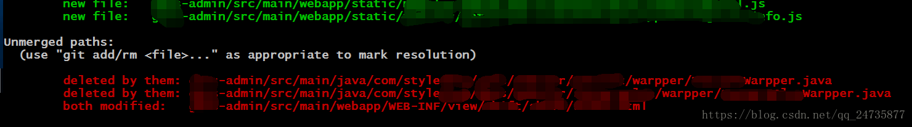
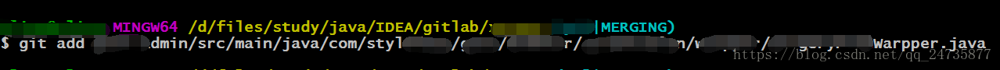

1、首先我在pull之前，git add . 和 git commit -m "" 了，最后还push了。(献上个人信息打码图)

2、然后开始pull。执行git pull origin master.告诉你存在三个冲突(其实有一个是内容冲突，另外两个是你新增部分提示你delete)，提示你修复冲突后再commit。

3、关闭你的开发工具（IDEA、eclipse等），用编辑器打开提示你内容有冲突的文件(其实直接vim打开也是可以，但是不建议使用)，删掉冲突部分，然后保存(vim是删掉之后，按Esc 、然后：wq保存退出)。

4、git status ，可以看到红色部分提示 

出现You have unmerged paths.

 (fix conflicts and run "git commit") 

5、然后分别git add 三个的文件。(贴一个git add

6、然后 git status 可以看到没有红色字体的提示了。

All conflicts fixed but you are still merging.
 (use "git commit" to conclude merge)

7、最后git add . 。然后git commit 。然后pull就没问题了。

