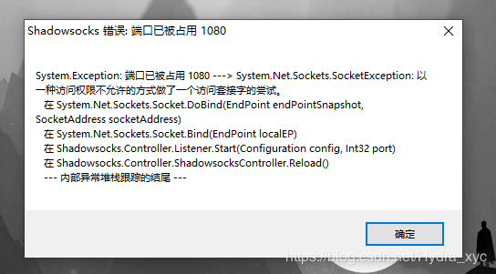
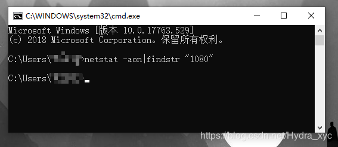
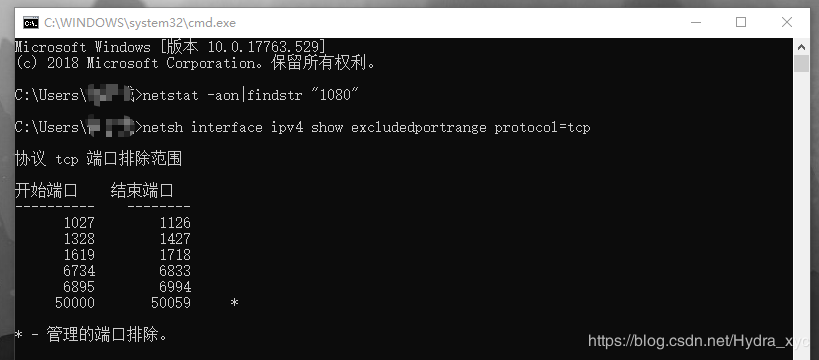

## 出现的问题：

环境：win10  64位  版本1809

某日，启动ssr时弹出了



如果怕麻烦，直接**重启电脑**。但下次可能还会出现问题。

本文给出两种方案，仅供参考。

## 方案一：

就像其他博主给出的方案，在CMD里使用netstat -aon|findstr "1080"，找到占用端口进程的PID，在任务管理器里结束进程。

## 方案二：

###   可能的原因：

可很多时候，没有进程在占用1080端口，你会发现：



是的，没有进程占用1080端口，但就是会报错。

这个问题并不是端口被占用，通过 `netstat` 里找不到占用这个端口的程序。实际上，这个错误对应的 last-error 是 [10013 （WSAEACCESS）](https://docs.microsoft.com/en-us/windows/desktop/WinSock/windows-sockets-error-codes-2)，权限不足。

根据2018年2月13日发布的 [KB4074588](https://support.microsoft.com/eu-es/help/4074588/windows-10-update-kb4074588) 里的 known issue，这个补丁会调整操作系统的 reserve port ranges，可以通过运行 以下指令查看。

```
netsh interface ipv4 show excludedportrange protocol=tcp
```

在我自己的环境里，***\*1027 ~ 1126 都被系统强制保留了\**，**所以其他应用程序无法监听在这个端口，比如1080。



workaround 要选取的端口也只能避开这些保留端口。

最后建议：ss 可以做一下 10013（WSAEACCES） 和 10048（WSAEADDRINUSE）的分类处理。毕竟看起来之后这个地方会出现坑不会少。

注：尝试使用 `netsh interface ipv4 delete excludedportrange ...` 会提示 access is denied，目前找不到可以认为调整的方法。

以上参考https://github.com/shadowsocks/shadowsocks-windows/issues/1835

除了系统补丁会保留端口外，***\*开启win10的hyper-v也会保留端口\****，比如我自己

###   解决方案：

更改SSR的本地端口

在SSR4.0.exe所在目录下，找到gui-config.json，并用记事本打开。


 找到`"localPort": 1080,`，将其修改为`"localPort": 12345,这里我随便选了一个没保留的端口。`


 保存并退出。重启SSR。

注意：如果你使用了像SwitchyOmega这样的插件，请修改情景模式。 

