# 中间人攻击-Arp之局域网内DNS欺骗

时间：2019-11-03 18:15:47   阅读：2   评论：0   收藏：0   [点我收藏+]
原文：https://www.cnblogs.com/BOHB-yunying/p/11786090.html

# 基础知识

## 网关是啥？

> 网关是工作在OSI七层模型中的传输层或者应用层，用于高层协议的不同
> 网络之间的连接，网关就好比一个房间通向另一个房间的一扇门。
>
> 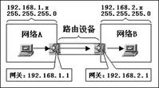

## ARP协议


假设A(192.168.1.2)与B(192.168.1.3)在同一局域网，A要和B实现通信。A首先会发送一个数据包到广播地址(192.168.1.255)，该数据包中包含了源IP（A）、源MAC、目的IP（B）、目的MAC，这个数据包会被发放给局域网中所有的主机，但是只有B主机会回复一个包含了源IP（B）、源MAC、目的IP（A）、目的MAC的数据包给A，同时A主机会将返回的这个地址保存在ARP缓存表中。

# ARP欺骗原理

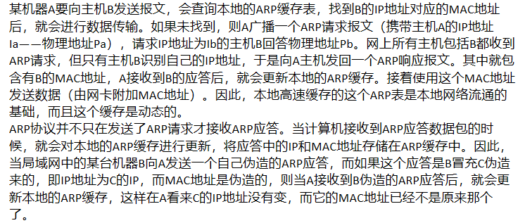

 

 ARP也分为单向欺骗和双向欺骗

> 假设主机 A 192.168.1.2,B 192.168.1.3,C 192.168.1.4; 网关 G 192.168.1.1; 在同一局域网，主机A和B通过网关G相互通信，就好比A和B两个人写信，由邮递员G送信，C永远都不会知道A和B之间说了些什么话。但是并不是想象中的那么安全，在ARP缓存表机制存在一个缺陷，就是当请求主机收到ARP应答包后，不会去验证自己是否向对方主机发送过ARP请求包，就直接把这个返回包中的IP地址与MAC地址的对应关系保存进ARP缓存表中，如果原有相同IP对应关系，则原有的会被替换。
> 这样C就有了偷听A和B的谈话的可能，继续思考上面的例子：
> C假扮邮递员，首先要告诉A说：“我就是邮递员” （C主机向A发送构造好的返回包，源IP为G 192.168.1.1，源MAC为C自己的MAC地址），愚蠢的A很轻易的相信了，直接把“C是邮递员”这个信息记在了脑子里；
>
> C再假扮A，告诉邮递员：“我就是A” （C向网关G发送构造好的返回包，源IP为A 192.168.1.2，源MAC地址为自己的MAC地址），智商捉急的邮递员想都没想就相信了，以后就把B的来信送给了C，C当然就可以知道A和B之间聊了些什么
>
> 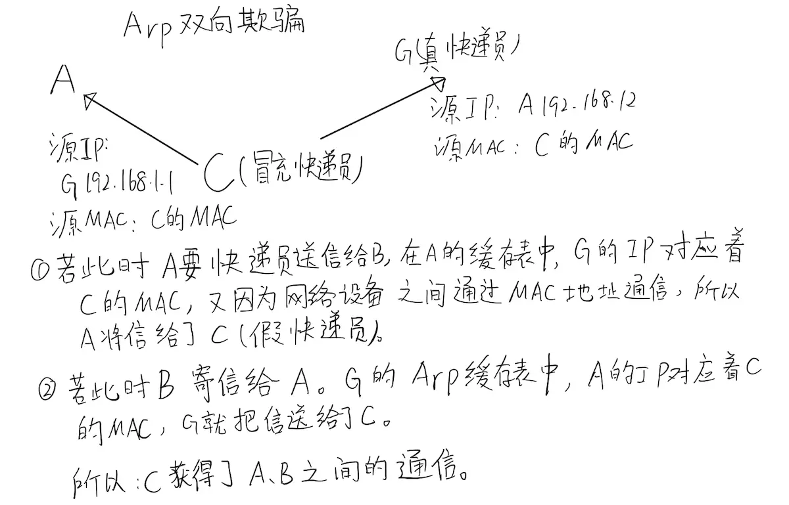
>
>  
>
>  上面ABCG的故事就是ARP双向欺骗的原理了
>
> ARP单向欺骗就更好理解了，C只向A发送一个返回包，告诉A：G 192.168.1.1 的MAC地址为 5c-63-bf-79-1d-fa（一个错误的MAC地址，C的MAC地址），A把这个信息记录在了缓存表中，而G的缓存表不变，也就是说，A把数据包给了C，而G的包还是给A，这样就是ARP单向欺骗了。

# 局域网DNS劫持（失败）

局域网内的DNS劫持可以依靠arp欺骗网关来达到修改dns请求，将其请求到我们指定的网站。

这里我们使用bettercap来完成局域网DNS劫持实验

kali_hacker：192.168.41.130

win7_hackde:192.168.41.128

win10_apache:100.66.10.247

安装bettercap

```
apt-get install bettercap
```

创建一个 dns.conf 文件，下面这个dns语句的意思是：所有的.com结尾的网站全部解析到我的本地Http服务器, .*\.com就是一个正则，也可以是自定义的正则　

```
169.254.197.219  .*\.com
```

查看网关地址

```
netstat -rn
route -n　　
```

因为安装的使bettercap2.x，感觉没有1.x操作简单，完全变了。所以重新找到一篇[文章](https://blog.csdn.net/qq_36119192/article/details/84582109)实验:

dns欺骗这里有一个前提，那就是局域网内的主机的DNS服务器是局域网内的网关，那样我们才能进行DNS欺骗，如果DNS服务器设置的是公网的DNS服务器，比如设置的谷歌的8.8.8.8 DNS服务器的话，这样是不能进行DNS欺骗的。

```
ipconfig/all    #查看DNS服务器
```

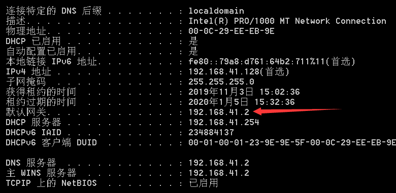

DNS欺骗之前，我们先得进行ARP欺骗，就是先欺骗主机让其认为网关就是我(攻击机)。然后由于主机的DNS服务器就是网关，所以主机会向我们发送DNS请求，这样我们就可以进行欺骗了。

```
set arp.spoof.targets 192.168.41.128    #设置arp欺骗的主机以逗号分隔，默认是整个子网
arp.spoof on    #先开启arp欺骗
set dns.spoof.domains www.baidu.com,www,taobao.com  #设置要欺骗的域名,多个域名用,分开，如果要欺骗所有的域名的话，为 * 
set dns.spoof.address 100.66.10.247   #设置将要欺骗的域名转换成对应的ip地址
dns.spoof on   #开启dns欺骗，www.baidu.com和www.taobao.com对应的ip是100.66.10.247
```

使用bettercap2.x实验失败，一直返回endpoint。

还是使用ettercap实验

# 成功实验

修改`/etc/ettercap/etter.dns文件`

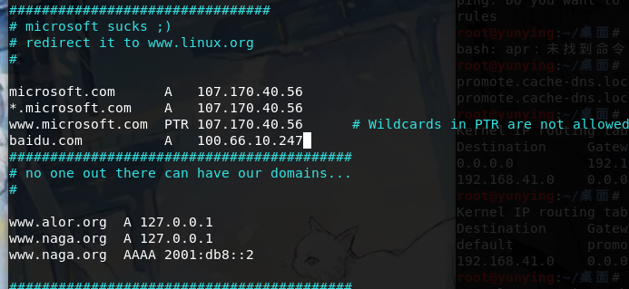

 

 开启ettercap

```
ettercap -G
```

选择模式默认全局Sniff->Unified sniffing

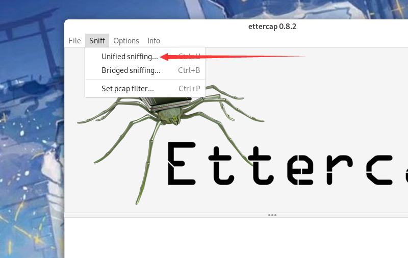

 

选择hosts->hosts-lists

 

 

 添加到Target1

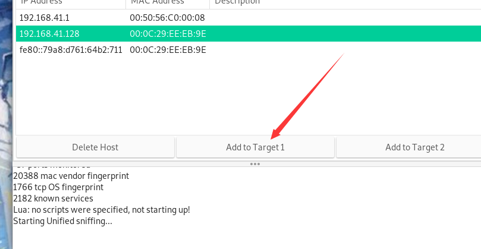

 

先arp毒化,选择Mitm->arp poisoning


 

 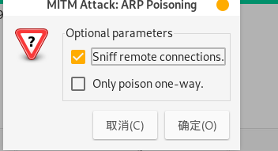

 

 然后选择plugin插件，选择dns_spoof,进行DNS劫持

　

 

查看靶机的ping项

第一个是arp攻击dns劫持前，第二个是arp攻击dns劫持后

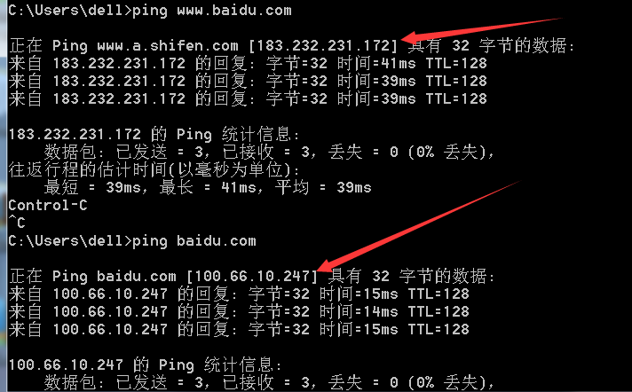

 

浏览器查看

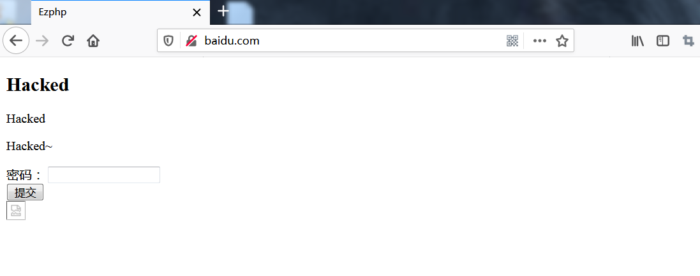

ettercap显示栏


ettercap通过view选项查看嗅探到的结果


 

因为我用的是之前出的题目的php，正好也有post请求，模拟hacker通过apr欺骗嗅探到受害者网页输入的密码

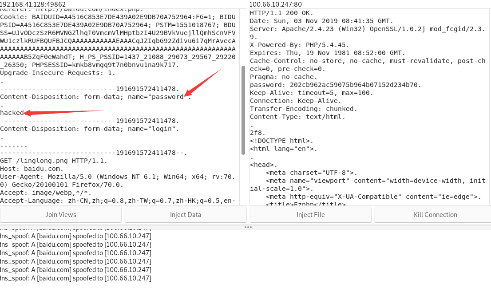

 

嗅探到了请求和返回，同时可以看到用户输入的密码。模拟了在局域网内通过apr欺骗网关，DNS劫持，使受害者所有的行径暴露于攻击者的视线中，通过可以诱骗用户访问你想要让他访问的网站。如果想把DNS劫持做的更完美的话，可以做一个很漂亮的前端，做的几乎分辨不出，然后让受害者下载一些木马病毒，比如诚殷网络的创始人黑无常做的天衣无缝的Flash下载页面，诱导受害者下载并执行。（前提是你的后门免杀)

# 最后总结

kali查看mac地址的一些命令

```
cat /proc/net/arp 查看远端连接ip的mac，非自身cat /sys/class/net/eth0/address 查看自身mac地址　　
```

实验中网关的ip为192.168.41.2，mac为00:50:56:fc:26:85


 

通过arp欺骗，使受害者中的arp表中的网关mac地址变为hacker的mac地址

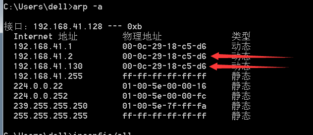

 

这里讲一下流程，更加的加深学习印象，hacker通过发送伪造的ARP包给局域网内的其他主机宣布自己的ip地址为192.168.41.2，把自己伪造成网关设备，其他主机学习到伪造的ARP包，误把网关的MAC地址解析为hacker主机的mac地址，此后，则受害者的所有访问外网的数据包都会发送给hacker。

ARP中的还有很多类型的攻击，有双向流量嗅探，有单向欺骗断网，有泛洪攻击影响网络通信等

 

注意：

结束后实验记得刷新下DNS缓存

```
ipconfig/flushdns　　
```

重启下浏览器，在访问baidu.com就会跳转到正常的访问页面了

 

参考链接:

https://blog.csdn.net/qq_36119192/article/details/84582109

如果要改成老版本1.6的话可以参考这篇文章:

https://www.cnblogs.com/diligenceday/p/9912542.html