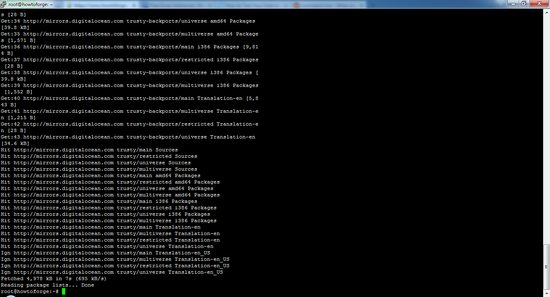
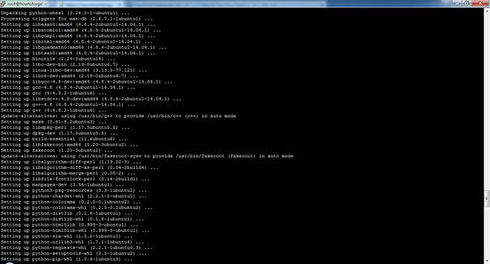
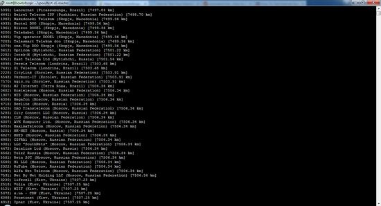
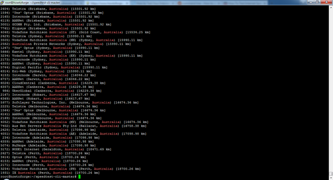

[TOC]

# 在Debian和Ubuntu上使用speedtest-cli检查Internet速度

## 什么是speedtest-cli？

Speedtest-cli是用Python编程语言编写的脚本，用于双向测量互联网速度。 此应用程序允许您在距离以km为单位检查您的互联网速度，它可以测试特定的服务器，它还提供一个URL，以便您可以在互联网上分享您的结果。


## 如何在Linux上安装speedtest-cli？

为了安装speedtest-cli应用程序，您必须在系统中安装一个Python 2.4-3.4或升级版本。

您可以使用两种方法安装speedtest-cli工具。 第一种方法包括使用python-pip包管理器，第二种方法是手动下载Python脚本，使其可执行然后运行应用程序。


### 方法1：使用python-pip安装speedtest-cli

下一步必须以root用户身份运行，因为我不想为每个命令添加sudo，请先在Ubuntu上运行以下命令成为root用户：

sudo su

1.第一步是通过运行以下命令确保来自所有Ubuntu存储库和PPA的软件包列表是最新的：

apt-get update

样品输出：

[](https://www.howtoing.com/wp-content/uploads/images/check_internet_speed_with_speedtest_cli_on_centos/big/up_tp_date.png)

2.下一步是在系统上安装pip软件包管理器。 您可以看到，该命令也将安装许多依赖项。

apt-get install python-pip

```
The following NEW packages will be installed: binutils build-essential dpkg-dev fakeroot g++ g++-4.8 gcc gcc-4.8 libalgorithm-diff-perl libalgorithm-diff-xs-perl libalgorithm-merge-perl libasan0 libatomic1 libc-dev-bin libc6-dev libdpkg-perl libfakeroot libfile-fcntllock-perl libgcc-4.8-dev libgomp1 libitm1 libquadmath0 libstdc++-4.8-dev libtsan0 linux-libc-dev make manpages-dev python-chardet-whl python-colorama python-colorama-whl python-distlib python-distlib-whl python-html5lib python-html5lib-whl python-pip python-pip-whl python-requests-whl python-setuptools python-setuptools-whl python-six-whl python-urllib3-whl python-wheel python3-pkg-resourcesThe following packages will be upgraded: libc61 upgraded, 43 newly installed, 0 to remove and 6 not upgraded.Need to get 6,698 kB/40.6 MB of archives.After this operation, 102 MB of additional disk space will be used.Do you want to continue? [Y/n] 
```

按Y继续

样品输出：

[](https://www.howtoing.com/wp-content/uploads/images/check_internet_speed_with_speedtest_cli_on_centos/big/python-pip_package.png)

3.安装软件包后，可以使用pip命令安装应用程序：

pip install speedtest-cli

```
Downloading/unpacking speedtest-cli Downloading speedtest_cli-0.3.4-py2.py3-none-any.whlInstalling collected packages: speedtest-cliSuccessfully installed speedtest-cliCleaning up...
```

4.如果将来要升级speedtest-cli应用程序，可以使用以下命令：

pip install speedtest-cli –-upgrade

```shell
Requirement already up-to-date: speedtest-cli in /usr/local/lib/python2.7/dist-packagesCleaning up...
```


### 方法2：从GitHub手动安装最新的speedtest-cli

首先你必须使用命令从GitHub下载python脚本

cd /tmp
wget https://github.com/sivel/speedtest-cli/archive/master.zip

```
Resolving github.com (github.com)... 192.30.252.130Connecting to github.com (github.com)|192.30.252.130|:443... connected.HTTP request sent, awaiting response... 302 FoundLocation: https://codeload.github.com/sivel/speedtest-cli/zip/master [following]--2016-02-19 11:25:34-- https://codeload.github.com/sivel/speedtest-cli/zip/mas terResolving codeload.github.com (codeload.github.com)... 192.30.252.161Connecting to codeload.github.com (codeload.github.com)|192.30.252.161|:443... c onnected.HTTP request sent, awaiting response... 200 OKLength: unspecified [application/zip]Saving to: ‘master.zip’
[ <=> ] 17,653 --.-K/s in 0.006s
2016-02-19 11:25:34 (2.72 MB/s) - ‘master.zip’ saved [17653]
```


2.第二步是解压缩已下载的文件（master.zip），并使用unzip命令解压缩：

unzip master.zip

```
Archive: master.zip7b09d8759fcbbda8a71aa49a4eaa825581b07439 creating: speedtest-cli-master/ inflating: speedtest-cli-master/.gitignore inflating: speedtest-cli-master/.travis.yml inflating: speedtest-cli-master/CONTRIBUTING.md inflating: speedtest-cli-master/LICENSE inflating: speedtest-cli-master/MANIFEST.in inflating: speedtest-cli-master/README.rst extracting: speedtest-cli-master/setup.cfg inflating: speedtest-cli-master/setup.py inflating: speedtest-cli-master/speedtest-cli.1 inflating: speedtest-cli-master/speedtest_cli.py inflating: speedtest-cli-master/tox.ini
```

3.提取文件后，通过转到提取的目录并使用chown命令，使提取的脚本可执行。

cd speedtest-cli-master/

chmod 755 speedtest_cli.py

4.为避免每次输入完整路径，请使用以下命令将可执行文件移至/ usr / local / bin：

sudo mv speedtest_cli.py /usr/local/bin/speedtest-cli


## 如何使用speedtest-cli测试互联网连接速度？

运行speedtest-cli命令来测试你的互联网连接的下载和上传速度，无任何争论：

speedtest-cli

```
Testing download speed........................................Download: 916.39 Mbit/sTesting upload speed..................................................Upload: 489.57 Mbit/s
```

如果要以字节为单位检查速度结果，请使用以下命令：

speedtest-cli --bytes

```
Testing download speed........................................Download: 114.15 Mbyte/sTesting upload speed..................................................Upload: 49.61 Mbyte/s
```

如果您想与朋友分享速度结果，则可以使用结果后提供的URL下载结果的图像。

speedtest-cli --share

```
Download: 900.64 Mbit/sTesting upload speed..................................................Upload: 445.14 Mbit/sShare results: https://www.howtoing.com/wp-content/uploads/result/5100016286.png
```

以下是我上面测试速度测试结果的图片。

[](https://www.howtoing.com/wp-content/uploads/images/check_internet_speed_with_speedtest_cli_on_centos/big/51000162861.png)

如果您只想在ping，下载和上传信息，请使用：

speedtest-cli --simple

```
Ping: 5.23 msDownload: 877.56 Mbit/sUpload: 162.21 Mbit/s
```

您还可以使用以下公式查看服务器列表：

speedtest-cli --list

```
2628) Telstra (Adelaide, Australia) [17098.98 km]4051) Vodafone Hutchison Australia (AE) (Adelaide, Australia) [17098.98 km]...........................................................................3254) Vodafone Hutchison Australia (PH) (Perth, Australia) [18700.26 km]1931) IX Australia (Perth, Australia) [18700.26 km]
```

[](https://www.howtoing.com/wp-content/uploads/images/check_internet_speed_with_speedtest_cli_on_centos/big/list.png)

通过搜索列表中的距离，您可能已经生成了大量的服务器列表。 如果要检查特定区域的服务器的结果，则可以通过将结果配置为grep命令来检查（澳大利亚是该区域的示例）：

speedtest-cli --list | grep –i Australia

```
2604) Telstra (Brisbane, Australia) [15501.92 km]1594) 'Yes' Optus (Brisbane, Australia) [15501.92 km]...............................................................................................3254) Vodafone Hutchison Australia (PH) (Perth, Australia) [18700.26 km]1931) IX Australia (Perth, Australia) [18700.26 km]
```

[](https://www.howtoing.com/wp-content/uploads/images/check_internet_speed_with_speedtest_cli_on_centos/big/list_2.png)

要测试与特定服务器的连接速度，必须使用第5步和6中生成的服务器ID。

speedtest-cli --server [server ID]

speedtest-cli --server 2604

这里使用服务器ID 2604作为示例：

```
Hosted by Telstra (Brisbane) [15501.92 km]: 452.614 msTesting download speed........................................Download: 28.79 Mbit/sTesting upload speed..................................................Upload: 11.71 Mbit/s
```

如果要查看speedtest-cli工具的帮助和版本号，请使用以下命令：

speedtest-cli --version

```
0.3.4
```

speedtest-cli --help

```
usage: speedtest_cli [-h] [--bytes] [--share] [--simple] [--list] [--server SERVER] [--mini MINI] [--source SOURCE] [--timeout TIMEOUT] [--secure] [--version]
Command line interface for testing internet bandwidth using speedtest.net.--------------------------------------------------------------------------https://github.com/sivel/speedtest-cli
optional arguments: -h, --help show this help message and exit --bytes Display values in bytes instead of bits. Does not affect the image generated by --share --share Generate and provide a URL to the speedtest.net share results image --simple Suppress verbose output, only show basic information --list Display a list of speedtest.net servers sorted by distance --server SERVER Specify a server ID to test against --mini MINI URL of the Speedtest Mini server --source SOURCE Source IP address to bind to --timeout TIMEOUT HTTP timeout in seconds. Default 10 --secure Use HTTPS instead of HTTP when communicating with speedtest.net operated servers --version Show the version number and exit
```


## 使用speedtest-cli创建一个互联网速度日志

Speedtest-cli可以作为cronjob运行，以获得互联网速度测试日志。 用这个命令打开crontab：

crontab -e

并添加这一行（我将假设speedtest_cli.py安装在/ usr / local / bin中）到crontab：

```
30 00 * * *  /usr/local/bin/speedtest-cli >> /tmp/speedlog.txt
```

保存更改并退出crontab编辑器。 这将在每天的0:30进行速度测试，并将结果追加到文件/tmp/speedlog.txt。


## 结论

此应用程序是轻量级的，易于使用和运行，没有任何问题，使其必须具有开发人员和系统管理员的工具。