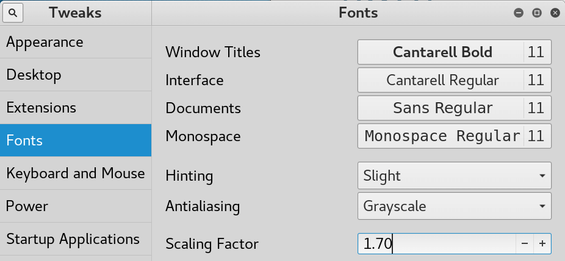
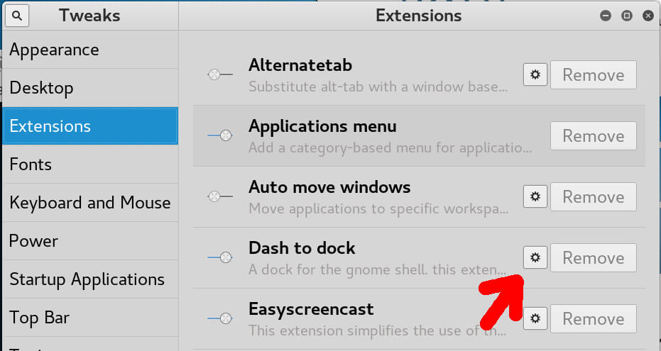
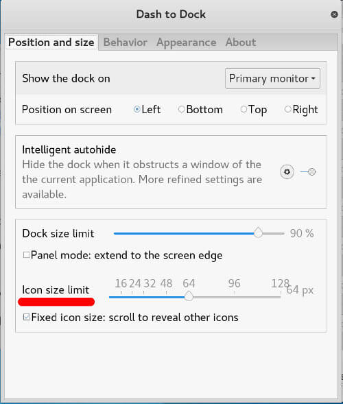
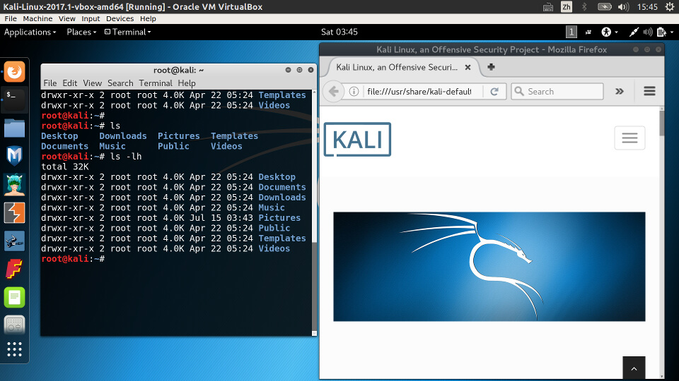

在Kali的终端中输入命令 `gnome-tweak-tool`

 如果出现找不到`gnome-tweak-tool`的同学可以使用`gnome-tweaks tool` 这样就出来了 

在Kali的终端中输入命令 gnome-tweak-tool 打开Tweaks面板，在字体(Fonts)中，有比例因数(scaling factor)，将其调整到一个合适的值即可，如下图所示。

这样便解决了字体的问题，但Kali左侧边栏的图标还是很小，其设置在扩展(Extensions)的Dash to dock中，点击Dash to dock旁的小齿轮图标进入设置界面，如下图所示。

然后设置Ico size limit为合适的值即可，如下图所示。

调整好后的界面如下图所示，可见字体与图标大小都很合适，看上去很舒服，不再伤眼睛了。

