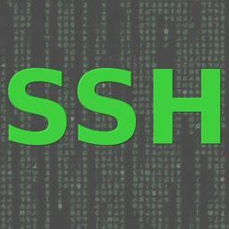

# Linux提高SSH安全性之限制用户及IP的登录

#### 于2016年8月17日由[**幻**](https://www.asmodeus.cn/archives/author/asmodeus)发布

**启动或禁止SSH用户登录**

http://blog.csdn.net/linghe301/article/details/8211305

一般情况下，在使用Linux操作系统都不会去机房来操作机器，都是使用一些第三方的工具来操作。



比如使用SSH Secure File Transfer Client工具来传输文件，利用Putty来操作，利用Xmanger综合操作等，那么最常见的连接类型包括telnet、SSH、Raw等

下面就针对SSH方面讨论一下，如果有人特别关注Linux环境的安全性，第一就从login方面来进行讨论，也就是文章标题

1：Linux启动或禁止SSH root用户的登录

2：Linux限制SSH用户

其实这些东西就是修改一个系统的配置文件

1. [root@rhsde ~]# vi /etc/ssh/sshd_config

我们可以查看

1. \#PermitRootLogin yes

把前面的#号去掉，yes修改为no即可

yes 就是可以使用SSH方式的root登录

no就是禁止使用SSH方式的root登录

1. login as: root
2. root@192.168.220.165’s password:
3. Access denied
4. root@192.168.220.165’s password:

 

另外如果需要限制SSH方式的用户登录 修改如下参数

1. AllowUsers arcsde

arcsde是我操作系统的用户，如果没有用户可以手动添加AllowUsers

这样的话，只能arcsde登录了

其他用户登录不了了(oracle)

1. login as: oracle
2. oracle@192.168.220.165’s password:
3. Access denied
4. oracle@192.168.220.165’s password:

以上修改完配置文件，必须重新启动SSH服务才能生效

1. [root@rhsde ~]# /etc/init.d/sshd restart
2. Stopping sshd:                       [ OK ]
3. Starting sshd:                       [ OK ]

 

可能会有人会问到如果我设置了，每次都是Access denied，有没有一些可以进行信息的提示，这肯定可以啊

我们可以修改如下文件

1. [root@rhsde ~]# vi /etc/issue.net

然后添加如下信息

1. \###############################################################
2. \#          Welcome to redhatserver                  #
3. \#     All connections are monitored and recorded              #
4. \# Disconnect IMMEDIATELY if you are not an authorized user!          #
5. \#            Please tel 400-819-2881
6. \###############################################################

我们仍然需要修改sshd_config里面的参数

1. Banner /etc/issue.net

后面对应的就是相关文件的路径，重启服务即可

然后我们测试一下

1. login as: root
2. Red Hat Enterprise Linux Server release 5.5 (Tikanga)
3. Kernel \r on an \m
4. \###############################################################
5. \#          Welcome to redhatserver                  #
6. \#     All connections are monitored and recorded
7. 
8.  \#
9. \# Disconnect IMMEDIATELY if you are not an authorized user!          #
10. \#Please tel 400-819-2881
11. \###############################################################
12. root@192.168.220.165’s password:

```

```

当我们输入root用户，系统就自动提示了。另外也可以在输入密码的时候提示，如果是这样的话，我们修改如下文件即可

1. vi /etc/motd

```
vi /etc/motd
```

 

启动或禁止用户IP登录

除了可以禁止某个用户登录，我们还可以针对固定的IP进行禁止登录，这里面其实就是修改了配置文件

查看 /etc/hosts.allow配置文件，设置允许登录的IP

1. [root@rhsde ~]# more /etc/hosts.allow
2. \#
3. \# hosts.allow  This file describes the names of the hosts which are
4. \#        allowed to use the local INET services, as decided
5. \#        by the ‘/usr/sbin/tcpd’ server.
6. \#
7. sshd:192.168.220.164:allow

 

查看/etc/hosts.deny文件，设置sshd:ALL

1. [root@rhsde ~]# more /etc/hosts.deny
2. \#
3. \# hosts.deny  This file describes the names of the hosts which are
4. \#        *not* allowed to use the local INET services, as decided
5. \#        by the ‘/usr/sbin/tcpd’ server.
6. \#
7. \# The portmap line is redundant, but it is left to remind you that
8. \# the new secure portmap uses hosts.deny and hosts.allow. In particular
9. \# you should know that NFS uses portmap!
10. sshd:ALL

也就是说，我们禁止所有IP，但是允许相关IP登录。

另外，如果对sshd_config文件中的配置参数感兴趣可以参考：http://doc.licess.org/openssh/sshd_config.html