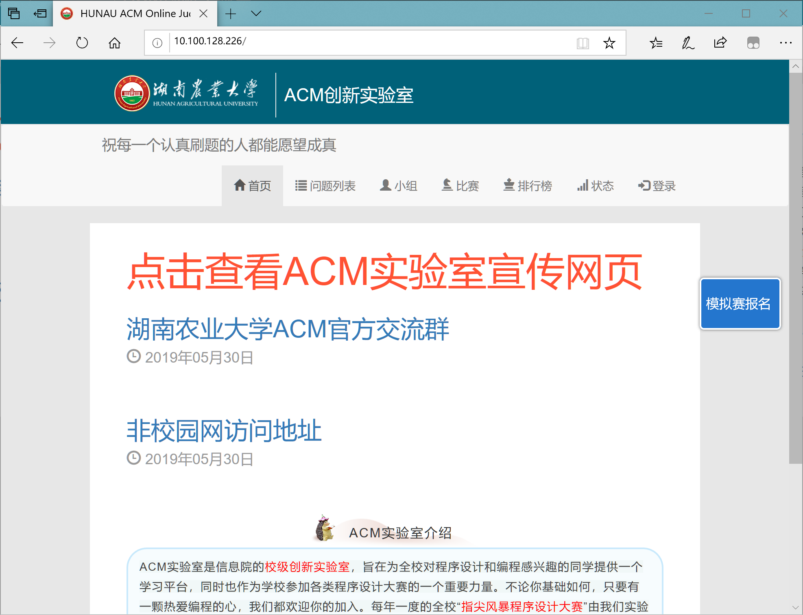
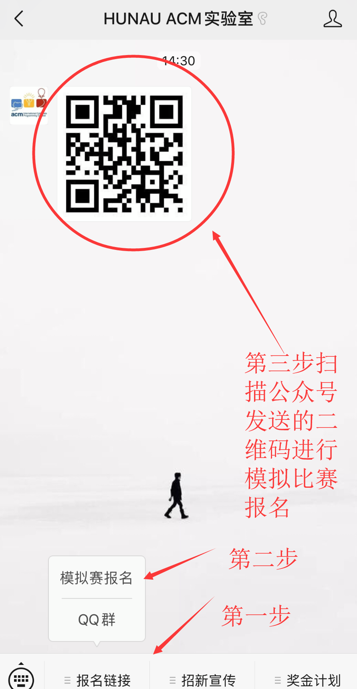

[TOC]

## ACM新生模拟赛报名方式以及说明

> #### 为增强新生对比赛环境的熟悉 以及 实验室提高组采取淘汰制
>
> 1. 模拟赛采用全原创题的方式
> 2. 题目内容不超过提高组上课所学知识
> 3. 比赛环境严格按照新生大一下第一次现场赛（团队天梯赛）的难度要求
> 4. 模拟赛题目按照ACM出题方式

1. 浏览器输入ACM实验室OJ的网址  http://10.100.128.226/ 限校园网访问

  在界面右边有一个模拟赛报名的按钮点击跳转界面进行报名

  

2. 关注湖南农业大学ACM公众号

   

   

## 比赛难度说明

因为考虑部分是18 以及 有些人是先学有基础  难度不会太难 也不太简单

做不出来的可以跳 英文题难度小一些

比赛按照ACM出题方式