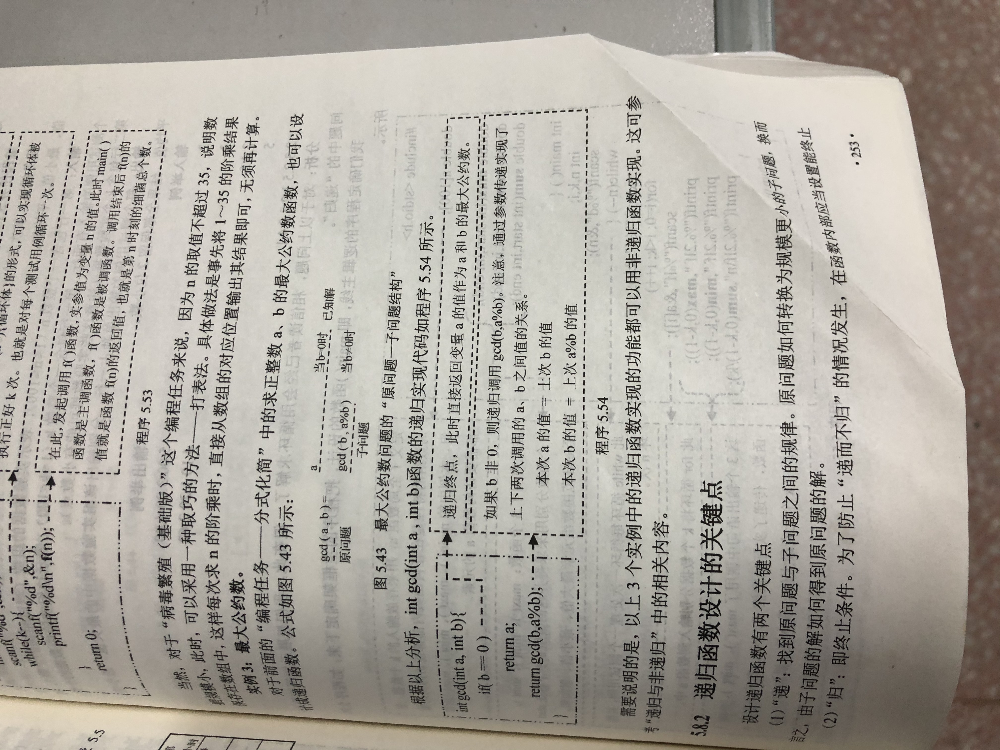

```c++
ll gcd(ll x, ll y)	//最大公因数
{
    return y ? gcd(y, x % y) : x;
}
ll lcm(ll x, ll y)	//最小公倍数                                                      
{
    return (x * y / gcd(x, y));
}
```

 

# C 语言实例 - 字符串排序

按字典顺序排序。

## 实例

```c++
#include <stdio.h>
#include <string.h>
 
int main()
{
    int i, j;
    char str[10][50], temp[50];
 
    printf("输入10个单词:\n");
 
    for(i=0; i<10; ++i) {
        scanf("%s[^\n]",str[i]);
    }
 
 
    for(i=0; i<9; ++i) {
        for(j=i+1; j<10 ; ++j)
        {
            if(strcmp(str[i], str[j])>0)
            {
                strcpy(temp, str[i]);
                strcpy(str[i], str[j]);
                strcpy(str[j], temp);
            }
        }
    }
 
    printf("\n排序后: \n");
    for(i=0; i<10; ++i)
    {
        puts(str[i]);
    }
 
    return 0;
}
```


输出结果为：

```
输入10个单词:
C
C++
Java
PHP
Python
Perl
Ruby
R
JavaScript
PHP

排序后: 
C
C++
Java
JavaScript
PHP
PHP
Perl
Python
R
Ruby
```

