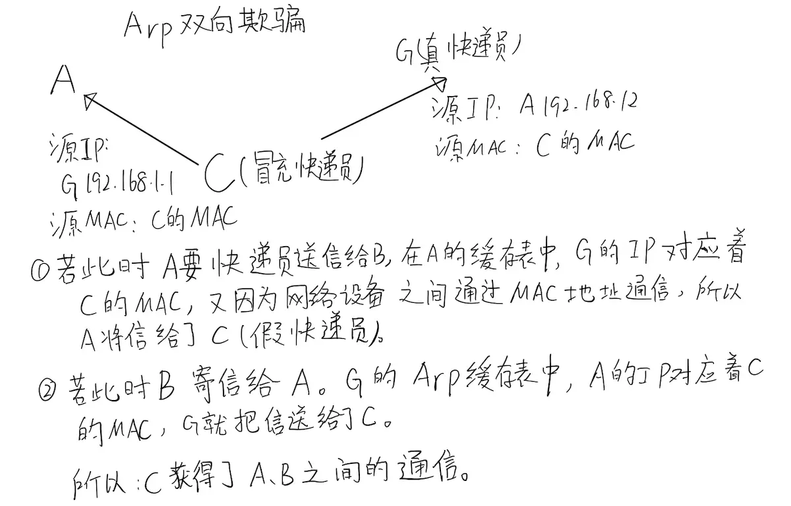
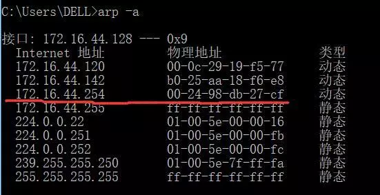
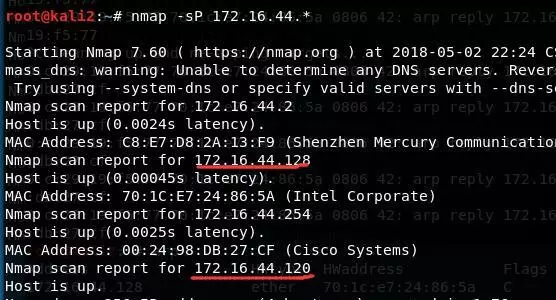
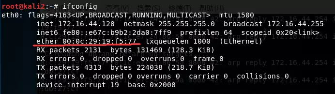
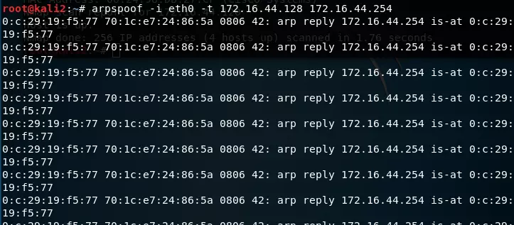
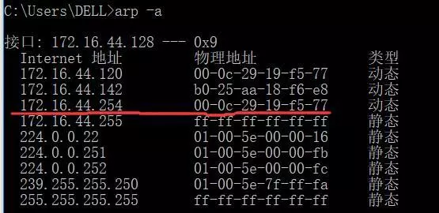
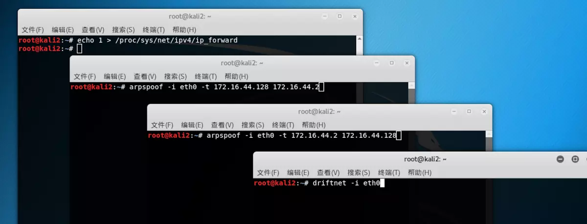
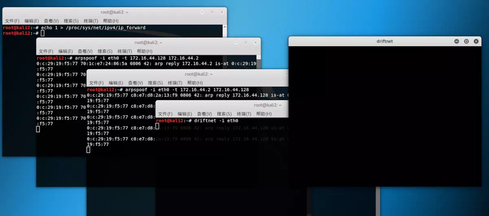

[TOC]

## 0x01 网关是啥？

> 网关是工作在OSI七层模型中的传输层或者应用层，用于高层协议的不同
> 网络之间的连接，网关就好比一个房间通向另一个房间的一扇门。

## 0x02 ARP协议

> ARP（Address Resolution Protocol）地址转换协议，工作在OSI模型的数据链路层，在以太网中，网络设备之间互相通信是用MAC地址而不是IP地址，**ARP协议就是用来把IP地址转换为MAC地址的**。而RARP和ARP相反，它是反向地址转换协议，把MAC地址转换为IP地址。

> 假设A(192.168.1.2)与B(192.168.1.3)在同一局域网，A要和B实现通信。A首先会发送一个数据包到广播地址(192.168.1.255)，该数据包中包含了源IP（A）、源MAC、目的IP（B）、目的MAC，这个数据包会被发放给局域网中所有的主机，但是只有B主机会回复一个包含了源IP（B）、源MAC、目的IP（A）、目的MAC的数据包给A，同时A主机会将返回的这个地址保存在ARP缓存表中。

## 0x03 ARP欺骗原理

> 在每台主机中都有ARP缓存表，缓存表中记录了IP地址与MAC地址的对应关系，而局域网数据传输依靠的是MAC地址(网络设备之间互相通信是用MAC地址而不是IP地址)。

###  1. ARP双向欺骗原理

假设主机 A 192.168.1.2,B 192.168.1.3,C 192.168.1.4; 网关 G 192.168.1.1; 在同一局域网，主机A和B通过网关G相互通信，就好比A和B两个人写信，由邮递员G送信，C永远都不会知道A和B之间说了些什么话。但是并不是想象中的那么安全，在ARP缓存表机制存在一个缺陷，就是当请求主机收到ARP应答包后，不会去验证自己是否向对方主机发送过ARP请求包，就直接把这个返回包中的IP地址与MAC地址的对应关系保存进ARP缓存表中，如果原有相同IP对应关系，则原有的会被替换。
这样C就有了偷听A和B的谈话的可能，继续思考上面的例子：
C假扮邮递员，首先要告诉A说：“我就是邮递员” （C主机向A发送构造好的返回包，源IP为G 192.168.1.1，源MAC为C自己的MAC地址），愚蠢的A很轻易的相信了，直接把“C是邮递员”这个信息记在了脑子里；

C再假扮A，告诉邮递员：“我就是A” （C向网关G发送构造好的返回包，源IP为A 192.168.1.2，源MAC地址为自己的MAC地址），智商捉急的邮递员想都没想就相信了，以后就把B的来信送给了C，C当然就可以知道A和B之间聊了些什么

image.png

上面ABCG的故事就是ARP双向欺骗的原理了

###  2. ARP单向欺骗原理

ARP单向欺骗就更好理解了，C只向A发送一个返回包，告诉A：G 192.168.1.1 的MAC地址为 5c-63-bf-79-1d-fa（一个错误的MAC地址，C的MAC地址），A把这个信息记录在了缓存表中，而G的缓存表不变，也就是说，A把数据包给了C，而G的包还是给A，这样就是ARP单向欺骗了。

## 0x04 实战ARP欺骗获取图片

### 1. 目标主机缓存表

### 2. 目标IP和本机IP

目标IP.jpg

1. 再进行arp欺骗之前必须要开启IP转发，否则当欺骗成功之后，目标机会断网，这样会被对方察觉。输出1，说明已经成功开启IP转发
   sysctl -w net.ipv4.ip_forward=1 或者 echo 1 > /proc/sys/net/ipv4/ip_forward

   

   

2. 向目标192.168.124.133发送返回包，包含内容：
   源ip(网关)：172.16.44.254
   源MAC：00:0c:29:19:f5:77

   

   

   语句格式：arpspoof [-i interface] [-c own|host|both] [-t target] [-r] host

   

   

   此时再来看目标主机ARP缓存

   

   可以看出目标主机arp缓存已经发生了变化，在缓存表中所记录的网关（172.16.44.254）的MAC已经变为了攻击者的MAC

   

   以上就是一次简单的ARP欺骗了

## 0x05 运行driftnet截取被攻击机正在浏览的网页的图片

因为被攻击机器还没上网所以最上边的终端窗口只有输入的命令，右上的driftnet窗口黑乎乎一片什么都没有，但是可以看到上边的三个终端都已经在工作了
接着我用被攻击的机器上网，测试效果

