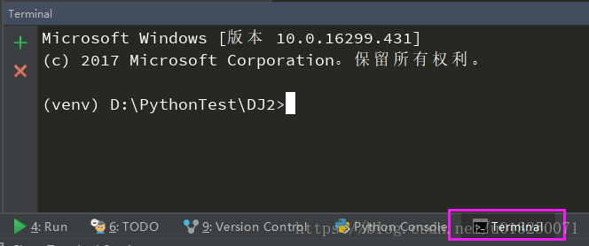
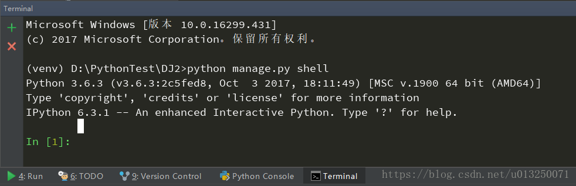
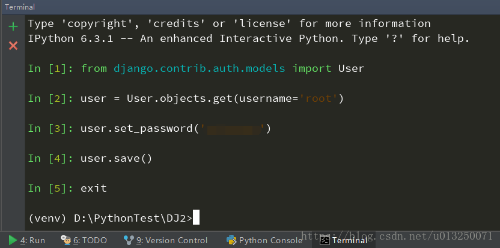

# Django常见问题

# 错误 No such Table ‘auth_user’

原因：没有用户表格，就是没有创建任何admin用户

解决办法：

```shell
python manage.py migrate
python manage.py createsuperuser
```

# 忘记管理员密码

### 1.在工程目录下进入Terminal终端



### 2.进入manage.py shell



### 3.执行命令（逐行输入）

```python
from django.contrib.auth.models import User 
user = User.objects.get(username='root') # username 为后台登录的用户名
user.set_password('这里输入新设置的密码') 
user.save()
```

