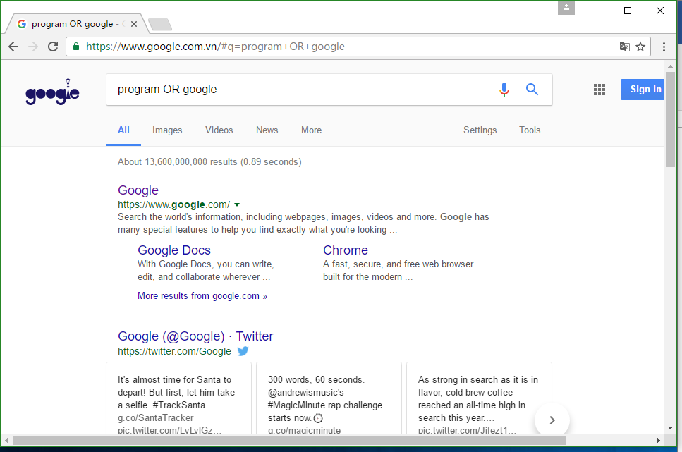
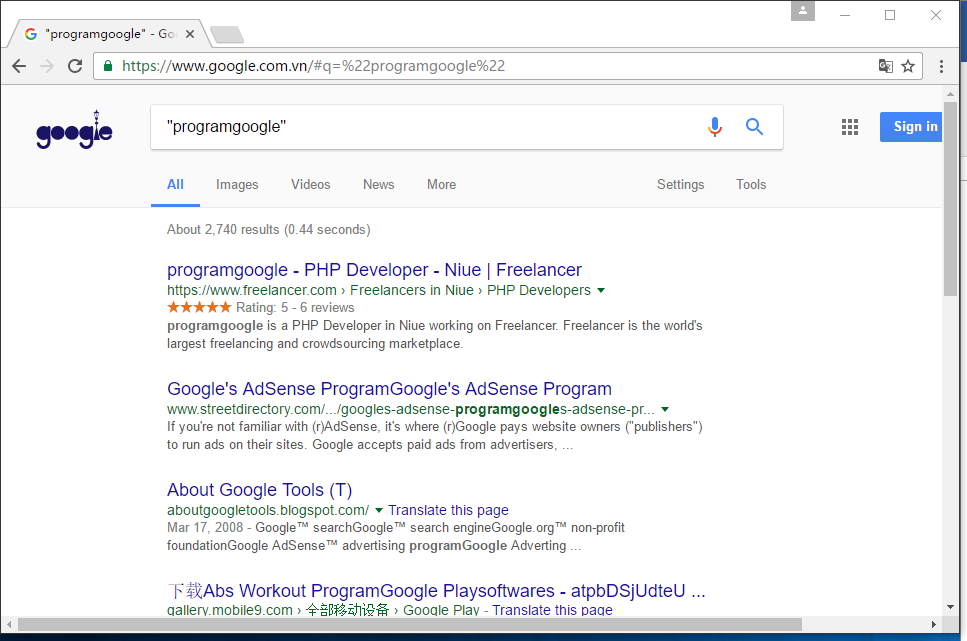
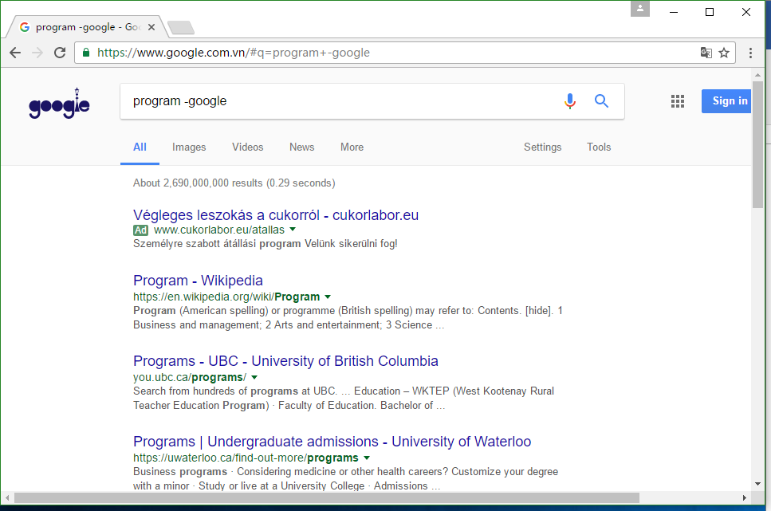
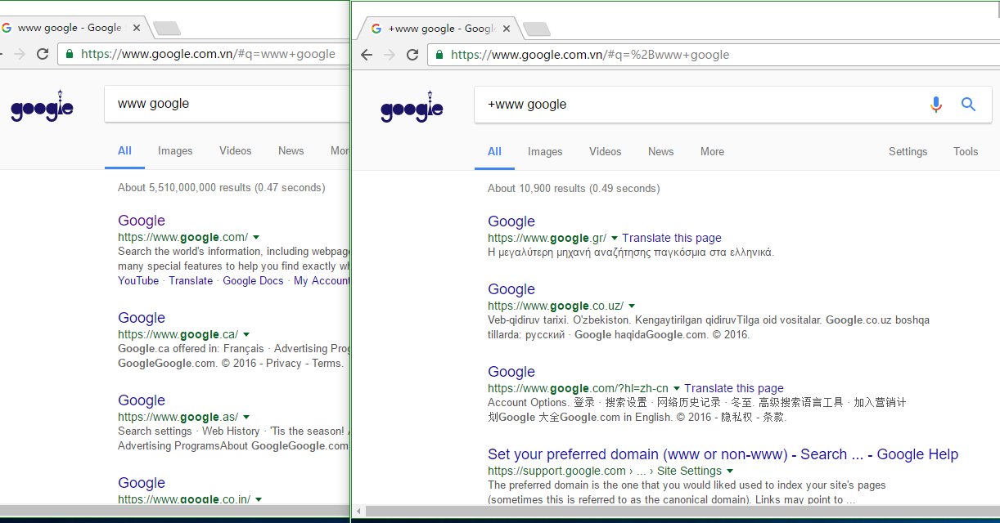

# [谷歌搜索语法基本语法](https://blog.csdn.net/u014565127/article/details/53842885)

> Google是一款十分强大的搜索引擎，黑客们常常借助它搜索网站的一些敏感目录和文件，甚至可以利用它的搜索功能来自动攻击那些有漏洞的网站；而有些人可以通过搜索把某个个人的信息，包括住址、电话号码、出生年月等都可以搜索出来；当然我们在日常的生活中正确的借助Google搜索也可以更加高效的找到我们需要的东西。

关于搜索，像国内外的百度，bing，Yahoo，soso等好多网站都可以做到，但是他们的影响力却远远不如Google大？那么为什么Google这么令人关注呢？我们先来了解一下Google的搜索特色。

Google的一些特色包括：支持多种搜索语言，种数达到了上百种；搜索速度快，据说Google拥有8000多台服务器，200多条T3级别的宽带；Google还拥有专利网页级别技术PageRank，可以提供高命中率的搜索结果；Google的智能化的“手气不错”功能，可以提供最符合要求的网站……在这里就不一一列举了。

为了做更深入了了解，我们还是先来学习一下Google的搜索语法。谷歌的搜索语法分成了两大类，一类是基本语法，另一类就是高级语法了。这一次，就先介绍一下Google的基本语法。

------

# 基本语法

## `AND`：缺一不可

谷歌的默认搜索是and逻辑，意思就是，我们在输入关键字后进行搜索时，如输入：“`program google`”后，会搜出包含“program”和“google”的文件内容，如图1。

说到这里，我就插入一个小知识点：基础布尔逻辑。
**对于一个搜索引擎来说，进行搜索的时候是要搜索到匹配到所有关键词的页面，还是包含关键词中的任意关键词就可以，取决于一个搜索引擎的一些特别算法，称之为搜索引擎的布尔逻辑默认值。**

## `OR`：两者皆可

而google就是用and作为默认逻辑（搜索到所有的关键词），当然这个前提是我们没有输入一些特殊的命令。如果你不确定你要搜索的内容，或者你想搜索两个中的任意一个，那么就要使用关键词“`OR`”。注意：OR是大写的，小写是不起作用的，而且，每一个关键词与“OR”之间是有一个空格的，我们来看一下搜索结果。

当然，可以预想的是，google的结果要比program多得多，所以结果第一页全是有关google的内容。此外，还可以借助计算机体系语言中的“`|`”来代替“`OR`”，效果是一样的。

## `""`：一刻都不能分割

当然，如果你希望搜索“programgoogle”的内容，而不希望这两个单词之间有任何其他的内容，那么就要使用双引号把搜索的内容组成一个词组`"programgoogle"`来达到目的。如图3所示。　
如上图所示，结果中的`programgoogle`都是在一起的，没有分割。当然这样的结果比较少，只有2740个，但是看图1，结果却有7亿多个。而且，大部分搜索引擎都有智能断句的功能，如果没有特殊的命令，搜索引擎会一定量的根据大众的语言使用习惯来判断你要搜索什么，而这样的做法，不仅仅没有使搜索引擎显得不听话，反而对大众来讲搜索引擎变得十分智能和高效！

## `-`：不想看到你

但是如果我们只想看到“program”的内容，而不希望看到“google”的内容，就可以把“`-`”（减号或者破折号）应用到搜索当中去，语法为“`program -google`”，注意，“-”之前是有一个空格的，而其后却是和下一个关键词是紧紧相连的！搜索的结果如下图4所示。可以看得到结果中都会包含program，而不包含google。

## `+`：就想看到你

说到这里，还要提一下google的约束扩展问题了。一般来说，当输入关键词后，google会把相关网页和信息的结果呈现在我们面前。然而，有一些单词在搜索引擎中是会被智能忽略的，导致我们得不到想要的结果。比如十分常用的“www”和“the”，基本上任何一个网页上都会找到的东西，就会被google自动忽略（不要觉得这样不好，还是那个道理，在实际引用当中这样做反而显得更加高效和智能）。如果我们不想忽略这些词进行查询，就得在这些关键词的前面加上符号“`+`”。如下图5所示：

看上去两者好像没有什么大的区别，其实仔细比较一下搜索结果就可以看得出，加上加号的搜索结果有一万多个，而不加加号的结果却有着55亿多！而因为google和www的关联度比较高，所以在前面的结果表现的差别不大。

## “`?`”和“`*`”：占位通配符

除了上述字符之外，一些搜索引擎支持一种叫做“stemming”（填充）的技术。Stemming是指在查询的关键词中添加一些通配符，通常是“`*`”，有时候也可能是“`？`”，这些通配符的作用是要求搜索引擎进行查询是可以返回多个不同的结果。其中通配符代表占位，可以匹配其他任意字母和单词，而其他的字或词组与用户输入的相同。如我们想要搜索“Lionel Messi”的内容，却忘记了第一个单词的一些拼写，就可以输入“`"l*Messi"`”进行查询，注意：此处整个字符串是要用一个英文半角双引号括住的！结果如下图所示。　
可以看到，google自动匹配出Lionel Messi的内容并且进行了搜索。这样的方式有利于我们只能记住单词或短语的一部分的内容时使用