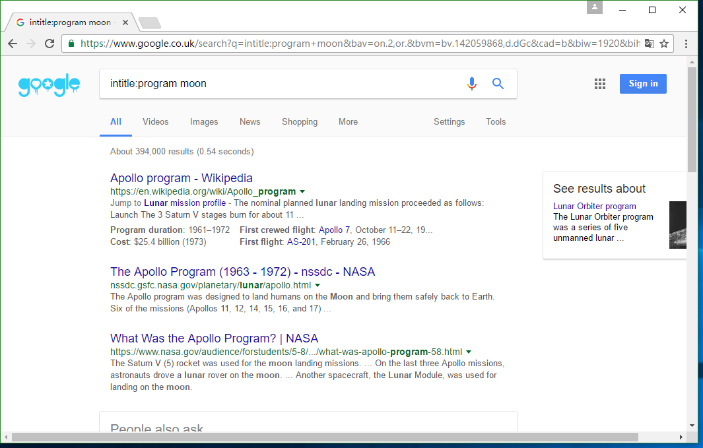
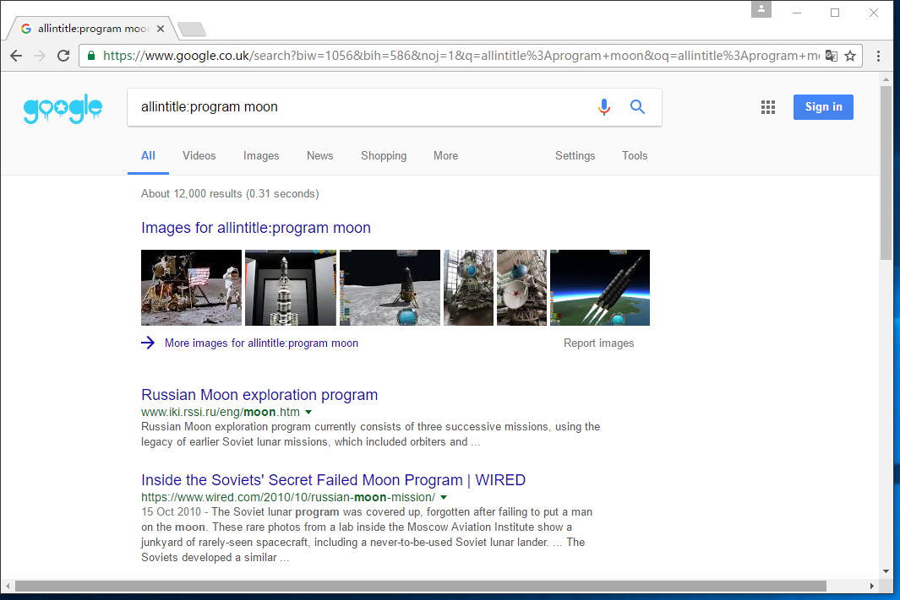
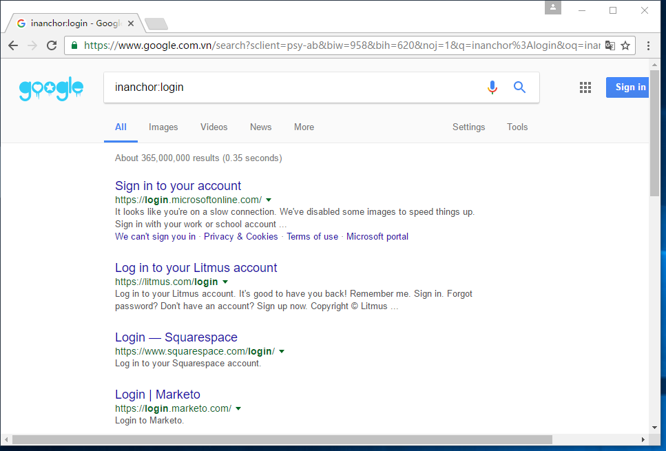
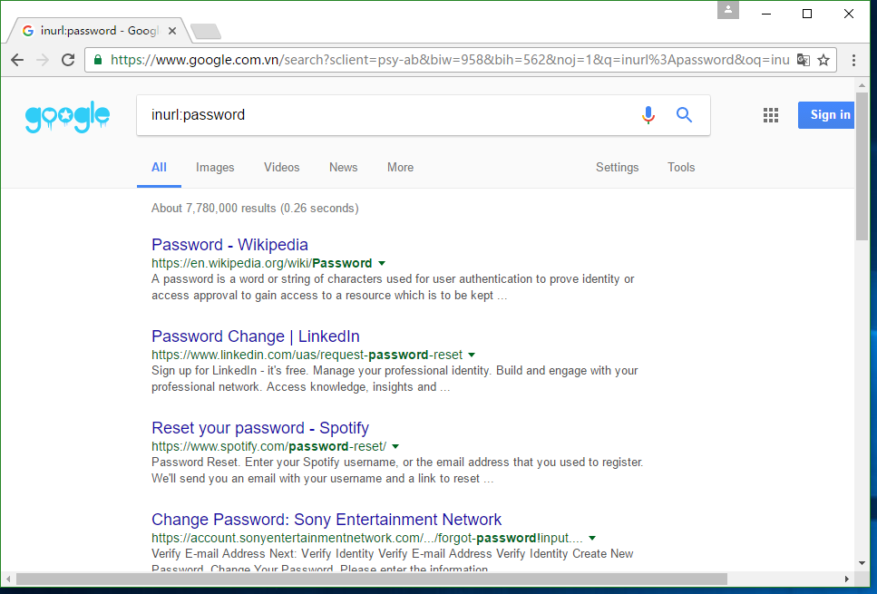
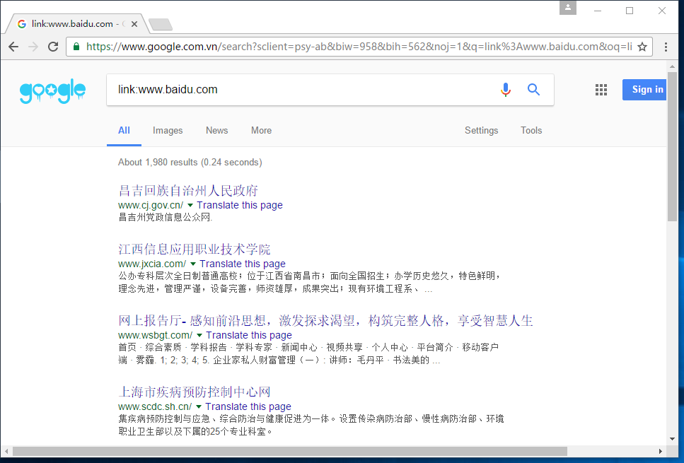
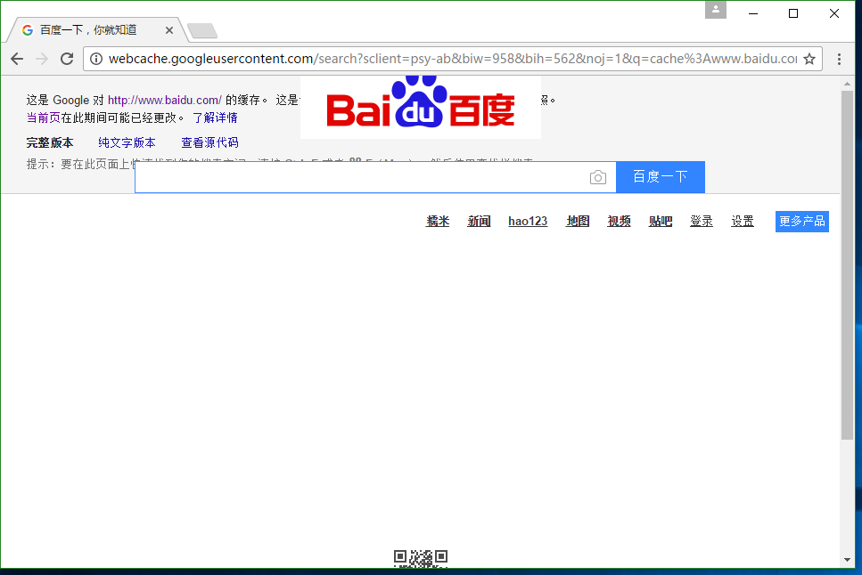
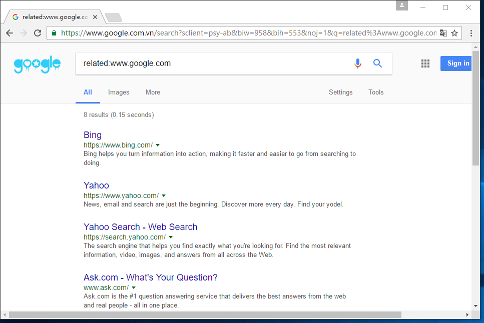
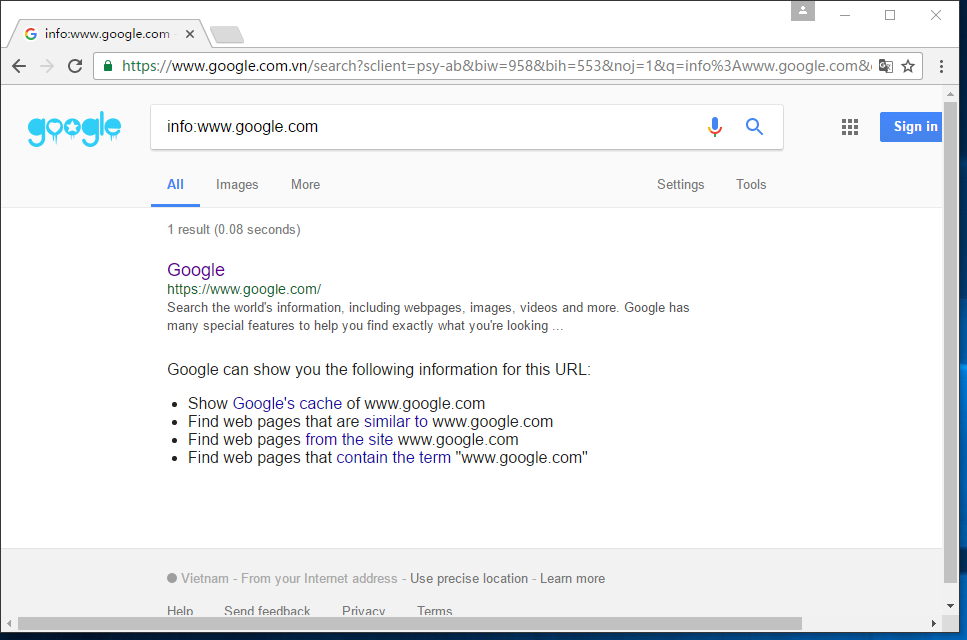

# 谷歌搜索语法高级语法

## 1.intitle

首先要介绍的就是“intitle:”的用法，这个串的作用是将搜索的范围局限在标题上。在关键词前面加上这个，就会只对网页的标题进行搜索并且配对，最后将结果返回给用户。例如输入“intitle:program moon”进行搜索，就会返回如下图所示的结果。

　　
　　但是可以看到，貌似搜索结果中只出现了关于program的内容，而并没有moon相关的内容，这里其实还是牵扯到搜索引擎的基础布尔逻辑问题，在intitle:语法上，google会检索所有的网页，只要出现program或者moon其中的一个就会被匹配，意料之中的是，关于program的内容肯定是要远远多于moon的内容的，所以搜索结果里关于program的内容占据了主导，可以理解为moon这个关键词被一定量的智能忽略了。但是如果我们想要找到网页标题中既有program又有moon的网页呢?那么我们就要使用“intitle:”的一个变体“allintitle:”，使用这个前缀后，就能得到我们想要的结果了。如下图所示，除了第一条为google的图片推荐，其余的结果中网页的标题既含有program这个关键词，又含有moon这个关键词。

## 2.intext

看到这个单词，大概就可以猜到它的意义了，“intext:”是用来搜索网页正文内容的，这样就可以忽略网页中的超文本链接、URL和题目。我们输入“intext:2018 program”进行搜索，结果如下图所示，结果中显示的网页大部分标题几乎没有规律，但是网页的索引中都包含着 “2018 program”，但是因为2018和program的同时出现的网页实在比较少，两个关键词的关联度实在不高（笔者此时的时间为2016年12月25日00:07:10），因为现在才是2016年，如果换成“2016 program”我相信应该会有更多的结果出现。但是我们要明白，这时搜索引擎关注的内容是网页的正文。与之相对应的也有一个变体：“allintext:”，用法和上面的“allintitle”相似，我就不做过多的介绍了。

　　到这里恐怕就有读者要问了，这与我们平时的搜索相比没有什么高级的地方啊？确实，就平时的搜索来讲，这个语法的意义确实不太重大，但是在某些领域，例如黑客作为一名攻击者，构造好关键词配合适当的语法就可以进行撒网式的攻击，这个呢，我们点到为止，这里就不谈了。

## 3.inanchor

这个语法的意思是在页面的链接锚点进行搜索。

> 链接锚点指的是一个链接的描述文本，如这样的一段HTML代码：`<a href=https://www.baidu.com>百度</a>`，链接的锚点就是“百度”了。（解释来自于网友）

我们搜索“inanchor:login”就可以搜索到有那些含有锚点的网页了，如下图所示。当然，这个语法也有一个变体“allinanchor:”，意思也与前面的类似。

## 4.site

这个语法是把搜索限制在站点域名之内。例如我们搜索“program site:google.com”，结果如下图所示，这里呢，我们通常不需要加上前面的www，这样搜索的结果就会是包括所有含有google.com域名的有关内容，包括顶级域名和二级域名甚至三级域名的内容。也就是说我们甚至可以通过搜索，确定google.com大概有多少个子域名！

## 5.inurl

inurl:会将搜索的范围限制在URL或者网站的页面上，这个语法对于查找搜索和帮助是很有用的，不仅适合我们普通的搜索，在黑客搜索中用处也很大。例如我们输入“inurl:password”，结果如下图所示，结果显示了所有URL中含有password的网页。另外，这个语法也有一个变体：“allinurl:”，用法与前面的相似。

在黑客领域，inurl和site的使用是十分的频繁的，利用他们组合可以搜索到有用的信息，如我们可以使用“site:google.com –inurl:www.google.com”，而这个语法的含义就是搜索google到底有多少个子域名。

## 6.link

这个的功能是查询所有链接到某个特定URL上的列表。要注意的是，是特定的URL页面，如输入：“link:www.baidu.com”进行搜索，如下图所示，就会返回所有链接到百度主页的网页了。因此，我们同样可以指定特定的URL页面来进行搜索。

## 7.cache

Cache可以帮助我们查找到google索引过的页面副本，它最大的好处就是及时源文件界面不存在了，或者变成了其它的内容，我们依然可以搜索的到。例如输入:“cache：www.baidu.com”，结果如下所示，可以看到，格式虽然乱糟糟的，但是依稀可以从中获取一些有用的信息的。在国内的搜索引擎上，可能也有类似的功能，比如百度的网页快照，其功能与这个类似。

## 8.filetype

filetype是指搜索指定后缀的文件。这个不太常用，但是在黑客领域有一定的作用。但是我们的重点是讲解语法，所以这里就一笔带过（关于filetype的一些其他内容我会在以后的博文中展示），如下图所示，输入“filetype:mdb”，结果就会显示出一些网站的数据库文件。
　　

## 9.related

这个语法是用于搜索语某些页面相关的网站的，可以辅助我们搜索同类的页面。比如我们输入“related:www.google.com”,显示的结果都是一些其他的搜索引擎。

## 10.info

这个语法可以搜索到关于一个URL的更多信息的页面列表，这里的信息包括这个网页的cache，还有与这个网页相似的网页等等，注意下面的英文信息就好。输入“info:www.google.com”,结果如下图所示。
