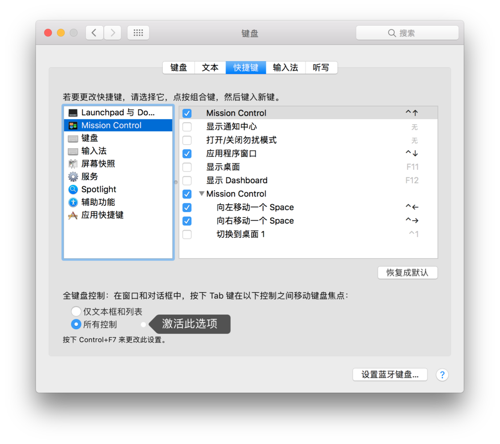

# macOS系统修改&增强

[toc]

## [macOS 禁用程序的黑色模式/Dark Mode](https://www.cnblogs.com/Wayou/p/disable_mac_chrome_dark_mode.html)

所以决定系统使用 Dark Mode 的情况下将 Chrome 的黑色禁用。

通过命令行中设置 `defaults` 值可达到目的。

```shell
defaults write com.google.Chrome NSRequiresAquaSystemAppearance -bool Yes
```

如果想恢复默认，只需要将刚才设置的值删掉或者将 `Yes` 设置成 `No`。

```shell
defaults delete com.google.Chrome NSRequiresAquaSystemAppearance
```

### 禁用任意 App 的 Dark Mode

推而广之，不仅可禁止 Chrome 进入 Dark Mode，还可让其他任意 App 不进入 Dark Mode，如果该应用支持过 Dark Mode 的话。只需要找出该应用的打包发布的 bundle id 即可。这个 id 可通过下面的命令来得到。比如查看 Canary 版本的 Chrome：

```shell
osascript -e 'id of app "Google Chrome Canary"'
com.google.Chrome.canary
```

其中 `Google Chrome Canary` （不区分大小写）是你在程序文件夹下看到的 `.app` 后缀的那个文件的文件名，比如这里 `Google Chrome Canary.app`。得到的 id 为 `com.google.Chrome.canary` 再代入最上面的命令中即可。

#### 程序 bundle id 的查找

更为准备的方式，查找 id，是通过右键 `.app` 文件选择 `Show Package Contents`，然后找到 `Contents>info.plist` 文件，搜索 `CFBundleIdentifier` 即可看到该程序的 bundle id。

```shell
defaults write com.google.Chrome.canary NSRequiresAquaSystemAppearance -bool Yes
```

这里 id 是区分大小写的，写错不生效。

要恢复默认时同理。

#### 一些常用软件

- 网易云音乐

同理，设置网易云音乐关闭其黑色模式，通过 `plist` 文件发现其 bundle id 为 `com.netease.163music`，

```shell
...
<key>CFBundleIdentifier</key>
<string>com.netease.163music</string>
...
```

设置：

```shell
defaults write com.netease.163music NSRequiresAquaSystemAppearance -bool Yes
```

- iBooks:

```shell
defaults write com.apple.iBooksX NSRequiresAquaSystemAppearance -bool Yes
```

- Xcode:

```shell
defaults write com.apple.dt.Xcode NSRequiresAquaSystemAppearance -bool YES
```

#### 其他默认值

通过 `defaults read` 可查看到所有应用已经存在的的 defaults 值。

```shell
defaults read >> defaults.txt
```

打开 `defaults.txt` 后搜索相应 app 的 id 可看到其所有可用值的列表。比如搜索 `com.google.chrome`

```shell
{
      "com.google.Chrome" =     {
        KeychainReauthorizeInAppSpring2017 = 2;
        KeychainReauthorizeInAppSpring2017Success = 1;
        LastRunAppBundlePath = "/Applications/Google Chrome.app";
        ...
    };
    "com.google.Chrome.canary" =     {
        KeychainReauthorizeInAppSpring2017 = 1;
        KeychainReauthorizeInAppSpring2017Success = 1;
        LastRunAppBundlePath = "/Applications/Google Chrome Canary.app";
        ...
    };
}
```

##  macOS Dock栏全屏弹出慢

终端输入

```bash
defaults write com.apple.Dock autohide-delay -float 0 && killall Dock
```

恢复

```bash
defaults delete com.apple.Dock autohide-delay && killall Dock       
```

> 注：使用快捷键**command + ->|** 切换APP更地道，如果习惯像Windows那样在任务栏切APP可参考这个。

## Mac OS字体平滑设置

关闭：

```shell
defaults -currentHost write -globalDomain AppleFontSmoothing -int 0
```

1用于光线平滑，2用于中等平滑，3用于强平滑。

执行命令后，您需要重新加载Finder和所有其他打开的应用程序以查看有效的更改，您可以通过杀死它来重新加载Finder：

```shell
killall Finder
```

另一种选择是简单地重启Mac，或者注销并重新登录，因为重新启动Finder以及WindowServer和所有其他应用程序，以使字体平滑更改生效。

恢复：

```
defaults -currentHost delete -globalDomain AppleFontSmoothing
```

## macOS一键关闭Finder

启用退出Finder的菜单项，终端输入

```bash
defaults write com.apple.finder QuitMenuItem -bool YES && killall Finder
```

打开任意一个Finder窗口，点击“访达”，或使用APP退出的通用快捷键“command + Q”，即可关闭全部的Finder窗口。

注：启用后仍然可以打开Finder窗口，但Finder窗口不会再一个一个地占用Docer栏。可以右键Finder APP，调出需要的窗口。

恢复

```bash
defaults write com.apple.finder QuitMenuItem -bool NO && killall Finder
```

## macOS显示隐藏文件相关命令

```shell
defaults write com.apple.finder AppleShowAllFiles -bool true;
KillAll Finder
```

这条命令来显示。同时，将 true 改成 false, 就可恢复隐藏状态。

鼓捣过一个 AppleScript, 做了个有 GUI 的小程序。可以打开 AppleScript 编辑器 这个自带 App, 新建一个文档，将下面的代码粘贴进去，编译，然后导出 .app 应用程序，方便切换显示/隐藏两个状态。

```shell
display dialog "隐藏/显示隐藏文件" buttons {"可见", "隐藏"} with icon 2 with title "Switch to presentation mode" default button 1

set switch to button returned of result

if switch is "隐藏" then
	do shell script "defaults write com.apple.finder AppleShowAllFiles -bool false;
KillAll Finder"

else
	do shell script "defaults write com.apple.finder AppleShowAllFiles -bool true;
KillAll Finder"

end if
```

## [mac下软件意外退出或崩溃报错时弹窗的关闭方法](https://blog.csdn.net/qq_43827595/article/details/103178501)

关闭软件意外退出弹窗：软件意外崩溃让人烦心，重新打开后还会一遍遍弹出的问题报告

终端下运行

```shell
defaults write com.apple.CrashReporter DialogType none 关闭这个问题报告
defaults write com.apple.CrashReporter DialogType crashreport 恢复其显示错误报告
```

用这个方法可以解决Copytranslator退出是弹出意外窗口的问题

## Macos鼠标改善

### 禁用鼠标加速

您可以从终端更改一个隐藏的首选项。读取其当前值类型

```shell
defaults read .GlobalPreferences com.apple.mouse.scaling
```


在终端提示下。正常值为0〜3，可以通过移动“系统偏好设置”的“鼠标”面板中的“跟踪速度”滑块来设置。因此，值0〜3不会禁用加速。

但是，如果通过键入将其设置为-1

```shell
defaults write .GlobalPreferences com.apple.mouse.scaling -1
```


在终端中，这似乎禁用了加速功能，并将鼠标跟踪速度设置为无法更改的恒定预定义值。

我发现我必须注销然后重新登录才能生效。在那之后，`pixels pointer moves / meters mouse moved`比率是恒定的，但是不幸的是无法调节。

### 如何撤消更改

要恢复为Apple的默认设置，只需打开“系统偏好设置”的“鼠标”面板并将“跟踪速度”更改为任何值，然后退出“系统偏好设置”。

鼠标≠触控板

Mac OS X独立存储鼠标和触控板设置。如果要禁用触控板而不是鼠标的加速，说明是相同的，只要在上面看到`com.apple.trackpad.scaling`的任何地方都替换为`com.apple.mouse.scaling`(显然，请使用“系统偏好设置”的触控板 Pane 而不是“鼠标” Pane )。

## 使用 Tab 键快速切换对话框按钮

熟悉 Windows 平台的人大抵知道一个功能，就是在对话框中可以通过敲击 Tab 键实现快速切换按钮并回车选中，以提高工作效率。但是刚刚使用 Mac 的人估计都会困惑，如此简单的功能为什么 macOS 下却不提供？其实并非是 macOS 系统中没有，只不过默认被关闭罢了。今天教大家如何打开这个实用的功能。

1. 首先打开**系统偏好设置** -> **键盘** -> **快捷键**；

2. 选中「全键盘控制：在窗口和对话框中，按下 Tab 键在以下控制之间移动键盘焦点：」下的所有控制选项；

   

3. 关闭**系统偏好设置**即可生效。

## macOS调整启动台应用程序图标排列

下面详细说说每一步是在干嘛：

```shell
1、调整每一列显示图标数量，8表示每一列显示8个（一般7、8就不错），比较不错，可根据个人喜好进行设置。 
defaults write com.apple.dock springboard-rows -int 8

2、调整多少行显示图标数量
defaults write com.apple.dock springboard-rows -int 7

3、重置Launchpad
defaults write com.apple.dock ResetLaunchPad -bool TRUE

4、重启Dock
killall Dock
```

如果我们想回复成默认的排列呢！（默认的是5行7列）

```shell
defaults write com.apple.dock springboard-rows Default
defaults write com.apple.dock springboard-columns Default
defaults write com.apple.dock ResetLaunchPad -bool TRUE
killall Dock
```

```shell
defaults write com.apple.dock springboard-rows -int 8
defaults write com.apple.dock springboard-rows -int 7
defaults write com.apple.dock ResetLaunchPad -bool TRUE
killall Dock
```

## macOS访达中文目录改英文

以Downloads为例，打开终端（Terminal），不知道在哪就 `command+空格` 搜索。

```
cd ~/Downloads
mv .localized .localized2
```

或者

```
rm ~/Downloads/.localized
```

重启Finder

## macOS仅安装Xcode环境

单独安装CommandLineTools，不需要Xcode

```shell
xcode-select --install
```

确认是否安装：

```shell
xcode-select --version
```

指定路径安装

```shell
sudo xcode-select --switch /Library/Developer/CommandLineTools
```

## 禁止远程产生.DS_Store

```shell
关闭命令
defaults write com.apple.desktopservices DSDontWriteNetworkStores true
删除命令
sudo find / -name ".DS_Store" -depth -exec rm {} \;
```

## [Mac如何修改通知横幅消失时间](https://blog.keepchen.com/a/mac-notification-hide-duration.html)

首先打开`终端`，然后运行以下命令：

```shell
defaults write com.apple.notificationcenterui bannerTime -int {多少秒后消失}
# 如 defaults write com.apple.notificationcenterui bannerTime -int 2
```

然后**重启电脑**。

重启后设置生效。

想要手动触发通知来测试一下，可以打开`终端`运行以下命令：

```shell
osascript -e 'display notification "test notification!"'
```

如果想还原回系统默认的状态，可以删除配置，打开`终端`运行以下命令：

```shell
defaults delete com.apple.notificationcenterui bannerTime
```

**重启系统**后生效。

