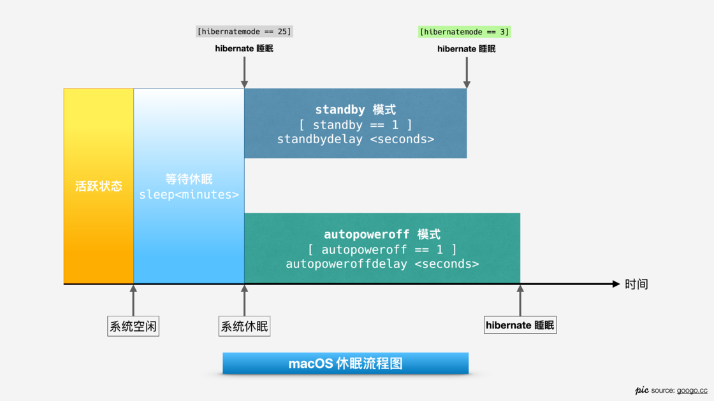
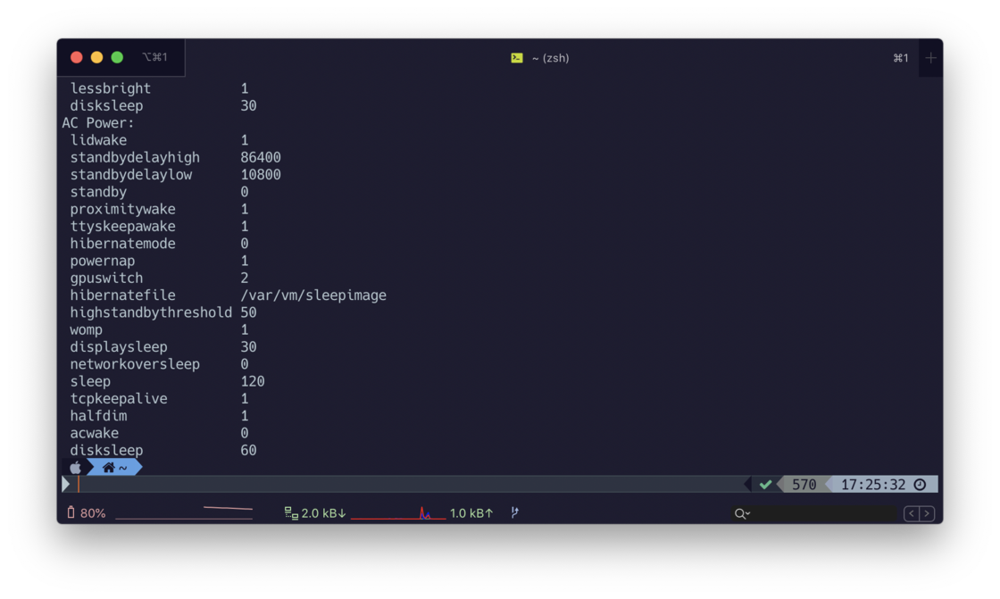
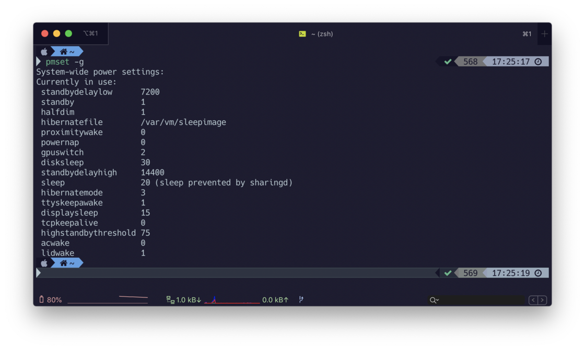

# [通过 pmset 工具管理 masOS 睡眠，让你的 Mac 睡得更好](https://sspai.com/post/61379)

> Power Manager Setting (pmset) 是 macOS 的系统级电池管理工具，通过调整 macOS 的睡眠计划，可以让Mac睡得更「好」，达到 「插电响应快，断电用得久」 的理想目标。

## Mac 是怎么睡觉的？

Mac 的睡觉分成两种，**「休眠」 (sleep)** 和 **「睡眠」 (hibernate)**。简单点说，休眠和睡眠就好比人的小憩和睡大觉，小憩醒得快，睡大觉就醒得慢。

当你长时间不操作 Mac 或把 MacBook 的盖子合上或点击 Apple Logo 菜单下的 Sleep 选项，系统会进入**「休眠」**状态，由于数据仍存储在内存中，此时系统可以被快速唤醒，快速恢复到休眠前的状态。

在「休眠」一段时间后，Mac 会根据你的设定进入更深一层的 **「睡眠」** 状态，此时 Mac 会考虑将内存中的数据作为一个镜像写入到硬盘中（GB 级别大小），然后放弃内存供电，达到更加省电的目的。此时唤醒系统，数据需要从硬盘重新装载至内存，耗时长，速度慢。

总结一下，「休眠」和「睡眠」的主要区别：

- 唤醒速度快慢
- 是否向内存供电
- 是否向硬盘写入内存镜像

当然，Mac 到底要怎么「睡」，我们是可以通过 `pmset` 调整的。

## macOS 系统睡眠流程

macOS 睡眠流程图

如图所示，当我们不使用 Mac 时，一段时候后，系统先进入 `sleep` 状态，然后根据 `hibernatemode` 的模式，决定将镜像数据写入内存还是硬盘。

`standby` 和 `autopoweroff` 相当于两个并行的模式计时器，Mac 会根据当前供电条件作出模式的选择，在计时器阶段内，当时间条件满足，Mac 就会将镜像写入硬盘并睡眠。

## pmset 用法

```
sudo pmset [-选项] <参数>
```

例子：

- `pmset -g custom`：查看当前所有睡眠计划
- `pmset -g cap`：查看当前供电条件下可以调节的参数
- `sudo pmset restoredefaults`：还原全部设置

### 常用选项

- `pmset -a`：调整任何条件下的睡眠计划
- `pmset -c`：调整外部供电的睡眠计划
- `pmset -b`：调整电池供电的睡眠计划
- `pmset -g`：查看计划

### 常用参数

🎨 **sleep**

sleep 控制进入休眠所需要的空闲时间

🎨 **hibernatemode**

> hibernatemode supports values of 0, 3, or 25. Whether or not a hibernation image gets written is also dependent on the values of standby and autopoweroff.

hibernatemode 负责管理睡眠模式。值得注意的是，休眠时的内存镜像是否写入硬盘，除了受 `hibernatemode` 的控制，还和 `standby` 以及 `autopoweroff` 的值有关。

hibernatemode 有 3 种休眠模式可选择

- `hibernatemode = 0`
  - **iMac, Mac Mini等 Mac桌面设备默认参数**
  - 持续向内存供电，将数据保留在内存
  - 唤醒速度快，减少硬盘占用
  - 数据有丢失风险
  - 耗电量大

- `hibernatemode = 25`
  - 将数据写入硬盘
  - 不向内存供电，将内存镜像直接写入硬盘
  - 数据不易丢失，镜像占用硬盘空间
  - 唤醒速度慢
  - 耗电量少

- `hibernatemode = 3`
  - **MacBook 笔记本设备默认参数**
  - safe sleep, 数据既写入内存又写入硬盘
  - 持续向内存供电
  - 唤醒时，根据设备电量自动选择从 内存/硬盘 恢复

🎨 **standby**

> standby causes kernel power management to automatically hibernate a machine after it has slept for a specified time period.

standby 是 Mac 在休眠时的计时器，当满足时间条件，Mac就会由「休眠」状态转至「睡眠」状态。

standby模式需要以下条件：

- **电池供电**
- 没有外接设备
- 没有网络活动
- 没有外接显示器

在满足条件的前提下， `standbydelayhigh/low` 秒后，会进行睡眠。比较人性化的的一点是，standby 提供了两个倒计时，通过一个阈值 (`highstandbythreshold`) 进行控制。

🎨 **highstandbythreshold**

highstandbythreshold(电池剩余电量百分比)它是`standbydelay`模式选择阈值，默认 50% 电量。

- 高于阈值，采用 `standbydelayhigh` 计算时间。
- 低于阈值，采用 `standbydelaylow` 计算时间。

🎨 **autopoweroff**

> autopoweroff is enabled by default on supported platforms as an implementation of Lot 6 to the European Energy-related Products Directive. After sleeping for <autopoweroffdelay> seconds, the system will write a hibernation image and go into a lower power chipset sleep. Wakeups from this state will take longer than wakeups from regular sleep.

autppoweroff 是为了满足 [欧盟能源效率 Lot 6 条例](https://ac-dc.powerint.cn/sites/default/files/greenroom/docs/EC_1275_2008PublishedRegulation.pdf)（关于待机和关闭模式的要求）而设计的，但并不是全部设备都有这个这个设定，需要通过 `pmset -g cap` 查看是否能调节此项参数。

`autopoweroff`模式需要满足以下条件：

- **外部电源供电**
- 没有外接设备
- 没有网络活动

在满足条件的前提下, `autopoweroffdelay`秒后，系统会写入内存镜像然后睡眠。与上文提到的 `standby` 不同，`autppoweroff` 更多是为了连接外部电源充电时设计的。

### 🎨 **gpuswitch**

`gpuswitch` 这个参数用于管理显卡的选择，适合有独立显卡/外置显卡的 Mac

- `gpuswitch=0` 只使用集成显卡
- `gpuswitch=1` 只使用独立显卡
- `gpuswitch=2` 自动切换显卡

调节这个参数可以避免在电池供电时使用耗电量高的独立显卡，以节省电量。

**其他常用参数**

- `lidwake`：开盖时是否唤醒
- `tcpkeepalive`：合盖时是否保存网络连接
- `displaysleep`：屏幕休眠时间
- `disksleep`： 硬盘休眠时间
- `acwake`: 被同一 iCloud ID 下的设备唤醒

更多参数在终端运行 `$ man pmset`, 查阅 `pmset` 的说明

## 🌟 个人设置方案

我个人所希望的睡眠计划是：外接供电条件下响应尽可能快，电池供电条件下耗电少。

### ⚡️ 外部供电下的 pmset 设置

外部供电时的设置

在进行外部供电的时候，我希望 MacBook 是处于一个 **「时刻准备着」** 的状态（参考 iMac ），因此我希望我的 Mac能清醒更久，并且永不 「睡眠」。因此我会作出以下设置：

**永不睡眠：**

- `hibernatemode` 设置成 `0`，让外部电源持续给内存供电。
- 关闭 `standyby` 和 `autopoweroff` 模式，阻止 MacBook 睡眠。

**详细设置：**

```
// 120 分钟后进入休眠，延长清醒时间 sudo pmset -c sleep 120 // 显示器休眠时间：30 分钟 sudo pmset -c displaysleep 30 // 硬盘休眠时间：60 分钟 sudo pmset -c disksleep 60 // 内存供电，内存镜像不写入硬盘 sudo pmset -c hibernatemode 0 // 关闭 standby 模式 sudo pmset -c standby 0 // 关闭 autopoweroff sudo pmset -c autopoweroff 0 // 休眠时持续联网 sudo pmset -c tcpkeepalive 1
```

### 🔋 电池供电下的 pmset 设置

电池供电时的设置

在通过电池供电的时候，我希望 Mac 能耗电少一些，同时「睡眠」后唤醒速度不太慢。因此我会作出以下设置：

- `hibernatemode` 为 `3`，将镜像数据既写入内存又写入硬盘，同时对内存只供电一段时间。
- `standby` 的电量阈值设置成 `75%`，当电量低于 75% stanby的计时器就使用 `standbydelaylow` 作为休眠倒计时。
- `tcpkeepalive` 设置成 `0`, 休眠时电脑将会断网，以节省电量。但此时无法进行下载工作，**FindMy 也无法定位。**
- `proximitywake` 设置成 0, 关闭被同一网络下的同 iCloud 设备唤醒

**详细设置：**

```
// 20 分钟后进入休眠
sudo pmset -b sleep 20
// 向硬盘写入镜像，同时内存供电
sudo pmset -b hibernatemode 3
// 显示器休眠时间：15 分钟
sudo pmset -b displaysleep 15
// 硬盘休眠时间：30 分钟
sudo pmset -b disksleep 30
// 休眠时断网
sudo pmset -b tcpkeepalive 0
// 高电量下 standby: 4小时
sudo pmset -b standbydelayhigh 14400
// 低电量下 standby: 2小时
sudo pmset -b standbydelaylow 7200
// standby 电量阈值：75%
sudo pmset -b highstandbythreshold 75
// 开盖唤醒
sudo pmset -b lidwake 1
// 关闭被同一 iCloud 下的设备唤醒
sudo pmset -b acwake 0
```

📖 参考资料:

- StackExchange: [Difference between autopoweroff and standby in pmset](https://apple.stackexchange.com/questions/113954/difference-between-autopoweroff-and-standby-in-pmset)
- tutsplus: [How to Hibernate a Mac](https://computers.tutsplus.com/tutorials/how-to-hibernate-a-mac--cms-23235)
- WikiPedia: [pmset](https://en.wikipedia.org/wiki/Pmset)

P.S. 「Hibernate」 英文直译为「睡得深的睡眠，如冬眠」，本文取「睡眠」之义，以表达设备的低功耗运作。