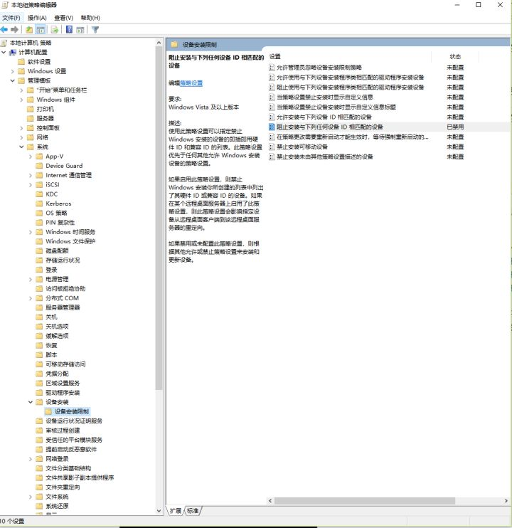
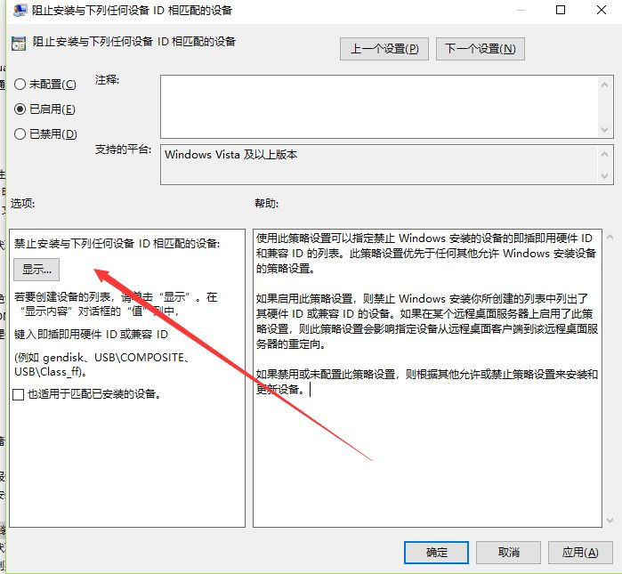

```
ACPI\VEN_INT&DEV_3403
ACPI\INT3403
*INT3403
ACPI\VEN_INT&DEV_3400
ACPI\INT3400
*INT3400
PCI\VEN_8086&DEV_1903&SUBSYS_09231028&REV_07
PCI\VEN_8086&DEV_1903&SUBSYS_09231028
PCI\VEN_8086&DEV_1903&CC_118000
PCI\VEN_8086&DEV_1903&CC_1180

```


> DPTF全称Dynamic Platform and Thermal Framework，直译过来就是“动态平台和热框架”，由英特尔提出和设计。顾名思义，不难猜出这个功能与温度控制有关。


可见，DPTF有“提高”和“降低”两个功能。在不满足触发条件的情况下，DPTF能将CPU的PL1默认值提高；在被触发之后，DPTF一般就只执行降低功耗来控制温度的功能了。如果关闭DPTF，意味着机器在非高温状态下会有性能“损失”（没额外加成），在高温状态下性能则可能会好一点。

DPTF删除后，PL1的默认值可能会改变，原先通过DPTF“打鸡血”的机器，PL1会回到正常值，但某些机器PL1会低于正常值

第一步我们首先来禁用dptf功能，右键开始菜单在设备管理器中我们就可以看到如上图的dptf功能。


不过如果直接在任务管理器中禁用，随着windows的自动更新这个驱动会被安装回来，所以我们通过策略组的方式禁用设备安装，按win+r键打开运行命令，输入gpedit.msc打开策略组





在策略组中打开计算机配置-管理模板-系统-设备安装-设备安装限制，在右侧窗口点击“阻止安装与下列任何设备id相匹配的设备”





打开面板，在左边的选择中点击已启用，在下面“禁止安装与下列任何设备id相匹配的设备”中打开显示按钮


在输入框中输入dptf的硬件id即可，硬件id可以通过右键开始菜单，设备管理器，右键点击设备-详细信息，硬件id来获取，因为dptf总共有三个设备，所以这三个设备的硬件id都需要输入到框里


然后点击也适用于匹配已安装的设备然后应用或者手动卸载dptf都可以，这样dptf就会被卸载并且不会自动安装。

