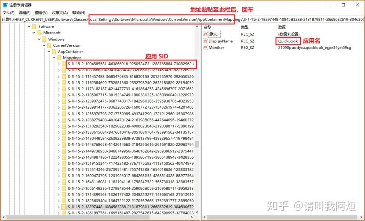

# UWP解除网络隔离

## 1. 开着代理的情况下，Win10 UWP 应用无法联网

平时经常需要使用网络代理，但是它开着的时候，总会导致我电脑里 UWP 应用出现无法联网的状态，EXE应用不受影响。每次使用UWP应用时把代理关了就可以正常联网了。了解到是 UWP 的一些特殊原因，具体原因如下：

> Win10 所有 UWP 应用均运行在被称为 App Container 的虚拟沙箱环境中，App Container 可以保证应用安全性，但同时也阻止了网络流量发送到本机（即 loopback）， 使大部分网络抓包调试工具无法对 UWP 应用进行流量分析。同样的，该机制也阻止了 UWP 应用访问 localhost，即使你在系统设置中启用了代理，也无法令 UWP 应用访问本地代理服务器。

### 解决办法有两种

#### 1. 使用 Fiddler 4 解除 UWP 应用的网络隔离。（此方法最为简单）

下载安装 Fiddler 应用，下载链接：[Fiddler 官网下载地址 ](https://www.telerik.com/download/fiddler)（下载前的资料随便填）

安装后打开应用，按照下方截图顺序：

> \1. 点击winConfig
> \2. 找到并勾选你所有需要解除网络隔离的应用 3. 点击Save Changes 保存

操作结束。开着代理使用一下刚刚修改的应用，看看是不是已经可以正常联网了。


#### 2. 通过命令行工具解除 UWP 应用网络隔离（这个办法稍微麻烦点）

Win10 自带了一款名为 CheckNetIsolation.exe 的命令行工具，可以将 UWP 应用添加到排除列表，具体步骤如下：

##### 1.通过注册表获取应用的 SID

Win + R 快捷键打开「运行」窗口，输入Regedit打开注册表编辑器。然后复制下面这段地址定位黏贴到地址栏中：HKEY_CURRENT_USER\Software\Classes\Local Settings\Software\Microsoft\Windows\CurrentVersion\AppContainer\Mappings

Mappings 文件夹内的内容，就是所有 UWP 应用的对应的 SID。随便点击一个 SID 右边会显示应用名称。找到你要解除网络隔离的应用，复制它的 SID。



##### 2.打开 CMD 面板，使用 CheckNetIsolation.exe 解除应用隔离

Win + R 快捷键打开「运行」窗口，输入CMD打开命令行。

直接在终端中输入：CheckNetIsolation.exe loopbackexempt -a -p= 等号后面加上你刚刚复制的应用 SID， 接着回车后命令行显示完成说一般就成功了。一次只能解除一个应用，想要解除多个应用，找到对应的 SID，依次解除即可。


## 一条cmd命令的事儿

```shell
FOR /F "tokens=11 delims=\" %p IN ('REG QUERY "HKCU\Software\Classes\Local Settings\Software\Microsoft\Windows\CurrentVersion\AppContainer\Mappings"') DO CheckNetIsolation.exe LoopbackExempt -a -p=%p
```

