[TOC]

# [Windows10安装ubuntu18.04双系统教程](https://www.cnblogs.com/masbay/p/11627727.html)

## 一、查看电脑的信息

### 1.查看BIOS模式

现在的电脑大多数使用了UEFI BIOS引导系统（原来都是使用传统Legacy BIOS），从而加快启动速度，但同时也给用惯传统BIOS的用户带来很多困惑！电脑不能识别制作好的U盘PE系统了。

贴个简易的示意图，概念不是什么新概念，win8时就出来了，只是我一直没遇到过。

"win+r"快捷键进入"运行"，输入"msinfo32"回车，出现以下界面，可查看BIOS模式：

UEFI模式：

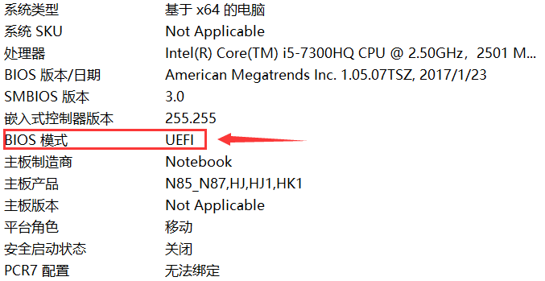 

传统MBR模式：

 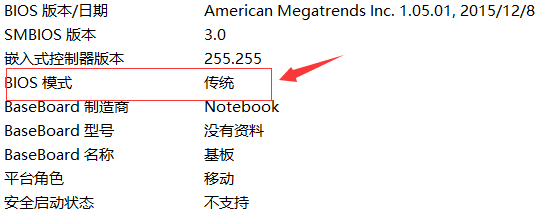

BIOS模式有传统的MBR模式和新式UEFI模式，这将对安装双系统的方法产生直接影响。目前来看，大部分电脑都属于新式UEFI模式，不过也存在一些老机子仍然属于传统MBR模式。本教程只介绍新式UEFI模式下的双系统安装方法，如果你的电脑属于传统MBR模式，强烈建议你重装windows系统来更新BIOS模式到UEFI。

### 2.搞清楚电脑的硬盘数

电脑是单双硬盘希望你买电脑时就已经清楚，这也算是卖点之一，如果这个都不知道，也请不要自暴自弃，继续往下看。

"此电脑"点击右键，点击"管理"，点击"磁盘管理"：

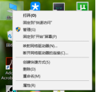 

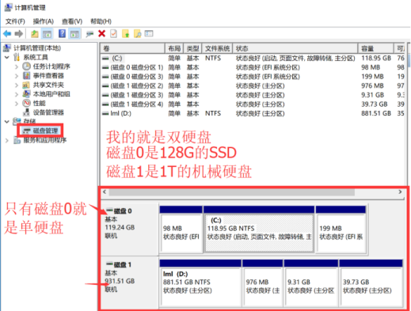

相信你已经清楚了自己电脑的信息，以下请注意有区分"单硬盘"和"双硬盘"操作的部分。

## 二、制作系统盘

需要准备以下工具：

①ubuntu系统镜像

②刻录软件，推荐"rufus"

③一个大于 4G 的 U 盘

按下图设置好参数，然后在FreeDOS旁边选择下载好的Ubuntu镜像文件（不选择也制作的。。。然后你懂的），点“开始”制作自己的UEFI启动盘吧。

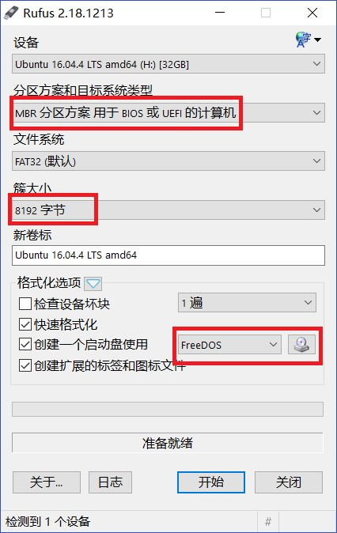

### U 盘安装系统

写在前面，因为个厂商的计算机 BOOT 启动的快捷键不相同，所以 个人觉得要是你无法进入接下来的 BOOT 界面，还是自行百度如何 进入 BOOT 界面，也就是进bios，如果这你都不知道，你还是放弃多学学再装，以免翻车。 第 6 步非常关键，如果你不想重装系统，一定要小心。

1. 重启系统，在开机进bios，在boot manager里关secure boot，（有些secure boot在另外的位置，自己找找）然后第一启动选择 USB，回车确认

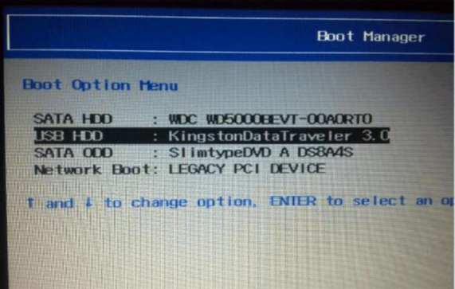

2. 之后就进入 unbuntu 的安装界面了

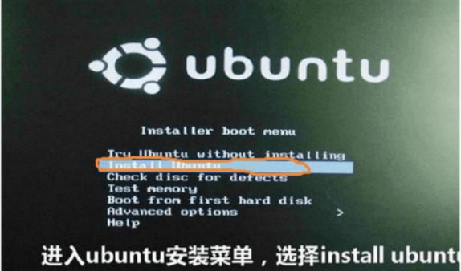

3. 或许没有这个界面，但是下面的界面是一定有的，系统不同界面会有些差异，但都一样

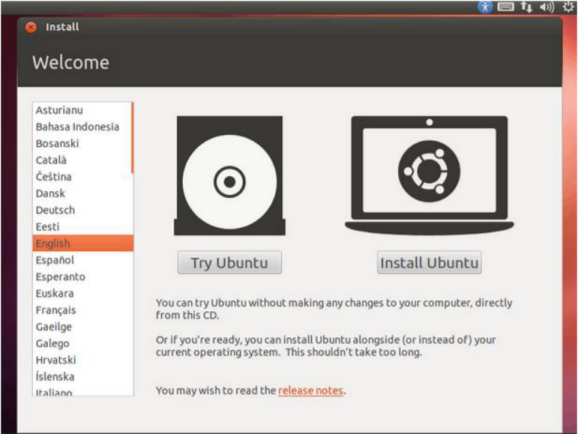

4. 然后呢选择右边的，往下拉会有中文选择，如图

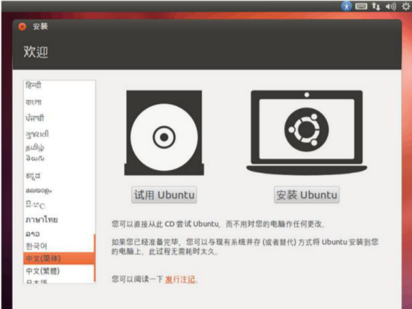

5. 安装 unbuntu

叫你联网的话不连，装系统不要联网，否则边装边下载很慢。

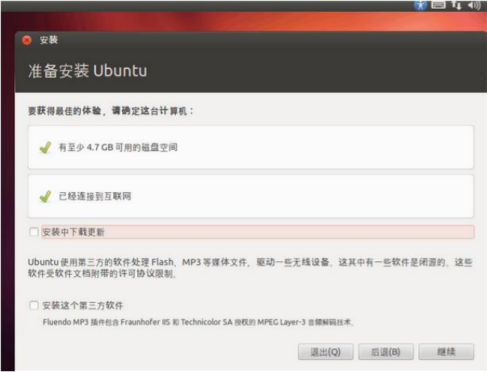

6. 选择继续（注意，接下来这一步非常重要，一定小心）

得到如下所视界面，如图:

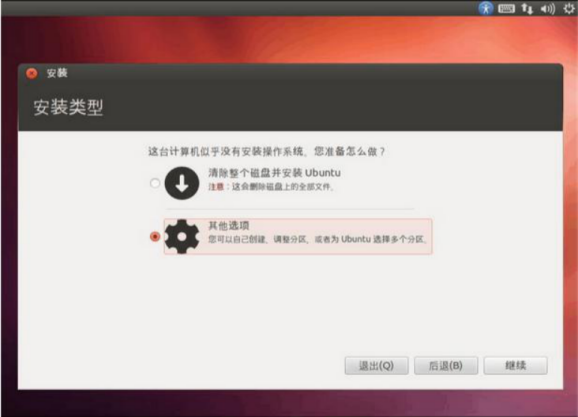

这一步很关键，一定要选择其他选项，切记，因为我们要手动分区，然后进入如下界面。这里说明一点，有人试过选择第一个选项，系统会自动找到你的空白分区进行安装，并且成功过，我不否认这样的装法，但是这样装完之后，磁盘基本上都会分给根目录，拿windows打比方，相当于你只有C盘，之后你的任何文件都只能存放在这个盘（不是说没有别的盘，而是别的盘空间太小。。。），试想你的文件存放在了系统盘，这会多么危险，所以既然你看到了这篇教程，强烈建议按照我的步骤来进行手动分区。

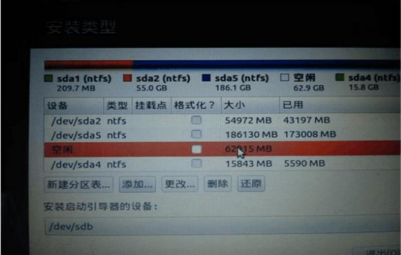

看到没有，里面会有一个空闲分区，也就是我们之前所创建的那个分区

在这里，我们谈谈关于 Linux的分区：

> a.首先 Linux 分区和 windows分区是不一样的， Linux 是以文件形式作为分区
>
> b.所以分区就像划分磁盘大小一样，在这假如你划分的空盘分区为 80G，则我们可以将其分为 :
>

点空闲盘符，点击+进行分区，分区如下

1）efi：这个就是实现你双系统的原因了，这个就是用启动 ubuntu 的目录，里面会有系统的引导，这个文件其实只有几十兆，但是我们建议将其划分为 200M 文件格式为efi，这个分区必不可少，否则后果你懂得！

（这也就是MBR和UEFI的区别！！！！不用/boot，看不懂请忽略这句话）

2）swap:这个是 Linux 也就是 ubuntu 的交换区目录，这个一般的大小为内存的 2 倍左右，主要是用来在电脑内存不足的情况下，系统会调用这片区域，来运行程序，我们可以将其分为 8G， 文件格式选择交换空间，英文swap

3) :这是 linux 也就是 ubuntu 的根目录就一个反斜杠表示,相当于windows的C盘，我们将其分为 20G，文件格式为 ext4（根据你的磁盘空间调整，可以大一点，毕竟ubuntu装软件都是默认装在根目录的）

4）/home:这是 ubuntu的其他盘，相当于windows的其他盘，所以为了让我们自己的目录大一点，剩下的全分给它，文件格式为 ext4

好了，这部分分区讲述完毕，你完全可以按照上面的描述进行分区，不会有任何问题，起码我一直都是这么做的（强烈建议）。当然，你可以划分的更详细，具体划分可以百度。

下来的这一步很重要，切记（关系到 ubuntu 的开机启动）在这个界面下方，选择安装启动下拉菜单，我们刚刚不是创建了200M的efi的文件吗，现在你看看这个区前面的编号是多少，我的是/dev/sda1,不同的机子在这个上面会有不同的编号，也就是选efi对应的编号（这里一定要注意，windows的启动项也是efi文件，大小大概是500M，而我们创建的ubuntu的efi大小是200M，一定要选对（下图中大小不准）！

只能是ext4分区格式

然后在安装启动的下拉菜单中找到 对应编号（例如sda1，可能是sda2，3等，具体看自己电脑efi对应的），选择它，切记一定是efi的编号如下图:

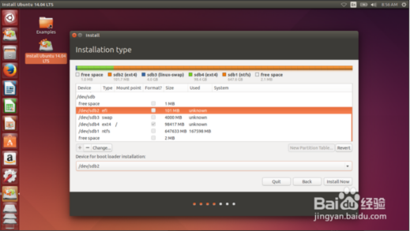

接下来就选择开始安装了；

8. 选择继续，进入下一步操作，设置地区不重要，按你需要设置，也可以直接继续，不影响，在下一步操作中选择键盘布局

9. 键盘布局“默认”，建议选择下面的英语的（默认中文也行）

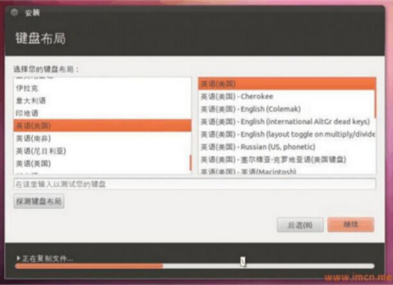

10. 这里设置系统用户，自己设置输入就可以了，例如姓名英文字母，尽量简单点吧

密码123456也简单点（好吧我可能是演员听多了。。。）

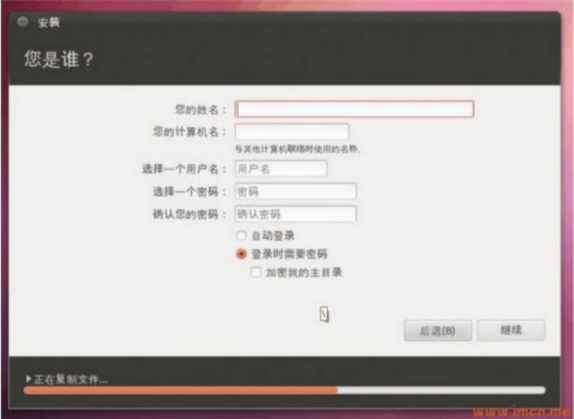

11. 这个可选可不选，点“继续”(有些安装过程没有这一项，略过）

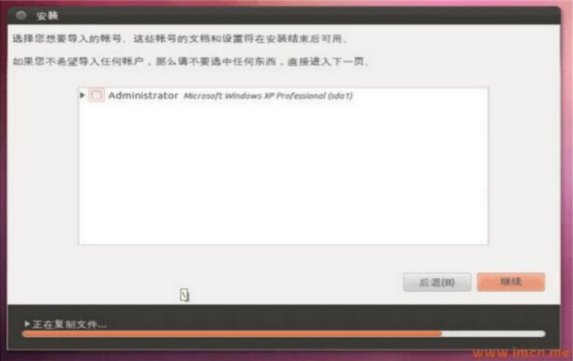

12． 系统开始安装，可以等会，等安装完毕就可以了（系统版本可能不一样，图片不准）

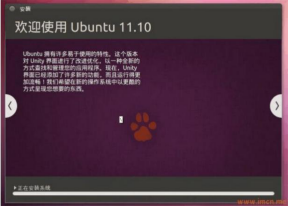

当这些全部完成之后，会提醒你重启，把U盘拔了，点重启。

进入UEFI(bios)设置里面把Ubuntu的启动顺序放在第一个就会出现下图

如果卡死就强制关机重启就好。

会出现一个蓝色背景的界面 perform mok management
正确的做法如下：

1. 当进入蓝色背景的界面perform mok management 后，选择 enroll mok ,
2. 进入enroll mok 界面，选择 continue ,
3. 进入enroll the key 界面，选择 yes ,
4. 接下来输入你在安装驱动时输入的密码，
5. 之后会跳到蓝色背景的界面perform mok management 选择第一个 reboot
6. 就会出现下图所示

 13. 也许你已经装好了系统并且成功进入了，那恭喜，你可以离开了；但是如果你装完之后重启，发现卡死在启动界面动不了了，这很大可能是你的电脑有特殊独立显卡，ubuntu系统下缺少驱动导致，其实这属于情况E，但是既然你在这里遇到了，我也就不卖关子了，你可以参考我的另一篇博客解决：[安装好ubuntu双系统启动时卡死解决办法](https://www.cnblogs.com/masbay/p/10718514.html)

 

#### 情况D UEFI新式bios+双硬盘

这个的装法和UEFI新式bios+单硬盘基本一样，唯一的差别就是一开始分区的时候在SSD（也就是windows的C盘）分200M的空间来安装启动项（因为启动项“必须”在电脑的第一个磁盘，这里的“必须”我打了引号，其实也可以装在其他磁盘，就是你装好进系统要从boot里面选择ubuntu启动，个人觉得比较麻烦，不推荐，更何况我的这种方法也没有什么难度和缺点），在机械硬盘分60~80G（可以更大，100、120或者150，只要你磁盘容量充足，也许会省去后面不少隐藏的麻烦），SSD分的200M的空间待会放EFI，其他的就放在另外的60~80G里面。其他的就完全一样了。图片分区可能不准。

#### E  以上任意一种情况+电脑有特殊独立显

装好系统后先不要点重启

进设置-在软件和更新里的驱动列表选择合适的驱动安装

选一个合适的专有驱动安装，图片百度的，不准 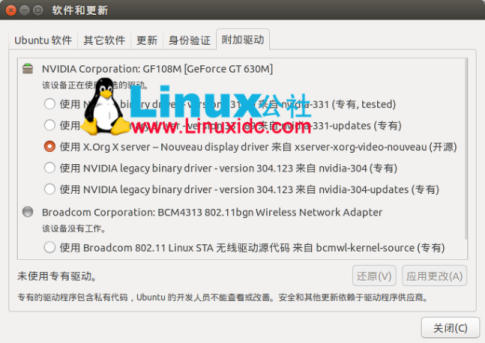

装好驱动后再重启。当然，这是针对你已经知道你电脑有特殊独立显卡，至于怎么判断，这个我也不是很清楚，其实你完全可以不用做这一步，出现的情况就是你在重启ubuntu进入系统是界面会卡死，这个问题我已经在我的另一篇博客中阐述了解决办法，如果你遇到了可以参考解决：[ubuntu双系统启动时卡死解决办法](https://www.cnblogs.com/masbay/p/10718514.html)

#### F 删除ubuntu：

直接到win10磁盘管理里删除ubuntu的卷就行，一点也麻烦，就是UEFI创建的EFI系统分区没办法删除，那就用DiskGenius软件删除，网上应该有这软件。MBR再加上用EasyBCD删除引导，不删也行，删了干净些。

## 总结：

装的过程如果出现什么问题一番查找之后还是不知道怎么解决，回到windows删除之后重装就行，胆大心细，就没问题，至少我装过20遍以上没装崩过一次，希望你看到这里已经成功装好了双系统，也感谢你不计较篇幅看到最后。

也欢迎纠错，帮我完善这篇教程，以帮助更多的人。
