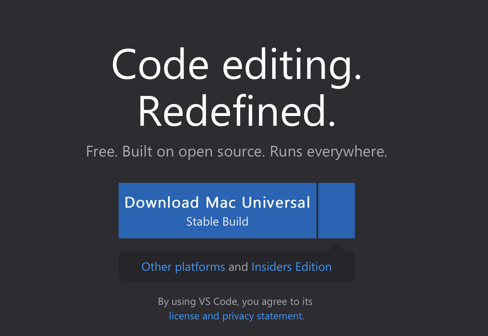
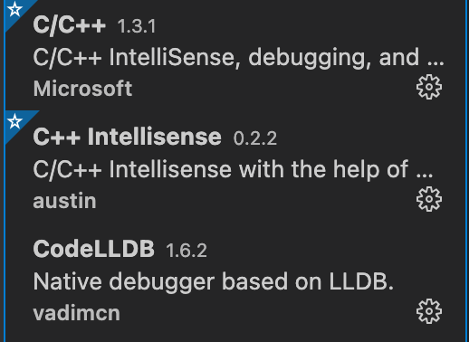
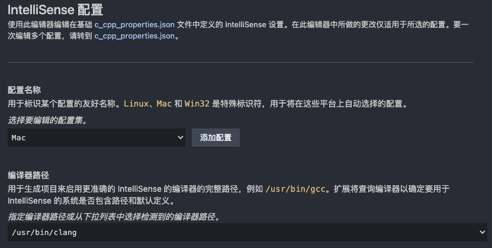

# M1 MacOS VSCode配置C++环境

==M1 MAC 因架构无法debug调试==

## 下载VSCode

vscode官网国内访问确实很慢，耐心等

点击前往vscode官网

选择下载Universal版本（支持arm架构）

## 安装插件

安装C/C++、CodeLLDB、C++ Intellisense



**一定要安装CodeLLDB**，要不然会无法debug，听说是apple取消了macos对lldb的支持，所以要用这个插件才能使用debug

## 生成c_cpp_properties.json等配置文件

首先新建一个cpp文件，随便写点啥。

接着shift+command+p，选择C/C++:Edit Configurations(UI)

按照下图配置



==task.json==

```json
{
  // See https://go.microsoft.com/fwlink/?LinkId=733558
  // for the documentation about the tasks.json format
  "version": "2.0.0",
  "tasks": [
    {
      "type": "shell",
      "label": "clang++ build active file",
      "command": "/usr/bin/clang++",
      "args": [
        "-std=c++17",
        "-stdlib=libc++",
        "-g",
        "${file}",
        "-o",
        "${fileDirname}/${fileBasenameNoExtension}"
      ],
      "options": {
        "cwd": "${workspaceFolder}"
      },
      "problemMatcher": ["$gcc"],
      "group": {
        "kind": "build",
        "isDefault": true
      }
    }
  ]
}
```

==launch.json==

```json
{
  // Use IntelliSense to learn about possible attributes.
  // Hover to view descriptions of existing attributes.
  // For more information, visit: https://go.microsoft.com/fwlink/?linkid=830387
  "version": "0.2.0",
  "configurations": [
    {
      "name": "clang++ - Build and debug active file",
      "type": "cppdbg",
      "request": "launch",
      "program": "${fileDirname}/${fileBasenameNoExtension}",
      "args": [],
      "stopAtEntry": true,
      "cwd": "${workspaceFolder}",
      "environment": [],
      "externalConsole": false,
      "MIMode": "lldb",
      "preLaunchTask": "clang++ build active file"
    }
  ]
}
```

==c_cpp_properties.json==

```json
{
  "configurations": [
    {
      "name": "Mac",
      "includePath": ["${workspaceFolder}/**"],
      "defines": [],
      "macFrameworkPath": [
        "/Library/Developer/CommandLineTools/SDKs/MacOSX.sdk/System/Library/Frameworks"
      ],
      "compilerPath": "/usr/bin/clang",
      "cStandard": "c11",
      "cppStandard": "c++17",
      "intelliSenseMode": "clang-x64"
    }
  ],
  "version": 4
}
```

或者 使用 `gcc -v -E -x c++ -` 获取include路径

## 终端不能输入

在 macOS Catalina 及更高版本上，您可能会遇到无法输入的问题，即使设置了 "externalConsole": true。一个终端窗口打开，但它实际上不允许您键入任何输入。

解决方法是让 VS Code 启动一次终端。您可以通过在 tasks.json 中添加和运行此任务来完成此操作：

```json
{
  "label": "Open Terminal",
  "type": "shell",
  "command": "osascript -e 'tell application \"Terminal\"\ndo script \"echo hello\"\nend tell'",
  "problemMatcher": []
}
```

您可以使用终端 > 运行任务...运行此特定任务，然后选择打开终端。

接受权限请求后，调试时应该会出现外部控制台。

