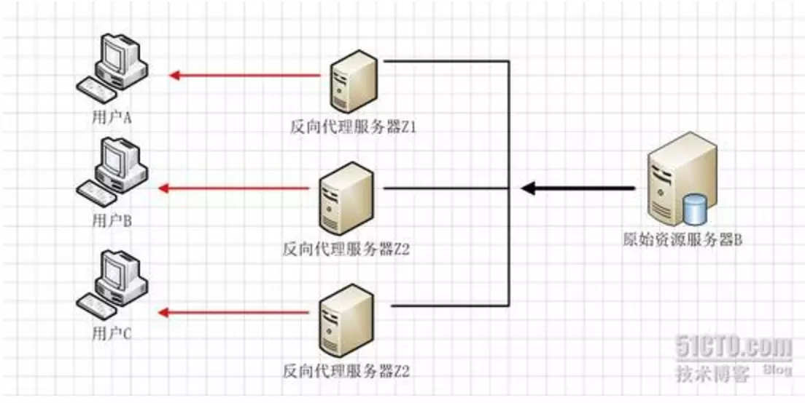
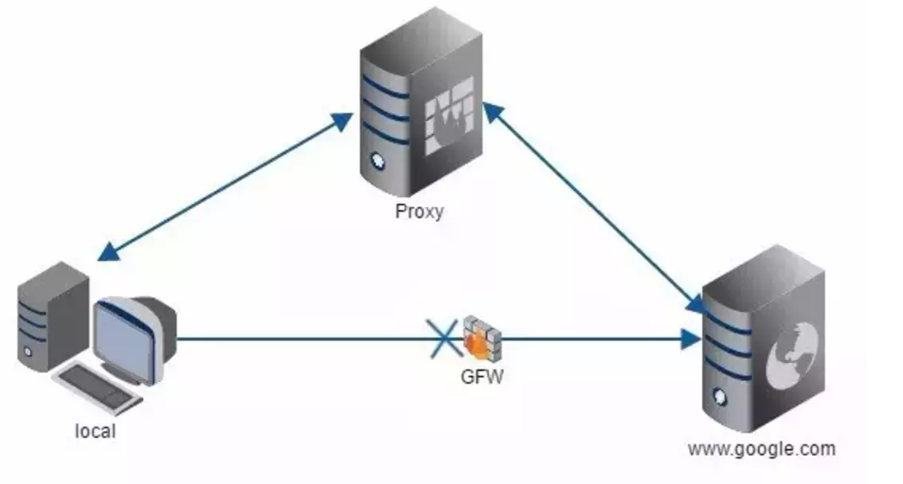
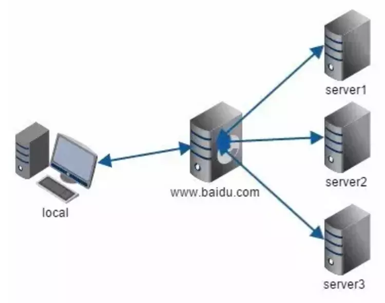

# [正向代理与反向代理的区别](https://www.jianshu.com/p/208c02c9dd1d)

> 在学习nginx过程中一直不太明白什么是反向代理，当然也就不知道正向代理的意思了，所以Google了好多，大概的明白是什么东西，这里主要是从两篇精彩的文章理解而来，一篇比较学术，另一篇就相对浅显易懂了
> [http://www.tuicool.com/articles/M7bAnqy](https://link.jianshu.com?t=http://www.tuicool.com/articles/M7bAnqy)

### 1. 概念

  正向代理是一个位于客户端和目标服务器之间的代理服务器(中间服务器)。为了从原始服务器取得内容，客户端向代理服务器发送一个请求，并且指定目标服务器，之后代理向目标服务器转交并且将获得的内容返回给客户端。正向代理的情况下客户端必须要进行一些特别的设置才能使用。

  反向代理正好相反。对于客户端来说，反向代理就好像目标服务器。并且客户端不需要进行任何设置。客户端向反向代理发送请求，接着反向代理判断请求走向何处，并将请求转交给客户端，使得这些内容就好似他自己一样，一次客户端并不会感知到反向代理后面的服务，也因此不需要客户端做任何设置，只需要把反向代理服务器当成真正的服务器就好了。

### 2. 区别

  正向代理需要你主动设置代理服务器ip或者域名进行访问，由设置的服务器ip或者域名去获取访问内容并返回；而反向代理不需要你做任何设置，直接访问服务器真实ip或者域名，但是服务器内部会自动根据访问内容进行跳转及内容返回，你不知道它最终访问的是哪些机器。

  正向代理是代理客户端，为客户端收发请求，使真实客户端对服务器不可见；而反向代理是代理服务器端，为服务器收发请求，使真实服务器对客户端不可见。

  从上面的描述也能看得出来正向代理和反向代理最关键的两点区别：

- 是否指定目标服务器

- 客户端是否要做设置
  下面用一张图来表示两者的差异：

  

  正向代理与反向代理

  正向代理中，proxy和client同属一个LAN，对server透明； 反向代理中，proxy和server同属一个LAN，对client透明。 实际上proxy在两种代理中做的事都是代为收发请求和响应，不过从结构上来看正好左右互换了下，所以把前者那种代理方式叫做正向代理，后者叫做反向代理。

  从用途上来区分：

- 正向代理：正向代理用途是为了在防火墙内的局域网提供访问internet的途径。另外还可以使用缓冲特性减少网络使用率
- 反向代理：反向代理的用途是将防火墙后面的服务器提供给internet用户访问。同时还可以完成诸如负载均衡等功能

  从安全性来讲：

- 正向代理：正向代理允许客户端通过它访问任意网站并且隐蔽客户端自身，因此你必须采取安全措施来确保仅为经过授权的客户端提供服务
- 反向代理：对外是透明的，访问者并不知道自己访问的是代理。对访问者而言，他以为访问的就是原始服务器

### 3. 使用场景

  正向代理的典型用途是为在防火墙内的局域网客户端提供访问Internet的途径。正向代理还可以使用缓冲特性减少网络使用率。反向代理的典型用途是将 防火墙后面的服务器提供给Internet用户访问。反向代理还可以为后端的多台服务器提供负载平衡，或为后端较慢的服务器提供缓冲服务。

##### 3.1 正向代理

  从上面的介绍也就可以猜出来正向代理的至少一个功能（俗称翻墙），也即：

  用户A无法访问facebook，但是能访问服务器B，而服务器B可以访问facebook。于是用户A访问服务器B，通过服务器B去访问facebook，，服务器B收到请求后，去访问facebook，facebook把响应信息返回给服务器B，服务器B再把响应信息返回给A。这样，通过代理服务器B，就实现了翻墙。

##### 3.2 反向代理

  从上面的介绍也可以猜出来反向代理的至少一个功能（比如负载均衡），也即：

  假设用户A访问 **[http://www.somesite.com/something.html](https://link.jianshu.com?t=http://www.somesite.com/something.html)**，但[www.somesite.com](https://link.jianshu.com?t=http://www.somesite.com)上并不存在something.html页面，于是接收用户请求的该服务器就偷偷从另外一台服务器上取回来，然后返回给用户，而用户并不知道something.html页面究竟位于哪台机器上。

  反向代理的作用就比较多了，这里简单列举一下：

- 保护和隐藏原始资源服务器
- 加密和SSL加速
- 负载均衡
- 缓存静态内容
- 压缩
- 减速上传
- 安全
- 外网发布

  下面做两个简单介绍

#### 保护和隐藏原始资源服务器

代理作用

  用户A始终认为它访问的是原始服务器B而不是代理服务器Z，但实用际上反向代理服务器接受用户A的应答，从原始资源服务器B中取得用户A的需求资源，然后发送给用户A。由于防火墙的作用，只允许代理服务器Z访问原始资源服务器B。尽管在这个虚拟的环境下，防火墙和反向代理的共同作用保护了原始资源服务器B，但用户A并不知情。

#### 负载均衡

负载均衡

  当反向代理服务器不止一个的时候，我们甚至可以把它们做成集群，当更多的用户访问资源服务器B的时候，让不同的代理服务器Z（x）去应答不同的用户，然后发送不同用户需要的资源。

##### 3.3 透明代理

  透明代理比较类似正向代理的功能，差别在于客户端根本不知道代理的存在，它改编你的request，并会传送真实IP（使用场景就是公司限制网络的访问）。

  比如为了工作效率或者安全，A公司屏蔽了QQ软件的使用。A公司的员工接上了网络，但发现无法使用qq。这就是透明代理捣的鬼。公司在内网和外网的中间插入一个透明代理，这个代理会根据规则抓取请求内容，遇到qq的请求我就把这个请求给屏蔽掉，这样就完成了透明屏蔽。当然了，如果你明白原理，就可以自己搞个正向代理来绕过公司的屏蔽。

> 以上是第一篇比较学术型的解释，接下来是比较浅显易懂的，转自[http://mp.weixin.qq.com/s/ikrI3rmSYs83wdSWqq2QIg](https://link.jianshu.com?t=http://mp.weixin.qq.com/s/ikrI3rmSYs83wdSWqq2QIg)

  Nginx作为时下最流行的HTTP服务器之一，同时它是一个反向代理服务器，提到反向代理服务器，有同学可能觉得这个概念很模糊，如果说到代理，他可能明白，但是再引出一个正向代理，估计懵了，笔者将尝试用浅显易懂的比方把这两个概念解释清楚。

# 正向代理

  A同学在大众创业、万众创新的大时代背景下开启他的创业之路，目前他遇到的最大的一个问题就是启动资金，于是他决定去找马云爸爸借钱，可想而知，最后碰一鼻子灰回来了，情急之下，他想到一个办法，找关系开后门，经过一番消息打探，原来A同学的大学老师王老师是马云的同学，于是A同学找到王老师，托王老师帮忙去马云那借500万过来，当然最后事成了。不过马云并不知道这钱是A同学借的，马云是借给王老师的，最后由王老师转交给A同学。这里的王老师在这个过程中扮演了一个非常关键的角色，就是代理，也可以说是正向代理，王老师代替A同学办这件事，这个过程中，真正借钱的人是谁，马云是不知道的，这点非常关键。

  我们常说的代理也就是只正向代理，正向代理的过程，它隐藏了真实的请求客户端，服务端不知道真实的客户端是谁，客户端请求的服务都被代理服务器代替来请求，知名的科学上网工具shadowsocks 扮演的就是典型的正向代理角色。在天朝用浏览器访问 [www.google.com](https://link.jianshu.com?t=http://www.google.com) 时，被残忍的拒绝了，于是你可以在国外搭建一台代理服务器，让代理帮我去请求[google.com](https://link.jianshu.com?t=http://google.com)，代理把请求返回的相应结构再返回给我。

正向代理

# 反向代理

  大家都有过这样的经历，拨打10086客服电话，可能一个地区的10086客服有几个或者几十个，你永远都不需要关心在电话那头的是哪一个，叫什么，男的，还是女的，漂亮的还是帅气的，你都不关心，你关心的是你的问题能不能得到专业的解答，你只需要拨通了10086的总机号码，电话那头总会有人会回答你，只是有时慢有时快而已。那么这里的10086总机号码就是我们说的反向代理。客户不知道真正提供服务人的是谁。

  反向代理隐藏了真实的服务端，当我们请求 [www.baidu.com](https://link.jianshu.com?t=http://www.baidu.com) 的时候，就像拨打10086一样，背后可能有成千上万台服务器为我们服务，但具体是哪一台，你不知道，也不需要知道，你只需要知道反向代理服务器是谁就好了，[www.baidu.com](https://link.jianshu.com?t=http://www.baidu.com) 就是我们的反向代理服务器，反向代理服务器会帮我们把请求转发到真实的服务器那里去。Nginx就是性能非常好的反向代理服务器，用来做负载均衡。

反向da

  两者的区别在于代理的对象不一样：正向代理代理的对象是客户端，反向代理代理的对象是服务端